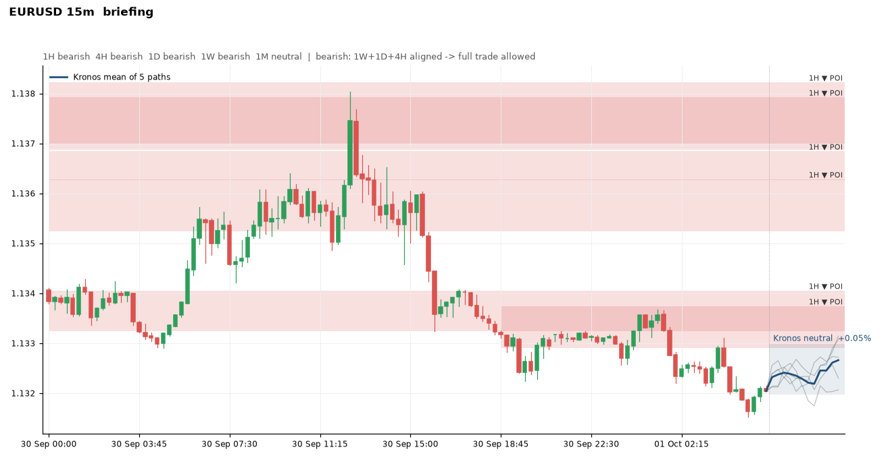
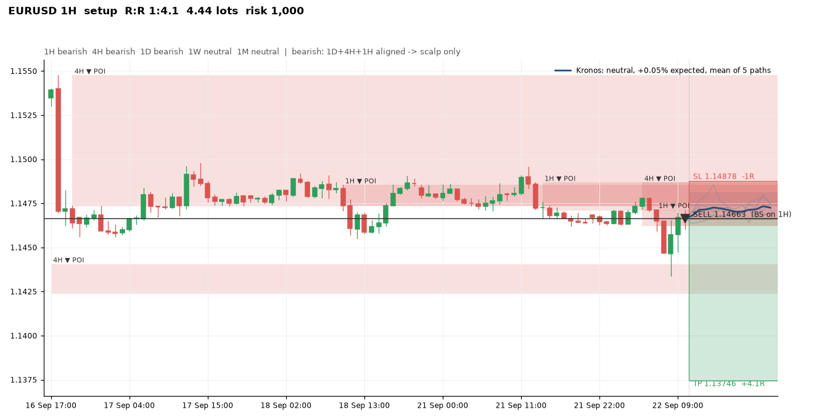

# Live setup - IBKR paper, Telegram, the loop, working from your phone

The live loop is `python -m kronos_trader live`. On every poll it pulls candles
from the broker (every timeframe the rules need, 1M down to 5m; the
TradingView cache is the fallback), runs the engine, sends setups to Telegram,
waits for your Approve tap, places a bracket order (market + stop + target),
moves the stop to break-even per the rules and reports fills and closes with
P&L.

Install the trader dependencies once:

```shell
pip install -r requirements-trader.txt
```

(`requirements.txt` is Kronos itself: torch and the model loader, only needed
for the forecast indicator.)

## 0. The EURUSD demo with reading F, version 3 (2 October 2026)

The profile `config/dorus_live.yaml` holds the reading that reproduces Dorus's entries and stops and gave 2026 on EURUSD
23 trades, 57 %, +11.2R (`docs/backtests/winrate/README.md`), in its version 3 (the origin target, the 1H required in the
bias, no W+D+4H combination: 2026 EURUSD 10 trades, 70 %, +5.9R; 2023-2026 73 trades, 49 %, +11.8R, never through the
FTMO margins): 5m shifts for 1H zones (15m for 4H, 1H for daily), the
sweep-extreme stop with an 8-pip minimum, the target on the low/high the zone's move started from (version 2, the
"vorige high/low" of the course), one trade per zone per visit, entries at most half the zone deep, 1D/4H/1H zones only,
sessions 09-11 and 13-17 Amsterdam, the news blackout, FTMO margins. EURUSD only; the same reading loses on gold. It needs no 1-minute candles: MT5's own bars (5m and up) are enough.

On the laptop, after sections 1b (MT5 demo) and 2 (Telegram) below:

```shell
python -m kronos_trader --config config/dorus_live.yaml mt5-test --symbol EURUSD --tf 15m
python -m kronos_trader --config config/dorus_live.yaml telegram-test
python -m kronos_trader --config config/dorus_live.yaml live --symbol EURUSD --broker mt5             # dry run: every setup to Telegram, no orders
python -m kronos_trader --config config/dorus_live.yaml live --symbol EURUSD --broker mt5 --execute   # demo orders, after your Approve tap
```

Run the dry run for the first days: the 08:45 briefing (bias per timeframe, decision, zone map), a chart at every zone
touch and every setup. Switch to `--execute` when the setups look like his. Every executed trade goes into the journal
(`python -m kronos_trader journal`) and into `docs/dossiers/source_trades.yaml` next to his, so the fast loop
(`scripts/source_trades.py`) keeps comparing the two.

## 1. IBKR paper account (TWS)

1. Start **Trader Workstation** and log in with the *paper* credentials
   (IB Gateway works the same way; its paper port is 4002).
2. File → Global Configuration → API → Settings:
   - tick *Enable ActiveX and Socket Clients*
   - untick *Read-Only API*
   - Socket port **7497**
   - add `127.0.0.1` to *Trusted IPs* (or leave the prompt on and accept the
     connection once)
   - leave *Download open orders on connection* ticked
3. Optional environment variables: `IBKR_HOST` (default 127.0.0.1),
   `IBKR_PORT` (default 7497), `IBKR_CLIENT_ID` (default 17), `IBKR_ACCOUNT`
   (only when the login holds more than one account).
4. Test the connection; TWS must be running and logged in:

   ```shell
   python -m kronos_trader ibkr-test --symbol EURUSD --tf 15m
   ```

   It prints equity, the contract, the price and the last five bars. Send the
   output back when anything looks wrong: the adapter was written against the
   `ib_async` API and still has to be exercised against a real TWS session.

Market data: IBKR serves quotes and historical bars to the API only when the
account has market data permissions. A paper account has them when the live
account has them and sharing is on: Client Portal, Settings, User Settings,
Paper Trading Account, share real-time market data subscriptions. Without
them `ibkr-test` shows `Error 10089` (quotes) and `Error 162 ... No market
data permissions for IDEALPRO CASH` (bars); orders still work. In that case
run the loop with candles from OANDA (`--feed oanda`, section 3) and keep the
orders on IBKR.

Forex trades on IDEALPRO in units (1.0 lot = 100,000). Keep the paper account
the size of the real one: orders under roughly 25,000 units are odd lots with
worse fills. Gold and indices go through IBKR CFDs (`ibkr_contract` in the
symbol spec); check they are enabled for your region.

## 1b. MetaTrader 5 demo: live candles and a paper venue without a live account

Any MT5 demo account gives real-time candles for every timeframe plus a
paper account that fills orders, and MT5 is what the prop firms run. This is
the route when IBKR has no market data.

1. Install MetaTrader 5 from metatrader5.com (or the terminal of the broker
   or prop firm you will use later). On first start it offers a demo account
   on the MetaQuotes-Demo server; accept, or open one under File, Open an
   Account. Note the login, the password and the server name.
2. Keep the terminal running and logged in.
3. On the laptop:

   ```powershell
   pip install MetaTrader5
   setx MT5_LOGIN "12345678"
   setx MT5_PASSWORD "your-password"
   setx MT5_SERVER "MetaQuotes-Demo"
   ```

   Open a new terminal. If the terminal is not found automatically, also set
   `MT5_PATH` to `C:\Program Files\MetaTrader 5\terminal64.exe`.
4. `python -m kronos_trader mt5-test --symbol EURUSD --tf 15m` prints the
   account, the server-time offset to UTC and the last five bars. It also says
   whether the terminal's **Algo Trading** button is on (toolbar; off after an
   install) and whether the login may trade (an investor password may not):
   both are needed before `--execute`, a dry run works without them.
5. `python -m kronos_trader live --symbol EURUSD --broker mt5` runs the loop
   with MT5 candles and MT5 paper orders.

Brokers name symbols differently (`EURUSD.r`, `XAUUSD.m`): set
`mt5_symbol` in the symbol spec. The server-time offset is read from the
last bar before the weekend gap (the forex week ends Friday 17:00 New York,
so a server whose week ends at 23:30 is UTC+2/+3 and follows US daylight
saving) and checked against the latest tick while the week is open; it is
re-read every hour. Pin it with `MT5_SERVER_OFFSET_HOURS` only when
`mt5-test` prints a wrong one.

When `mt5-test` fails:

- `No module named MetaTrader5` (or `pandas`): the virtualenv is not active in
  this window. `cd` into the repo and run `.\.venv\Scripts\Activate.ps1` first.
- `(-10005, 'IPC timeout')`: the terminal runs as administrator (the installer
  starts it that way; close it with File, Exit and start it from the normal
  shortcut), or PowerShell does, or two terminals are running. Each attempt
  waits 60 seconds before giving up.
- `(-6, 'Terminal: Authorization failed')`: the terminal itself is not logged
  in (red connection icon bottom right, the Journal tab says why). Wrong or
  investor password, or the demo account expired: log in again under File,
  Login to Trade Account, or open a new demo account under File, Open an
  Account, and update `MT5_LOGIN` / `MT5_PASSWORD` (new window afterwards).

## 2. Telegram (10 minutes)

Telegram is what makes the phone workflow possible: setups, the
Approve / Skip buttons, fills, break-even moves and closes all arrive in the
bot chat, and `/approve <id>` or `/skip <id>` typed in the chat work too.
Without it the same messages are printed in the terminal
(`[telegram dry-run]`), fine for a dry run, useless for approving a trade
from the sofa.

1. In Telegram open **@BotFather**, send `/newbot`, pick a name, copy the
   token (`/mybots`, the bot, *API Token* shows it again): digits, a colon
   and 35 characters, no `bot` prefix.
2. Start a chat with your new bot and send it any message.
3. Set the token on the machine that runs the loop and open a new terminal.
   Windows:

   ```powershell
   setx TELEGRAM_BOT_TOKEN "123456:ABC..."
   ```

4. `python -m kronos_trader telegram-test` checks the token (`getMe`) and,
   with no chat id set yet, prints the ids of the chats that messaged the bot.
   Set yours the same way (`setx TELEGRAM_CHAT_ID "123456789"`, new terminal).
5. `python -m kronos_trader telegram-test` again → the bot says "connected".
   A `404` from Telegram means the token is wrong, `chat not found` the chat
   id (or the bot was never messaged); the command says which.

Only taps and `/approve` / `/skip` texts coming from that chat are accepted.

## 3. Data

The loop needs live candles for every timeframe the rules use (1M down to
5m, `live.broker_timeframes`) and takes them from one source, chosen with
`--feed`:

- `broker` (default with `--broker ibkr` or `mt5`): the broker's own bars.
  MT5 always has them (section 1b); IBKR needs market data permissions
  (section 1).
- `oanda`: a free OANDA practice account. Open one at oanda.com, create a
  token under *Manage API Access*, then

  ```powershell
  setx OANDA_TOKEN "your-token"
  ```

  open a new terminal and test with
  `python -m kronos_trader feed-test --symbol EURUSD --tf 15m`. Forex, gold
  and index CFDs are available; BTC is not in the EU.
- `cache`: the TradingView CSVs in `data/tv_cache/` only (default without a
  live broker). Filled through the TradingView MCP
  (`docs/TRADINGVIEW_BRIDGE.md`); only as fresh as the last import, fine for
  a dry run.

The cache is also the fallback for a timeframe the live source fails to
deliver, a source that fails for every timeframe is left alone for ten
minutes (`live.feed_retry_seconds`), and the loop prints where each timeframe
came from. When the newest candle of a timeframe closed more than two
candles ago the data is stale: the loop keeps analysing and managing
positions but opens no new setups and says why
(`live.max_data_age_bars`, `live.require_fresh_data`).

## 4. Run

```shell
# 1) dry-run: setups to Telegram (or the terminal) only, no orders
python -m kronos_trader live --symbol EURUSD --broker ibkr

# same on an MT5 demo account: candles and paper orders from MetaTrader 5
python -m kronos_trader live --symbol EURUSD --broker mt5

# IBKR orders with candles from OANDA (only where OANDA hands out API tokens)
python -m kronos_trader live --symbol EURUSD --broker ibkr --feed oanda

# 2) execute with the Approve step (the mode for the challenge)
python -m kronos_trader live --symbol EURUSD --broker ibkr --execute

# 3) fully automatic (only after weeks of 1 and 2)
python -m kronos_trader live --symbol EURUSD --broker ibkr --execute --no-approval

# single scan and exit, useful for a quick check
python -m kronos_trader live --symbol EURUSD --broker ibkr --once
```

Approval requests expire after one confirmation-timeframe candle (minimum 5
minutes); an approval that arrives after that is refused. An approved order
is re-checked against the risk guard and a fresh current price (R:R still
≥ 1:3) before it is sent, and not sent at all when no current price can be
had. An order counts as filled only once the broker confirms the fill;
otherwise the loop reports it as submitted and confirms it, or reports that
it did not fill, on a later poll.

## 5. Working from your phone

The loop runs on the laptop; the phone only needs Telegram. Keep the laptop
on mains power, awake and logged in to TWS:

1. Power: in an administrator PowerShell

   ```powershell
   powercfg /change standby-timeout-ac 0
   powercfg /change hibernate-timeout-ac 0
   powercfg /change monitor-timeout-ac 10
   ```

   and Settings → System → Power → "closing the lid" → *Do nothing*.
2. TWS logs itself out once a day. Global Configuration → Lock and Exit:
   choose *Auto restart* with a time outside the sessions (for example
   23:45). It then restarts without a login prompt, except for the full
   login once a week on Sunday.
3. Start the loop in a terminal that stays open (mode 1 first, then 2):

   ```shell
   python -m kronos_trader live --symbol EURUSD --broker mt5
   ```

   Windows Task Scheduler ("at log on", restart on failure) brings it back
   after a reboot.
4. While testing, add `--notify-every-scan` to get one message per poll on
   the phone; drop it once you trust the loop.

What arrives on the phone in a normal day: the morning analysis at 08:45
Amsterdam (bias per timeframe, decision, the POI map), a heads-up when price
enters a POI the bias allows, the setup with Approve / Skip once a
confirmation closes, then fills, break-even moves and closes. Entries only
between 09:00 and 17:00 Amsterdam and never inside a high-impact news window.

Prop-firm limits in the guard are FTMO-style with margin: the firm stops you
at 5 % daily and 10 % total loss, the guard stops at 4 % and 8 %, one open
trade, 1 % risk.

### The journal

Every setup, approval, skip, expiry, fill, break-even move and close is
appended to `journal/trades.csv` as it happens (`live.journal_path`). The
forward test's numbers come from that file alone:

```shell
python -m kronos_trader journal
```

prints closed trades, win rate, expectancy per trade, average winner, total R
and P&L, plus the counts of setups, approvals, skips and expiries, by month.

### Charts and Kronos on the chart



With a setup the chart adds the position tool: the entry marker on the confirmation
candle, the risk box to the stop and the reward box to the target, with the R:R.



Backtest trades can be drawn the same way, one image per trade with the zone, the X/B/P marks, entry, stop and
target, so a trade list can be checked by eye instead of replaying each setup:

```
python -m kronos_trader --config config/dorus_pure.yaml trade-charts --symbol EURUSD --data-dir data/histdata \
    --trades docs/backtests/phase2/EURUSD_5m_pure.csv --out charts/backtest --max 20
```

`--max 0` draws every trade; the default spreads 20 images over the list.

Every briefing, POI touch and setup comes with a chart image on Telegram:
the last 120 candles, the zones the bias allows, entry, stop and target when
there is a setup, and Kronos's sampled paths as a fan to the right of the
last candle with its mean path and expected band (`live.send_charts`,
`kronos.mode: advisory`; Kronos never decides, it only shows).

To see the same fan on the MetaTrader chart: copy `mt5/KronosForecast.mq5`
into the terminal's `MQL5\Indicators` folder (File, Open Data Folder),
compile it in MetaEditor (F7), drag it onto the chart, and enable the chart
shift (the arrow icon in the toolbar) so there is room on the right. The
loop writes `kronos_forecast_<SYMBOL>.csv` to the terminal's common files
folder whenever it sends a chart (`live.mt5_overlay`), and the indicator
re-reads it every 30 seconds. TradingView cannot take drawings from outside,
so the forecast is not shown there.

Secrets stay in environment variables on that machine only; never in the repo
and never in a third-party agent sandbox. A small VPS is the alternative if
the laptop cannot stay on.

News: the loop opens no new trade from 30 minutes before to 30 minutes after
a high-impact event of the symbol's currencies (`news:` in the config). It
loads `data/calendar/high_impact.csv` and refreshes this and next week from
the free ForexFactory feed every hour; each setup message names the next
high-impact event.

## 6. Prop-firm phase

The challenge runs on the firm's platform, not on IBKR. MetaTrader 5 is
supported through `MT5Broker` (`--broker mt5`, Windows, `MT5_LOGIN`,
`MT5_PASSWORD`, `MT5_SERVER`). cTrader or MatchTrader adapters are built once
the firm is chosen.
