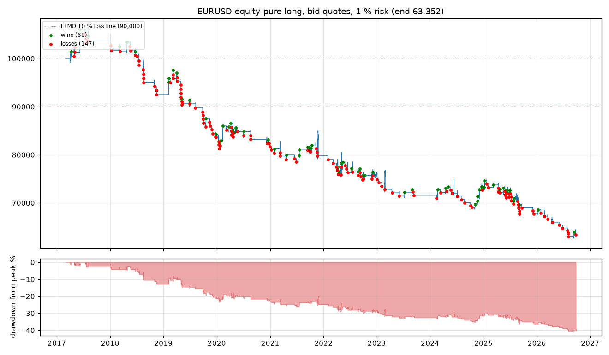

# EURUSD 2017-03 to 2026-09 on the second pure profile: the unseen years

Astra's step 5 ("one frozen version on data not used yet"), applied to the focus pair: the second edition of the pure
profile (`profile_pure_second_edition.yaml`, the frozen phase 2 settings) run over nine and a half years of EURUSD on
HistData.com 1-minute bid candles resampled as in phase 2, 5-minute steps, one account of 100,000, 1 % risk, FTMO limits
recorded but not halting. Code `e24a0d8`, identity taken at start; the commit changed during the run (documentation
commits) while the source files did not (`changed_since_start` is true for the commit, the source hash at start equals
the one at write). Started 19:05 UTC, finished 20:27 UTC. The years 2017 to 2022 were never used while the rules were
read from the videos or while the code was fixed; 2023 to 2026 overlap the phase 2 run.

## Headline

| Trades | Win rate | Expectancy | Total | Profit factor | End equity | Deepest drawdown (from peak) | First breach of the 10 % line |
|---|---|---|---|---|---|---|---|
| 219 | 32 % | -0.22R | -49.0R | 0.67 | 63,352 | -41.0 % (2026-09-11) | 2019-08-05 |



## By year

```
trades  wins  losses  expectancy  total
opened_at                                         
2017           11     4       7        0.40   4.42
2018           19     3      16       -0.66 -12.46
2019           33     8      25       -0.34 -11.12
2020           27    10      17       -0.09  -2.53
2021           21     8      12       -0.13  -2.65
2022           29    10      19       -0.23  -6.67
2023           10     2       7       -0.49  -4.92
2024           20     8      11        0.06   1.24
2025           37    13      23       -0.20  -7.45
2026           12     2      10       -0.57  -6.82

by poi_tf
        trades  expectancy  total
poi_tf                           
1D          11       -0.58  -6.33
1H         103       -0.23 -23.90
1W           9        0.41   3.70
4H          96       -0.23 -22.44

by confirmation
              trades  expectancy  total
confirmation                           
BMS              166       -0.17 -28.94
BS                53       -0.38 -20.03

by confirmation_tf
                 trades  expectancy  total
confirmation_tf                           
15m                  45       -0.32 -14.35
1D                    5       -0.03  -0.13
1H                   13       -0.76  -9.83
4H                    6        0.30   1.83
5m                  150       -0.18 -26.48

by direction
           trades  expectancy  total
direction                           
LONG           95       -0.32 -30.73
SHORT         124       -0.15 -18.24

by stop_tf
         trades  expectancy  total
stop_tf                           
1D            4       -1.04  -4.16
1H          146       -0.23 -34.18
4H           69       -0.15 -10.63

by entry hour (Amsterdam)
      trades  expectancy  total
hour                           
9         55       -0.46 -25.10
10        38       -0.10  -3.72
13        37       -0.17  -6.15
14        25       -0.45 -11.35
15        31       -0.04  -1.21
16        33       -0.04  -1.43
```

## Reading it

1. **The unseen years confirm the seen ones.** 2017 to 2022: 140 trades, -31.0R; 2023 to 2026: 79 trades, -18.0R. Only 2017
   (11 trades, +4.4R) and 2024 (20 trades, +1.2R) end positive. The 10 % line was crossed in August 2019, after two and a half
   years, and the account never recovered it.
2. **Same shape as phase 2.** 1H zones -23.9R and 4H zones -22.4R carry the loss; the 09:00 hour alone -25.1R of the -49.0R;
   the 1H P as stop (146 trades) -34.2R; balance-shift confirmations (53 trades) -20.0R against BMS (166 trades) -28.9R; the
   15m confirmations (45) -14.4R and the 1H confirmations (13) -9.8R are the worst per trade. Shorts lose less per trade than
   longs here (-0.15R against -0.32R), the opposite of phase 2's four-market picture, so direction is not a pattern.
3. **The overlap year 2025 is identical to the phase 2 ledger** (37 trades, -7.45R), although this run started six years
   earlier; 2023 and 2024 differ slightly because the phase 2 run started cold on 1 March 2023.
4. **What it does not say.** No 1-minute candles here either, so the 103 trades on 1H zones were confirmed on the 5m or 15m,
   not on the 1m the table names. Costs: spread only. It says nothing about Dorus's own trading; it says that this reading of
   his list, mechanically applied, loses on EURUSD in every regime of the last decade except two single years.

## Files

`EURUSD_5m_pure_long.csv` (ledger with the stop's P and the confirmation close), `.equity_1H.csv`, `.equity.csv.gz`,
`.provenance.json`, `.run.txt` (console log with the rejection funnel), `EURUSD_equity.png`, `equity_all.png`,
`headline.csv`, `by_year.txt`, `profile_pure_second_edition.yaml`.

Repeat: `python -m kronos_trader --config docs/backtests/eurusd_2017_2026/profile_pure_second_edition.yaml backtest --symbol EURUSD
--data-dir data/histdata --step-tf 5m --start 2017-03-01 --kronos off --quote-basis bid --out eurusd_long.csv` on commit `e24a0d8`
or later, with the HistData cache built as in the phase 2 README.
