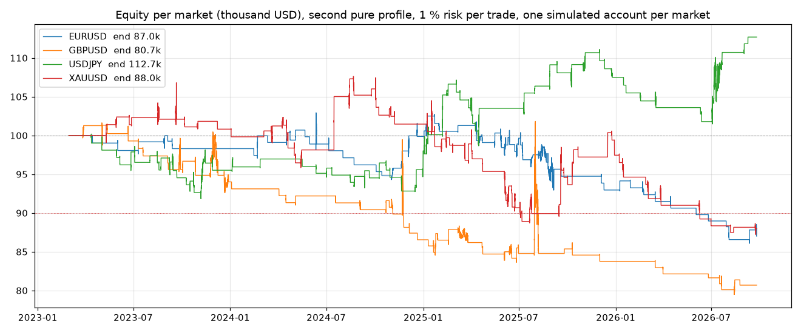

# Phase 2, frozen run: Dorus's second pure profile on four markets, 2023-03 to 2026-09

Run of 1 October 2026 (started 14:35 UTC, finished 16:23 UTC) with the settings in `profile_pure_frozen.yaml` next to
this file: `config/dorus_pure.yaml` of commit `1f7e2b5`, with the prop-firm halt lifted so the whole period is walked.
Bid quotes, one simulated account of 100,000 per market, 1 % of the balance at risk per trade, every closed 5-minute
candle from 2023-03-01 to 2026-09-25. The four `.provenance.json` files carry the exact command, the package versions,
the settings and the SHA-256 of every data file the run read.

**Which code ran (Astra, control of 1 October).** The four provenance files name commit `aef7c65` in their `code` field.
That field was captured when the results were written (16:22 UTC), not when the processes started (14:35 UTC on
`1f7e2b5`, logged in the batch status file); the eight commits in between changed `engine.py`, `confirmation.py`,
`runner.py`, `cli.py`, `config.py` and added `dossier.py`. Python imports a package once, at start, so the four processes
ran the modules of `1f7e2b5`; only the provenance writer itself is imported at the end, and that file did not change between
the two commits. This is reasoning about the interpreter, not a record: the provenance file cannot prove which program
ran. Fixed for every later run: the code identity (commit, dirty flag, SHA-256 of every source file) is now taken at
process start and the file flags whether the sources changed before the results were written. For this run, the same
EURUSD slice (May to September 2025) was re-run on checkouts of both commits; the outcome is in the section "Slice check" below.

Data: HistData.com 1-minute bid candles resampled to 5m, 15m, 1H and 4H (4H bins anchored to 17:00 New York, daylight
saving followed); daily, weekly and monthly candles from TradingView (OANDA for EURUSD, FOREX.com for the others; the EURUSD
weekly series rebuilt from the OANDA daily candles). News: 2,848 high-impact events (2017-01-06 to 2026-10-02), no entry
30 minutes either side. Costs: the symbol's typical spread on every fill, no commission, no slippage, no swap; the
"net of commission" column subtracts 6 USD per lot round trip afterwards. Guard: FTMO's daily 5 % and total 10 % limits are
recorded (first breach per market, in Europe/Prague days) but did not halt the run.

Profile, every line with its source in `profile_pure_frozen.yaml` and `docs/DORUS_RULES_FROM_TRANSCRIPTS.md`: bias 3 of 5 with
the four listed combinations only; POI from liquidity (X) to protection (P) on 1M, 1W, 1D, 4H and 1H; confirmation on the
timeframe table = balance shift with a close or BMS (first candle off, BOS off); minimum R:R 0.7 ("attractive"; his lowest
accepted example is 0.73); stop on the P of the most recent 1H balance level in the trade direction since the touch, else the
zone's own P, without buffer ("SL ALTIJD op minimale 1H P"); target on the nearest liquidity above the confirmation timeframe
and never below the 1H; entries 09:00-11:00 and 13:00-17:00 Amsterdam; one trade at a time; break-even per the rule table;
only the first return to a zone is traded; Kronos off.

**Coverage the run does not have (Astra, finding 2).** No 1-minute candles were loaded: the steps are 5-minute candles and
the smallest confirmation timeframe is the 5m. The written table puts the confirmation for a 1H zone on the 1m; all 168
trades on 1H zones in this run were confirmed on the 5m (113) or the 15m (55) instead, and those 168 trades carry -32.4R of
the -36.7R. The code reads the table as the lowest allowed timeframe and accepts anything between it and the zone's
timeframe, smallest first: 223 of the 324 trades were confirmed above the table's minimum (-31.9R, of which the 168
1H-zone trades are -32.4R, so outside the 1H zones the effect is nil); 101 trades sat exactly on it (-4.7R). A 5-minute
run cannot judge a 1-minute confirmation or the exact entry moment; it can only say what the rules do when the 1m is
replaced by the 5m. A 1-minute cache is being built for the source comparison.

## Headline

| Market | Trades | Win rate | Expectancy | Total | Profit factor | End equity | Deepest drawdown (from peak) | First breach of the 10 % line |
|---|---|---|---|---|---|---|---|---|
| EURUSD | 75 | 34 % | -0.20R | -15.0R | 0.69 | 87,006 | -16.4 % (2026-09-11) | 2026-06-02 |
| GBPUSD | 58 | 25 % | -0.40R | -23.2R | 0.47 | 80,688 | -21.9 % (2026-08-13) | 2024-11-04 |
| USDJPY | 87 | 39 % | +0.15R | +13.3R | 1.25 | 112,691 | -8.7 % (2026-07-03) | never |
| XAUUSD | 104 | 31 % | -0.11R | -11.8R | 0.83 | 88,006 | -19.0 % (2026-09-23) | 2025-07-03 |
| **all four** | **324** | **33 %** | **-0.11R** | **-36.7R** | **0.83** | | | |

The 5 % daily limit was never reached on any market (worst day -2.2R). Equity curves: `equity_all.png` and
`<market>_equity.png` (wins and losses marked, drawdown below).

## Reading it

1. **The written list, run mechanically, loses on three of the four markets and on the whole.** 324 trades, 33 % winners,
   average winner +1.7R against average loser -1.0R, -36.7R before commission and -48.1R after it. USDJPY is the exception
   (+13.3R, profit factor 1.25), but 87 trades in 43 months with a -5.0R first year is not enough to call it an edge.
2. **An FTMO account would have failed on EURUSD, GBPUSD and gold.** The 10 % line was crossed in June 2026, November 2024
   and July 2025. The daily limit never triggered, so the failures come from long losing runs (17 to 25R), not from single days.
3. **Where the losses sit, over all four markets.** 1H zones: -32.4R of the -36.7R (168 trades). Entries in the 09:00 hour:
   -32.3R (82 trades), while the 10:00 and 13:00 hours are positive. Entries less than a day after the zone touch: -46.4R
   (223 trades) against +9.7R for entries a day or more after it. Planned R:R between 2 and 5: -30.9R (89 trades) against
   +5.1R for 1.5 to 2. Targets on the daily, weekly or monthly: -24.0R (54 trades). 2026 alone: -16.5R over 46 trades.
   These are patterns in one run, not rules: cutting 324 trades into bands this fine makes some bands look bad by chance,
   and any rule built on them has to be tested on data the run did not see.
4. **Against the first profile.** The diagnostic run (`diagnostic/`, first edition of the pure profile, pre-fix code) had
   397 trades and -52.9R; this run has 324 trades and -36.7R. Code fixes and profile changes happened at the same time, so
   the two are not a clean comparison; dropping the lone first candle and flooring targets at the 1H removed losing trades
   but did not turn the result positive.
5. **What this does and does not say.** It does not say that Dorus loses. It says that this mechanical reading of his list,
   on these feeds, hours and costs, loses. Every place where the code's reading is a choice rather than a quoted rule is
   listed below under "interpretations"; none of them was changed to make this run look better, and none will be changed
   without a quote or a chart of his own.

## EURUSD 2025 in detail

The frozen list has 37 EURUSD trades opened in 2025, total -7.4R, 13 winners and 23 losers (one break-even). The diagnostic
first-profile list had 44; a count of 41 belongs to neither list in this folder. Full output in `EURUSD_2025_analysis.txt`.

- **Zones.** 32 distinct zones. Four were traded more than once (three twice, the weekly zone three times), all within the same visit (visit 1,
  same touch time): after the first trade closed, a new BMS inside the same zone gave another entry. Twice this was a re-entry the day after a stop:
  the 4H zone of 30 June (stopped 7 July, stopped again 8 July) and the 4H zone of 22 August (stopped 25 August, stopped again
  26 August). An earlier version of this paragraph said that these stops proved price had traded through the zone's P; Astra
  refuted that from the ledger and the correction stands: only the first July stop (1.17075) sat on the zone's P. The other
  three sat on a 1H P above it (1.17088; 1.16970, 99.7 pips above the zone's P; 1.16176, 20.3 pips above), so a stop there says
  nothing about the zone's P. The five later entries on already-traded zones made +1.9R together; the other 32 trades of
  2025 made -9.3R. Re-entries are therefore not the cause of the EURUSD 2025 loss (this is a contribution sum, not a
  simulation of a no-re-entry rule). When a visit ends, and whether a wick through the zone's P ends the zone, stay
  interpretations (Astra's finding 2); the ledger of later runs names the P behind every stop (`stop_tf`, `stop_p_open`,
  `stop_basis`) so this can be read off instead of inferred.
- **Touch to entry.** Median 21 h, mean 137 h, longest 1,435 h (60 days, the weekly zone). By band: under 1 h, 6 trades -3.9R;
  1-4 h, 3 trades +0.8R; 4-24 h, 12 trades -6.4R; 1-3 days, 6 trades +2.2R; over 3 days, 10 trades -0.2R.
- **Confirmation to entry.** `confirmed_at` is the confirmation candle's open label (Astra, finding 5). From that open to the
  entry the median is 5 minutes, which is the 5m candle's own length: the fill is at the candle's close. Measured from the
  candle's close the median is 0 h and the longest 16 h (a daily BMS that closed on a Wednesday evening and was filled the
  next trading afternoon; the 40 h quoted earlier included the daily candle itself). No trade in the 324 records was entered
  before its confirmation candle's nominal close (Astra checked all four ledgers; `EURUSD_2025_analysis.txt` checks the 37).
  Later runs write `confirmed_close_at` next to `confirmed_at`.
- **Confirmations that lost.** BMS: 31 trades, -3.5R. Balance shift: 6 trades, -3.9R (5 of 6 lost). By confirmation timeframe:
  the five 15m confirmations all lost (-5.0R); 5m 28 trades -3.6R; 4H 2 trades +3.1R; 1D and 1H one trade each, both lost.
- **Targets that lost.** 1H liquidity: 29 trades, -6.3R. Daily liquidity: 3 trades, +3.9R. Weekly and monthly liquidity:
  4 trades, all lost (-4.0R).
- **Direction and R:R.** 34 longs -11.5R against 3 shorts +4.0R (all three won). By R:R at the fill: 2 to 3, six trades, none won
  (-5.0R); below 1, 13 trades, -0.3R; above 3, 7 trades, -2.9R.
- **Months.** June +1.2R (9 trades), January +0.7R, March +0.8R, September +0.1R; April -2.2R, July -2.3R, August -3.0R,
  December -2.0R. Nothing in February, October and November.

## Slice check

EURUSD, 2025-05-01 to 2025-10-01, re-run with the frozen settings on separate checkouts of `1f7e2b5` (the commit the batch
was started on) and `aef7c65` (the commit the provenance files name), and on the working tree after the tooling changes
below (`slice_check/`, with each run's provenance and the comparison script).

| Run | Trades in the window | Sum R | Signals | Final equity | Against the frozen ledger (26 rows) | Against the `1f7e2b5` slice |
|---|---|---|---|---|---|---|
| checkout `1f7e2b5` | 26 | -4.66R | 52 | 95,624.81 | all 26 rows identical (entry, stop, target, exit, R) | - |
| checkout `aef7c65` | 26 | -4.66R | 52 | 95,624.81 | all 26 rows identical | every column of the ledger identical; equity series identical at all 31,392 steps |
| working tree after the tooling changes | running at the time of this commit; its ledger and comparison follow in `slice_check/` with the next commit | | | | | |

Within this window the two commits are indistinguishable, and the cold start reproduces the frozen ledger row for row, so
the visit memory did not matter here. This is evidence for one window, not a proof for the whole period; it is the
strongest check available without re-running the batch, and later runs no longer need it because the code identity is
taken at start.

## Programming errors and interpretations, kept apart

Status per finding, with evidence, is in `docs/ASTRA_FINDINGS_STATUS_2026-10-01.md`. In short:

- **Programming errors found and fixed before this run** (all with tests): monthly candles read one month ahead and the
  month-end close across daylight saving; 4H bins drifting across daylight saving; mid instead of bid quotes; fills at a stale
  price; stops that could not gap through; position size not recomputed when the entry moved; shorts valued without the ask;
  visit memory lost when a zone was refused by a later gate; the balance-level threshold looking ahead. Each changed the trade
  list, which is why the diagnostic run and this run differ in code as well as profile.
- **Registration weaknesses found by Astra's control of this run, fixed after it** (tooling, not strategy): the code identity
  was captured at write time (now at start, with per-file hashes and a changed-since-start flag); the ledger did not name the P
  behind the stop (now `stop_p`, `stop_tf`, `stop_p_open`, `stop_p_close`, `stop_basis`, and charts draw a stop P that is not
  the zone's P as its own line); `confirmed_at` was an open label without the close (now `confirmed_close_at` beside it);
  charts for source matching can hide the outcome (`trade-charts --blind`). The frozen ledgers predate these columns.
- **Interpretations, unchanged and open**: the size below which a three-candle gap is ignored (20 % of the median range; he
  names no size); when a visit ends (1.5 zone heights; he names no distance); the P candle (always candle 2) and the outer
  edge of the zone (the top of B above X: P57 entered 98 pips above X); which 1H P the stop takes when the zone is higher
  (the most recent 1H balance level since the touch: K1 06:28 supports "at least the 1H P", not this selection); whether a
  wick through P ends a zone; the confirmation table as a lowest timeframe rather than the one timeframe; "attractive" R:R
  (0.7); the nearest-liquidity target with the 1H floor; the session windows and the 30-minute news gap; the first-candle
  entry. Each carries its source lines in `profile_pure_frozen.yaml`; a change needs a quote or chart of his own, then a run
  on data not used here.

## Files

- `profile_pure_frozen.yaml`: the settings, line by line with sources.
- `<market>_5m_pure.csv`: the trade list (entry, exit, stop, target, lots, P&L, R, exit reason, POI timeframe and zone X/B/P,
  confirmation and its timeframe, planned R:R and R:R at the fill, touch and confirmation times, visit number, risk amount).
  `confirmed_at` is the confirmation candle's open label. Ledgers written after commit `345cc77` also carry
  `confirmed_close_at` and the stop's P (`stop_p`, `stop_tf`, `stop_p_open`, `stop_p_close`, `stop_basis`).
- `<market>_5m_pure.equity.csv.gz`: equity after every 5-minute step (gzip); `<market>_5m_pure.equity_1H.csv`: the same hourly.
- `<market>_5m_pure.provenance.json`: code revision, command, versions, settings, data hashes, calendar, costs, run summary
  and first breach.
- `<market>_5m_pure.run.txt`: the console log with the full rejection funnel and the distinct zones per reason.
- `<market>_equity.png`, `equity_all.png`: equity curves.
- `trade_charts_pure/`: 44 trade charts (20 EURUSD, 8 per other market, spread evenly over each list) with the zone, X, B, P,
  entry, stop and target drawn from the ledger.
- `EURUSD_2025_analysis.txt`: the EURUSD 2025 tables and the list of losing trades.
- `diagnostic/`: the earlier first-profile run on the pre-fix code, kept for comparison only.

## Repeat the run

    git checkout 1f7e2b5
    python -m kronos_trader --config docs/backtests/phase2/profile_pure_frozen.yaml backtest --symbol EURUSD \
        --data-dir data/histdata --step-tf 5m --start 2023-03-01 --kronos off --quote-basis bid --out eurusd.csv

`data/histdata` is built with `python -m kronos_trader histdata` from the HistData.com archives; the provenance file lists the
SHA-256 of every input so a rebuilt cache can be checked against this run. The settings file lives in this folder at a later
commit, so copy it out before checking out `1f7e2b5`.

## Per market

| Symbol | Period | Decided trades | Win rate | Expectancy | Average winner | Planned R:R | Profit factor | Total | Net of commission | Worst run | Open at end |
|---|---|---|---|---|---|---|---|---|---|---|---|
| EURUSD | 2023-03-01 to 2026-09-25 | 75 | 34% (25W 48L 2BE) | -0.20R | +1.3R | 2.5 | 0.69 | -15.0R | -18.5R | -17.7R | none |
| GBPUSD | 2023-03-01 to 2026-09-25 | 58 | 25% (14W 41L 3BE) | -0.40R | +1.5R | 3.0 | 0.47 | -23.2R | -25.6R | -25.2R | none |
| USDJPY | 2023-03-01 to 2026-09-25 | 87 | 39% (34W 53L 0BE) | +0.15R | +2.0R | 2.2 | 1.25 | +13.3R | +9.1R | -8.9R | none |
| XAUUSD | 2023-03-01 to 2026-09-25 | 104 | 31% (32W 70L 2BE) | -0.11R | +1.8R | 7.0 | 0.83 | -11.8R | -13.0R | -20.7R | none |
| **all four** | | **324** | **33%** (105W 212L 7BE) | **-0.11R** | +1.7R | 4.0 | 0.83 | **-36.7R** | -48.1R | -48.2R | +0.0R |

Distinct zones behind each rejection reason (zones, not candles; one zone can appear under several reasons; the full funnel per market is in `<market>_5m_pure.run.txt`)

| Reason | EURUSD | GBPUSD | USDJPY | XAUUSD |
|---|---|---|---|---|
| POI - touched | 274 | 253 | 294 | 311 |
| POI - visit #2 - only the first return is traded | 71 | 44 | 85 | 77 |
| POI - visit #3 - only the first return is traded | 16 | 8 | 25 | 22 |
| POI - visit #4 - only the first return is traded | 5 | 5 | 8 | 6 |
| POI - visit #5 - only the first return is traded |  | 4 | 6 | 6 |
| POI - no active visit on 5m | 7 | 3 |  | 2 |
| POI - R:R 0.48 below minimum 0.7 (target 4H buy-side liquidity 1.16928 | 3 |  |  |  |
| POI - R:R 0.22 below minimum 0.7 (target 1H sell-side liquidity 1909.4 |  |  |  | 3 |
| POI - R:R 0.37 below minimum 0.7 (target 1H sell-side liquidity 1909.4 |  |  |  | 3 |
| POI - no opposite liquidity or unmitigated balance block to target |  |  |  | 3 |
| POI - R:R 0.53 below minimum 0.7 (target 1H buy-side liquidity 1.14071 | 2 |  |  |  |
| POI - R:R 0.56 below minimum 0.7 (target 4H buy-side liquidity 1.17157 | 2 |  |  |  |
| POI - R:R 0.19 below minimum 0.7 (target 1H buy-side liquidity 1.16493 | 2 |  |  |  |
| POI - R:R 0.10 below minimum 0.7 (target 1H buy-side liquidity 1.16551 | 2 |  |  |  |

By year

| Year | Trades | Wins | Losses | Expectancy | Total |
|---|---|---|---|---|---|
| 2023 | 62 | 19 | 40 | -0.20R | -12.5R |
| 2024 | 82 | 30 | 51 | -0.04R | -3.1R |
| 2025 | 134 | 46 | 85 | -0.04R | -4.7R |
| 2026 | 46 | 10 | 36 | -0.36R | -16.5R |

By POI timeframe

| POI | Trades | Wins | Losses | Expectancy | Total |
|---|---|---|---|---|---|
| 1D | 19 | 6 | 13 | +0.37R | +6.9R |
| 1H | 168 | 53 | 114 | -0.19R | -32.4R |
| 1M | 6 | 1 | 4 | -0.47R | -2.8R |
| 1W | 7 | 1 | 2 | +0.16R | +1.1R |
| 4H | 124 | 44 | 79 | -0.08R | -9.5R |

By confirmation

| Confirmation | Trades | Wins | Losses | Expectancy | Total |
|---|---|---|---|---|---|
| BMS | 239 | 83 | 152 | -0.09R | -22.1R |
| BS | 85 | 22 | 60 | -0.17R | -14.6R |

By direction

| Direction | Trades | Wins | Losses | Expectancy | Total |
|---|---|---|---|---|---|
| LONG | 241 | 78 | 159 | -0.10R | -23.2R |
| SHORT | 83 | 27 | 53 | -0.16R | -13.5R |

By target timeframe

| Target on | Trades | Wins | Losses | Expectancy | Total |
|---|---|---|---|---|---|
| 1D | 35 | 9 | 24 | -0.33R | -11.7R |
| 1H | 229 | 83 | 146 | -0.06R | -14.6R |
| 1M | 7 | 1 | 5 | -0.48R | -3.3R |
| 1W | 12 | 0 | 9 | -0.75R | -9.0R |
| 4H | 41 | 12 | 28 | +0.05R | +1.9R |

By planned R:R

| Planned R:R | Trades | Wins | Losses | Expectancy | Total |
|---|---|---|---|---|---|
| 1.5-2 | 52 | 21 | 31 | +0.10R | +5.1R |
| 2-3 | 54 | 10 | 43 | -0.30R | -15.9R |
| 3-5 | 35 | 4 | 28 | -0.43R | -15.0R |
| <1.5 | 149 | 66 | 83 | -0.02R | -3.5R |
| >5 | 34 | 4 | 27 | -0.22R | -7.4R |

By entry hour (Amsterdam)

| Hour | Trades | Wins | Losses | Expectancy | Total |
|---|---|---|---|---|---|
| 9 | 82 | 20 | 60 | -0.39R | -32.3R |
| 10 | 58 | 22 | 36 | +0.08R | +4.9R |
| 13 | 50 | 21 | 27 | +0.14R | +7.1R |
| 14 | 32 | 8 | 24 | -0.45R | -14.4R |
| 15 | 52 | 17 | 33 | -0.02R | -0.9R |
| 16 | 50 | 17 | 32 | -0.02R | -1.2R |

By time from the zone touch to the entry

| Since touch | Trades | Wins | Losses | Expectancy | Total |
|---|---|---|---|---|---|
| 1-3d | 40 | 16 | 23 | +0.11R | +4.5R |
| 1-4h | 51 | 16 | 35 | -0.09R | -4.4R |
| 4-24h | 100 | 34 | 66 | -0.20R | -19.9R |
| <1h | 72 | 17 | 53 | -0.31R | -22.1R |
| >3d | 61 | 22 | 35 | +0.09R | +5.2R |

By entry distance beyond the zone edge (in zone heights)

| Entry | Trades | Wins | Losses | Expectancy | Total |
|---|---|---|---|---|---|
| 0-25% beyond | 16 | 4 | 12 | -0.53R | -8.4R |
| inside zone | 308 | 101 | 200 | -0.09R | -28.3R |

By visit number (1 = first return to the zone)

| Visit | Trades | Wins | Losses | Expectancy | Total |
|---|---|---|---|---|---|
| 1 | 324 | 105 | 212 | -0.11R | -36.7R |

FTMO lens (1 % risk per trade, R curve per symbol)

| Symbol | Trades | Total | Worst run | First 10R drawdown | 10R drawdowns | Worst single day |
|---|---|---|---|---|---|---|
| EURUSD | 75 | -15.0R | -17.7R | 2025-09-04 | 3 | -2.0R |
| GBPUSD | 58 | -23.2R | -25.2R | 2024-04-15 | 2 | -2.2R |
| USDJPY | 87 | +13.3R | -8.9R | never | 0 | -2.0R |
| XAUUSD | 104 | -11.8R | -20.7R | 2025-03-21 | 4 | -2.0R |

By exit

| Exit | Trades | Total |
|---|---|---|
| breakeven | 8 | -2.2R |
| stop | 211 | -212.8R |
| take_profit | 105 | +178.3R |
