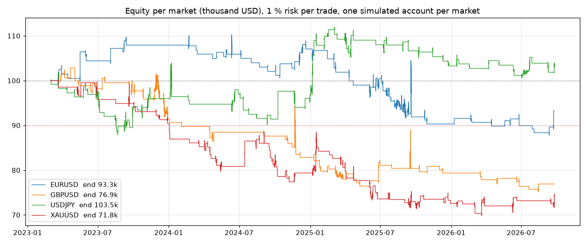

# Phase 2, first edition of the pure profile: the same four markets and years, run on the fixed code

Companion to the frozen run in the folder above (second edition of the pure profile, commit `1f7e2b5`). This batch runs
the **first edition** of `config/dorus_pure.yaml` (`profile_pure_v1.yaml` here: lone first candle accepted as a
confirmation, BOS accepted, minimum R:R 1.5, target on the liquidity of the POI's timeframe without the 1H floor, the
1-pip buffer off) on the same data, period and costs, with the code of commit `e24a0d8` (every fix of 1 October included;
the engine's default path is the same as `1f7e2b5`, see the slice check in the phase 2 README). Started 19:05 UTC, finished
19:43 UTC. The earlier diagnostic run of this edition (`../diagnostic/`, 397 trades, -52.9R) ran on the pre-fix code and is
superseded by this one. The code identity in the provenance files was taken at process start.

## Headline

| Market | Trades | Win rate | Expectancy | Total | Profit factor | End equity | Deepest drawdown (from peak) | First breach of the 10 % line |
|---|---|---|---|---|---|---|---|---|
| EURUSD | 90 | 27 % | -0.07R | -6.0R | 0.90 | 93,286 | -20.3 % (2026-09-11) | 2026-04-15 |
| GBPUSD | 71 | 19 % | -0.39R | -27.7R | 0.51 | 76,916 | -26.9 % (2026-08-13) | 2024-02-02 |
| USDJPY | 108 | 28 % | +0.02R | +2.3R | 1.03 | 103,473 | -13.7 % (2023-08-22) | 2023-08-17 |
| XAUUSD | 122 | 20 % | -0.27R | -33.1R | 0.65 | 71,753 | -30.4 % (2026-03-20) | 2024-01-02 |
| **all four** | **391** | **24 %** | **-0.17R** | **-64.5R** | **0.78** | | | |

## Against the second edition (frozen run, same data and code path)

| | First edition (this folder) | Second edition (`../`) |
|---|---|---|
| Trades | 391 | 324 |
| Winners | 24 % | 33 % |
| Average winner / loser | +2.5R / -1.0R | +1.7R / -1.0R |
| Expectancy | -0.17R | -0.11R |
| Total | -64.5R (net of commission -85.9R) | -36.7R (net -48.1R) |
| Profit factor | 0.78 | 0.83 |
| Markets positive | USDJPY +2.3R | USDJPY +13.3R |
| 10 % line crossed | EURUSD, GBPUSD, USDJPY, XAUUSD | EURUSD, GBPUSD, XAUUSD |
| Entries with the lone first candle | 179 trades, -23.8R | none (off) |
| Entries under one hour after the touch | 184 trades, -42.5R | 72 trades, -22.1R |
| Planned R:R above 5 | 72 trades, -39.4R | 34 trades, -7.4R |

Reading: the first edition loses more because it takes more and worse trades, not because its winners are smaller (its
average winner is larger). The lone first candle supplies 179 of its 391 entries and most of the entries within an hour
of the touch; the POI-timeframe targets push 72 trades above 5R planned, of which 3 won. Removing both, which is what
the second edition did on the strength of his own words (D 13:48, A 01:21:00, A 01:54:49), takes the result from -64.5R to
-36.7R. It does not make the result positive, so the remaining loss sits in what both editions share: the zone reading,
the stop's P, the hours and the 5-minute confirmation standing in for the 1-minute one.

## Files

Per market: `<market>_5m_pure_v1.csv` (ledger, with the new columns `confirmed_close_at`, `stop_p`, `stop_tf`,
`stop_p_open`, `stop_p_close`, `stop_basis`), `.equity_1H.csv` and `.equity.csv.gz`, `.provenance.json` (code identity at
start), `.run.txt` (console log with the rejection funnel), `<market>_equity.png`; plus `equity_all.png`, `headline.csv` and
`profile_pure_v1.yaml`. Tables below from the same report script as the phase 2 README.

## Tables

Distinct zones behind each rejection (not candles; a zone can appear under several reasons)

| Reason | EURUSD | GBPUSD | USDJPY | XAUUSD |
|---|---|---|---|---|
| (not recorded in this run) | | | | |

By year

| Year | Trades | Wins | Losses | Expectancy | Total |
|---|---|---|---|---|---|
| 2023 | 87 | 19 | 64 | -0.17R | -14.7R |
| 2024 | 104 | 22 | 78 | -0.21R | -21.8R |
| 2025 | 147 | 33 | 105 | -0.17R | -24.6R |
| 2026 | 53 | 15 | 37 | -0.06R | -3.4R |

By POI timeframe

| POI | Trades | Wins | Losses | Expectancy | Total |
|---|---|---|---|---|---|
| 1D | 30 | 6 | 24 | -0.41R | -12.2R |
| 1H | 215 | 43 | 167 | -0.22R | -47.9R |
| 1M | 10 | 0 | 8 | -0.80R | -8.0R |
| 1W | 16 | 5 | 5 | +0.21R | +3.4R |
| 4H | 120 | 35 | 80 | +0.00R | +0.2R |

By confirmation

| Confirmation | Trades | Wins | Losses | Expectancy | Total |
|---|---|---|---|---|---|
| BMS | 93 | 24 | 66 | -0.17R | -15.6R |
| BOS | 51 | 15 | 31 | -0.04R | -2.0R |
| BS | 68 | 13 | 53 | -0.34R | -23.1R |
| first_candle | 179 | 37 | 134 | -0.13R | -23.8R |

By direction

| Direction | Trades | Wins | Losses | Expectancy | Total |
|---|---|---|---|---|---|
| LONG | 282 | 63 | 205 | -0.17R | -49.0R |
| SHORT | 109 | 26 | 79 | -0.14R | -15.5R |

By target timeframe

| Target on | Trades | Wins | Losses | Expectancy | Total |
|---|---|---|---|---|---|
| 15m | 140 | 30 | 109 | -0.25R | -34.6R |
| 1D | 47 | 7 | 35 | -0.43R | -20.0R |
| 1H | 114 | 29 | 82 | -0.08R | -8.8R |
| 1M | 5 | 1 | 4 | +0.41R | +2.1R |
| 1W | 18 | 1 | 10 | -0.46R | -8.4R |
| 4H | 67 | 21 | 44 | +0.08R | +5.2R |

By planned R:R

| Planned R:R | Trades | Wins | Losses | Expectancy | Total |
|---|---|---|---|---|---|
| 1.5-2 | 111 | 33 | 77 | -0.12R | -13.1R |
| 2-3 | 95 | 25 | 69 | +0.03R | +2.7R |
| 3-5 | 70 | 9 | 56 | -0.31R | -21.5R |
| <1.5 | 43 | 19 | 24 | +0.15R | +6.6R |
| >5 | 72 | 3 | 58 | -0.55R | -39.4R |

By entry hour (Amsterdam)

| Hour | Trades | Wins | Losses | Expectancy | Total |
|---|---|---|---|---|---|
| 9 | 65 | 9 | 51 | -0.52R | -33.7R |
| 10 | 55 | 15 | 39 | +0.03R | +1.5R |
| 11 | 45 | 11 | 32 | -0.12R | -5.3R |
| 12 | 50 | 11 | 37 | -0.15R | -7.7R |
| 13 | 36 | 13 | 22 | +0.12R | +4.4R |
| 14 | 26 | 7 | 18 | +0.01R | +0.2R |
| 15 | 50 | 7 | 42 | -0.47R | -23.6R |
| 16 | 64 | 16 | 43 | -0.00R | -0.2R |

By time from the zone touch to the entry

| Since touch | Trades | Wins | Losses | Expectancy | Total |
|---|---|---|---|---|---|
| 1-3d | 32 | 6 | 26 | -0.39R | -12.4R |
| 1-4h | 60 | 16 | 42 | -0.03R | -1.9R |
| 4-24h | 56 | 12 | 42 | -0.29R | -16.2R |
| <1h | 184 | 36 | 142 | -0.23R | -42.5R |
| >3d | 59 | 19 | 32 | +0.14R | +8.4R |

By entry distance beyond the zone edge (in zone heights)

| Entry | Trades | Wins | Losses | Expectancy | Total |
|---|---|---|---|---|---|
| 0-25% beyond | 21 | 2 | 18 | -0.64R | -13.5R |
| inside zone | 370 | 87 | 266 | -0.14R | -51.1R |

By visit number (1 = first return to the zone)

| Visit | Trades | Wins | Losses | Expectancy | Total |
|---|---|---|---|---|---|
| 1 | 391 | 89 | 284 | -0.17R | -64.5R |

FTMO lens (1 % risk per trade, R curve per symbol)

| Symbol | Trades | Total | Worst run | First 10R drawdown | 10R drawdowns | Worst single day |
|---|---|---|---|---|---|---|
| EURUSD | 90 | -6.0R | -24.0R | 2025-04-11 | 3 | -2.0R |
| GBPUSD | 71 | -27.7R | -32.3R | 2023-12-20 | 2 | -3.0R |
| USDJPY | 108 | +2.3R | -12.1R | 2023-08-17 | 6 | -3.0R |
| XAUUSD | 122 | -33.1R | -35.0R | 2023-12-28 | 1 | -2.0R |

By exit

| Exit | Trades | Total |
|---|---|---|
| breakeven | 19 | -2.2R |
| stop | 283 | -287.1R |
| take_profit | 89 | +224.7R |
