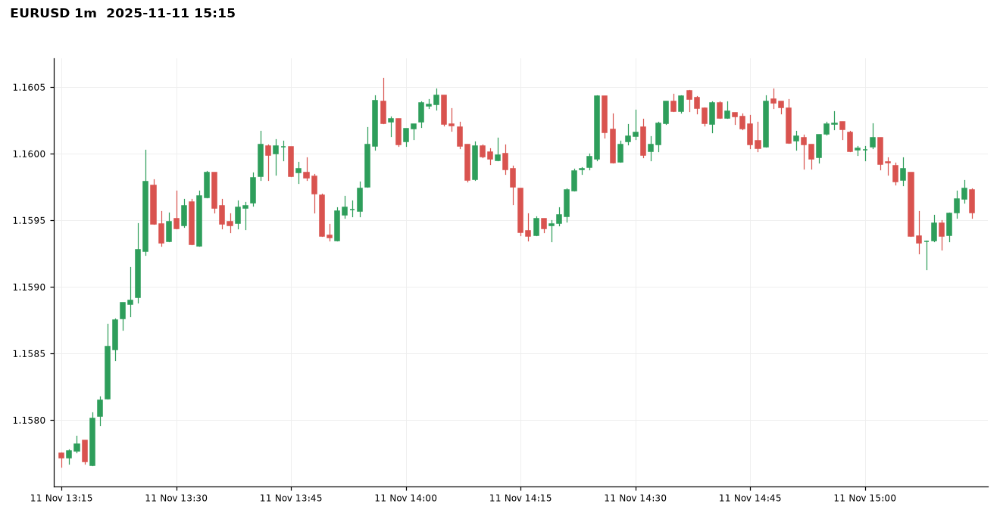
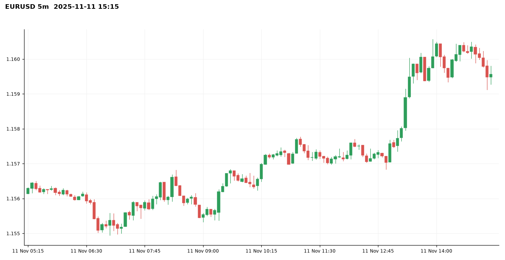
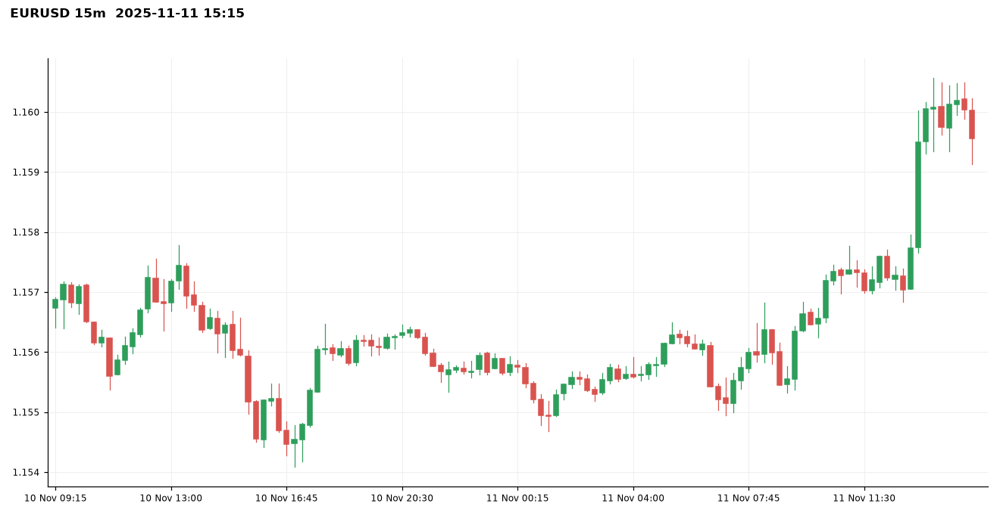
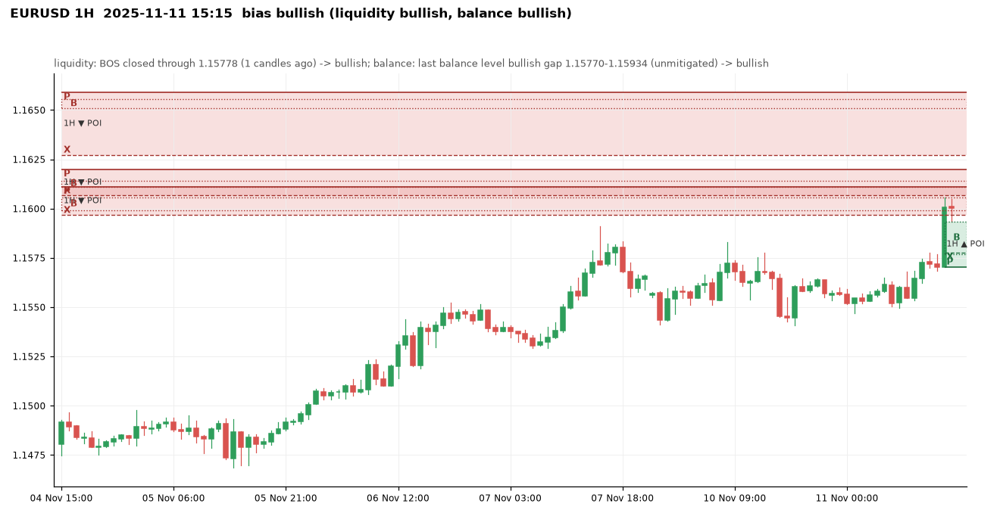
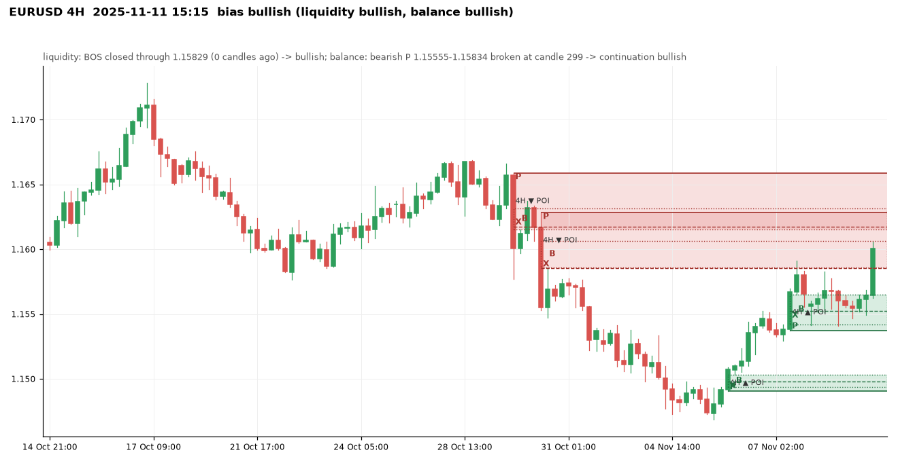
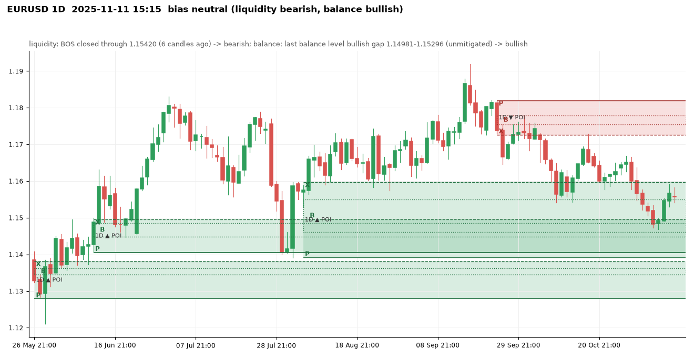
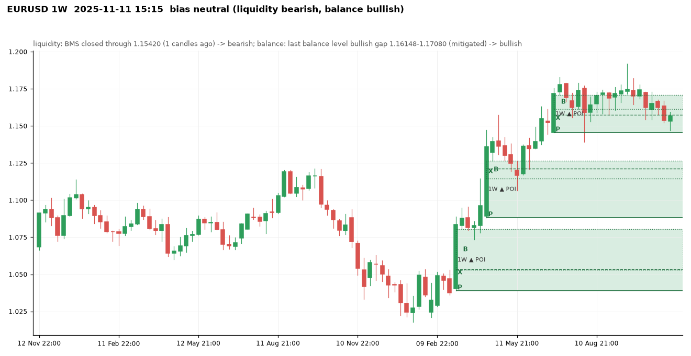
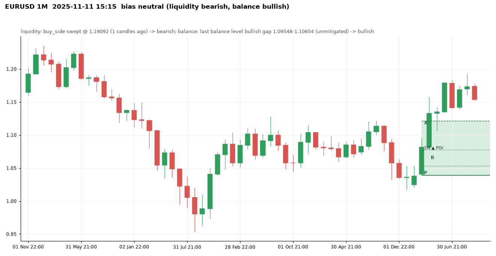

# EURUSD at 2025-11-11 15:15 UTC

Price 1.15956. Decision: **neutral**, none: fewer than 3 timeframes agree (1M=50/50, 1W=50/50, 1D=50/50, 4H=bullish, 1H=bullish) -> no trade

Visit memory: warm-up replay of 5732 steps before this moment.

## 1m

Balance levels: 80 kept of 109 three-candle gaps in the window; 29 dropped by the size threshold (20% of the median range before them).

| Dropped gap (candle 3) | Side | Width | Required |
|---|---|---|---|
| 2025-11-11 13:57 | bullish | 0.00003 | 0.00003 |
| 2025-11-11 14:02 | bullish | 0.00001 | 0.00003 |
| 2025-11-11 14:28 | bearish | 0.00002 | 0.00004 |
| 2025-11-11 14:30 | bullish | 0.00001 | 0.00004 |
| 2025-11-11 14:56 | bullish | 0.00004 | 0.00004 |
| 2025-11-11 14:58 | bearish | 0.00001 | 0.00004 |
| 2025-11-11 15:08 | bearish | 0.00003 | 0.00004 |
| 2025-11-11 15:12 | bullish | 0.00002 | 0.00004 |

## 5m

Balance levels: 68 kept of 100 three-candle gaps in the window; 32 dropped by the size threshold (20% of the median range before them).

| Dropped gap (candle 3) | Side | Width | Required |
|---|---|---|---|
| 2025-11-11 02:35 | bearish | 0.00001 | 0.00003 |
| 2025-11-11 02:45 | bearish | 0.00003 | 0.00003 |
| 2025-11-11 03:05 | bullish | 0.00003 | 0.00003 |
| 2025-11-11 05:20 | bullish | 0.00001 | 0.00003 |
| 2025-11-11 08:55 | bearish | 0.00003 | 0.00004 |
| 2025-11-11 09:35 | bullish | 0.00002 | 0.00004 |
| 2025-11-11 14:15 | bearish | 0.00005 | 0.00006 |
| 2025-11-11 15:05 | bearish | 0.00002 | 0.00007 |

## 15m

Balance levels: 59 kept of 85 three-candle gaps in the window; 26 dropped by the size threshold (20% of the median range before them).

| Dropped gap (candle 3) | Side | Width | Required |
|---|---|---|---|
| 2025-11-10 19:15 | bullish | 0.00001 | 0.00010 |
| 2025-11-11 01:45 | bullish | 0.00003 | 0.00009 |
| 2025-11-11 02:00 | bullish | 0.00003 | 0.00009 |
| 2025-11-11 02:45 | bearish | 0.00004 | 0.00009 |
| 2025-11-11 03:15 | bullish | 0.00005 | 0.00009 |
| 2025-11-11 07:45 | bullish | 0.00002 | 0.00008 |
| 2025-11-11 09:00 | bearish | 0.00004 | 0.00008 |
| 2025-11-11 09:45 | bullish | 0.00003 | 0.00008 |

## 1H

Bias **bullish**: liquidity view bullish, balance view bullish.

- liquidity: BOS closed through 1.15778 (1 candles ago) -> bullish
- balance: last balance level bullish gap 1.15770-1.15934 (unmitigated) -> bullish
- aligned -> bullish

| Zone | Low | High | X | B | P | Formed | Status | Visits (a visit stays open until a close 1.5 zone heights beyond the zone) |
|---|---|---|---|---|---|---|---|---|
| bullish | 1.16086 | 1.16278 | 1.16278 | 1.16156-1.16206 | 1.16086 | 2025-10-24 14:00 | invalidated |  |
| bearish | 1.16207 | 1.16322 | 1.16207 | 1.16278-1.16302 | 1.16322 | 2025-10-27 07:00 | invalidated |  |
| bullish | 1.16350 | 1.16490 | 1.16490 | 1.16415-1.16440 | 1.16350 | 2025-10-27 19:00 | invalidated |  |
| bullish | 1.16446 | 1.16520 | 1.16520 | 1.16458-1.16494 | 1.16446 | 2025-10-28 00:00 | invalidated |  |
| bearish | 1.16404 | 1.16598 | 1.16451 | 1.16404-1.16549 | 1.16598 | 2025-10-28 13:00 | invalidated |  |
| bearish | 1.16313 | 1.16559 | 1.16313 | 1.16479-1.16528 | 1.16559 | 2025-10-29 05:00 | invalidated |  |
| bullish | 1.16448 | 1.16606 | 1.16606 | 1.16513-1.16554 | 1.16448 | 2025-10-29 16:00 | invalidated |  |
| bearish | 1.16273 | 1.16589 | 1.16273 | 1.16511-1.16554 | 1.16589 | 2025-10-29 18:00 | tested | 0 (no visit) |
| bearish | 1.16067 | 1.16199 | 1.16067 | 1.16111-1.16142 | 1.16199 | 2025-10-30 11:00 | fresh | 0 (no visit) |
| bearish | 1.15967 | 1.16111 | 1.15967 | 1.15990-1.16058 | 1.16111 | 2025-10-30 12:00 | tested | 1 (visit open) |
| bearish | 1.15425 | 1.15562 | 1.15548 | 1.15425-1.15531 | 1.15562 | 2025-10-31 14:00 | invalidated | 2 (visit open) |
| bearish | 1.15207 | 1.15400 | 1.15214 | 1.15207-1.15335 | 1.15400 | 2025-11-03 09:00 | invalidated | 1 (visit open) |
| bullish | 1.15059 | 1.15220 | 1.15220 | 1.15128-1.15214 | 1.15059 | 2025-11-03 16:00 | invalidated |  |
| bearish | 1.15100 | 1.15183 | 1.15159 | 1.15100-1.15184 | 1.15183 | 2025-11-04 01:00 | invalidated |  |
| bullish | 1.15113 | 1.15223 | 1.15176 | 1.15139-1.15223 | 1.15113 | 2025-11-04 07:00 | invalidated |  |
| bearish | 1.15073 | 1.15287 | 1.15073 | 1.15170-1.15223 | 1.15287 | 2025-11-04 09:00 | invalidated | 1 (visit open) |
| bearish | 1.14928 | 1.15056 | 1.14980 | 1.14928-1.14989 | 1.15056 | 2025-11-04 12:00 | invalidated | 3 (visit open) |
| bullish | 1.14802 | 1.14934 | 1.14934 | 1.14837-1.14859 | 1.14802 | 2025-11-05 23:00 | tested | 1 (no visit) |
| bullish | 1.14930 | 1.15007 | 1.14978 | 1.14969-1.15007 | 1.14930 | 2025-11-06 01:00 | fresh | 0 (no visit) |
| bullish | 1.15140 | 1.15290 | 1.15237 | 1.15210-1.15290 | 1.15140 | 2025-11-06 13:00 | tested | 1 (no visit) |
| bullish | 1.15374 | 1.15522 | 1.15522 | 1.15422-1.15493 | 1.15374 | 2025-11-07 11:00 | tested | 2 (no visit) |
| bullish | 1.15652 | 1.15775 | 1.15775 | 1.15696-1.15713 | 1.15652 | 2025-11-07 16:00 | invalidated | 1 (visit open) |
| bearish | 1.15513 | 1.15668 | 1.15513 | 1.15548-1.15592 | 1.15668 | 2025-11-10 16:00 | invalidated | 1 (visit open) |
| bullish | 1.15705 | 1.15934 | 1.15778 | 1.15770-1.15934 | 1.15705 | 2025-11-11 14:00 | fresh | 1 (visit open) |

Balance levels: 39 kept of 65 three-candle gaps in the window; 26 dropped by the size threshold (20% of the median range before them).

| Dropped gap (candle 3) | Side | Width | Required |
|---|---|---|---|
| 2025-11-06 02:00 | bullish | 0.00013 | 0.00017 |
| 2025-11-07 14:00 | bullish | 0.00002 | 0.00017 |
| 2025-11-07 20:00 | bearish | 0.00010 | 0.00017 |
| 2025-11-09 23:00 | bearish | 0.00006 | 0.00017 |
| 2025-11-10 08:00 | bullish | 0.00003 | 0.00017 |
| 2025-11-10 15:00 | bearish | 0.00001 | 0.00018 |
| 2025-11-11 01:00 | bearish | 0.00015 | 0.00017 |
| 2025-11-11 11:00 | bullish | 0.00014 | 0.00019 |

## 4H

Bias **bullish**: liquidity view bullish, balance view bullish.

- liquidity: BOS closed through 1.15829 (0 candles ago) -> bullish
- balance: bearish P 1.15555-1.15834 broken at candle 299 -> continuation bullish
- aligned -> bullish

| Zone | Low | High | X | B | P | Formed | Status | Visits (a visit stays open until a close 1.5 zone heights beyond the zone) |
|---|---|---|---|---|---|---|---|---|
| bearish | 1.17036 | 1.17626 | 1.17036 | 1.17297-1.17410 | 1.17626 | 2025-09-09 21:00 | invalidated |  |
| bullish | 1.16589 | 1.17306 | 1.17306 | 1.16951-1.17277 | 1.16589 | 2025-09-11 17:00 | invalidated |  |
| bullish | 1.17298 | 1.17508 | 1.17416 | 1.17441-1.17508 | 1.17298 | 2025-09-15 13:00 | invalidated |  |
| bullish | 1.17572 | 1.17799 | 1.17799 | 1.17686-1.17735 | 1.17572 | 2025-09-16 05:00 | invalidated |  |
| bearish | 1.17787 | 1.18163 | 1.17787 | 1.18049-1.18108 | 1.18163 | 2025-09-24 09:00 | fresh | 0 (no visit) |
| bearish | 1.16831 | 1.17455 | 1.17262 | 1.16831-1.17305 | 1.17455 | 2025-09-25 17:00 | invalidated |  |
| bearish | 1.17164 | 1.17583 | 1.17164 | 1.17265-1.17450 | 1.17583 | 2025-10-02 17:00 | tested | 0 (no visit) |
| bearish | 1.16829 | 1.17275 | 1.16829 | 1.17307-1.17382 | 1.17275 | 2025-10-06 05:00 | tested | 0 (no visit) |
| bearish | 1.16516 | 1.17072 | 1.16516 | 1.16828-1.16963 | 1.17072 | 2025-10-07 17:00 | invalidated |  |
| bearish | 1.16341 | 1.16530 | 1.16454 | 1.16341-1.16488 | 1.16530 | 2025-10-08 05:00 | invalidated |  |
| bearish | 1.15662 | 1.16231 | 1.15983 | 1.15662-1.16030 | 1.16231 | 2025-10-09 17:00 | invalidated |  |
| bearish | 1.15775 | 1.16047 | 1.15918 | 1.15775-1.15973 | 1.16047 | 2025-10-13 13:00 | invalidated |  |
| bullish | 1.15479 | 1.16305 | 1.16305 | 1.15631-1.16011 | 1.15479 | 2025-10-15 05:00 | invalidated |  |
| bearish | 1.16103 | 1.16374 | 1.16103 | 1.16274-1.16326 | 1.16374 | 2025-10-21 17:00 | invalidated |  |
| bearish | 1.16255 | 1.16559 | 1.16255 | 1.16377-1.16483 | 1.16559 | 2025-10-29 05:00 | invalidated |  |
| bearish | 1.16153 | 1.16589 | 1.16176 | 1.16153-1.16316 | 1.16589 | 2025-10-29 21:00 | tested | 0 (no visit) |
| bearish | 1.15853 | 1.16283 | 1.15853 | 1.15861-1.16066 | 1.16283 | 2025-10-30 13:00 | active | 1 (visit open) |
| bearish | 1.15395 | 1.15562 | 1.15470 | 1.15395-1.15531 | 1.15562 | 2025-10-31 17:00 | invalidated | 1 (visit open) |
| bearish | 1.15214 | 1.15413 | 1.15214 | 1.15220-1.15263 | 1.15413 | 2025-11-03 10:00 | invalidated | 1 (visit open) |
| bullish | 1.14905 | 1.15031 | 1.14978 | 1.14940-1.15031 | 1.14905 | 2025-11-06 02:00 | fresh | 0 (no visit) |
| bullish | 1.15374 | 1.15652 | 1.15522 | 1.15422-1.15652 | 1.15374 | 2025-11-07 14:00 | tested | 1 (visit open) |

Balance levels: 41 kept of 66 three-candle gaps in the window; 25 dropped by the size threshold (20% of the median range before them).

| Dropped gap (candle 3) | Side | Width | Required |
|---|---|---|---|
| 2025-10-20 21:00 | bearish | 0.00012 | 0.00048 |
| 2025-10-21 05:00 | bearish | 0.00016 | 0.00048 |
| 2025-10-21 13:00 | bearish | 0.00004 | 0.00047 |
| 2025-10-22 17:00 | bullish | 0.00028 | 0.00046 |
| 2025-10-23 05:00 | bearish | 0.00015 | 0.00044 |
| 2025-10-27 21:00 | bullish | 0.00008 | 0.00042 |
| 2025-10-28 01:00 | bullish | 0.00017 | 0.00042 |
| 2025-11-04 14:00 | bearish | 0.00032 | 0.00039 |

## 1D

Bias **neutral**: liquidity view bearish, balance view bullish.

- liquidity: BOS closed through 1.15420 (6 candles ago) -> bearish
- balance: last balance level bullish gap 1.14981-1.15296 (unmitigated) -> bullish
- conflicting / incomplete -> 50/50

| Zone | Low | High | X | B | P | Formed | Status | Visits (a visit stays open until a close 1.5 zone heights beyond the zone) |
|---|---|---|---|---|---|---|---|---|
| bearish | 1.04224 | 1.05129 | 1.04532 | 1.04224-1.04792 | 1.05129 | 2024-12-18 22:00 | invalidated |  |
| bearish | 1.03100 | 1.03759 | 1.03430 | 1.03100-1.03439 | 1.03759 | 2025-01-02 22:00 | invalidated |  |
| bullish | 1.04116 | 1.04539 | 1.04370 | 1.04380-1.04539 | 1.04116 | 2025-01-26 22:00 | invalidated |  |
| bullish | 1.03732 | 1.04471 | 1.04432 | 1.04299-1.04471 | 1.03732 | 2025-02-13 22:00 | tested | 0 (no visit) |
| bearish | 1.04009 | 1.04926 | 1.04009 | 1.04200-1.04750 | 1.04926 | 2025-02-27 22:00 | invalidated |  |
| bullish | 1.03886 | 1.05290 | 1.05290 | 1.04200-1.04710 | 1.03886 | 2025-03-03 22:00 | fresh | 0 (no visit) |
| bullish | 1.06020 | 1.07658 | 1.06300 | 1.06278-1.07658 | 1.06020 | 2025-03-05 22:00 | tested | 0 (no visit) |
| bullish | 1.09432 | 1.11902 | 1.11464 | 1.10952-1.11902 | 1.09432 | 2025-04-10 21:00 | tested | 0 (no visit) |
| bullish | 1.13958 | 1.14739 | 1.14739 | 1.13978-1.14175 | 1.13958 | 2025-04-21 21:00 | invalidated |  |
| bearish | 1.13080 | 1.13998 | 1.13080 | 1.13412-1.13704 | 1.13998 | 2025-04-30 21:00 | invalidated |  |
| bullish | 1.12790 | 1.13813 | 1.13813 | 1.13450-1.13624 | 1.12790 | 2025-05-25 21:00 | tested | 0 (no visit) |
| bullish | 1.14054 | 1.14951 | 1.14951 | 1.14478-1.14854 | 1.14054 | 2025-06-11 21:00 | tested | 1 (visit open) |
| bullish | 1.14536 | 1.16319 | 1.16319 | 1.15440-1.15746 | 1.14536 | 2025-06-24 21:00 | invalidated |  |
| bearish | 1.15569 | 1.17706 | 1.15569 | 1.15994-1.17030 | 1.17706 | 2025-07-28 21:00 | invalidated |  |
| bearish | 1.14463 | 1.15728 | 1.14463 | 1.14608-1.15190 | 1.15728 | 2025-07-30 21:00 | invalidated |  |
| bullish | 1.13916 | 1.15971 | 1.15971 | 1.14608-1.15496 | 1.13916 | 2025-08-05 21:00 | active | 1 (visit open) |
| bullish | 1.16480 | 1.17365 | 1.17365 | 1.16696-1.17036 | 1.16480 | 2025-09-07 21:00 | invalidated |  |
| bullish | 1.17574 | 1.18078 | 1.17801 | 1.17746-1.18078 | 1.17574 | 2025-09-16 21:00 | invalidated |  |
| bearish | 1.17262 | 1.18194 | 1.17262 | 1.17540-1.17790 | 1.18194 | 2025-09-24 21:00 | tested | 0 (no visit) |

Balance levels: 34 kept of 55 three-candle gaps in the window; 21 dropped by the size threshold (20% of the median range before them).

| Dropped gap (candle 3) | Side | Width | Required |
|---|---|---|---|
| 2025-08-28 21:00 | bullish | 0.00028 | 0.00167 |
| 2025-09-02 21:00 | bearish | 0.00046 | 0.00165 |
| 2025-09-15 21:00 | bullish | 0.00096 | 0.00161 |
| 2025-09-18 21:00 | bearish | 0.00150 | 0.00165 |
| 2025-09-29 21:00 | bullish | 0.00048 | 0.00156 |
| 2025-10-16 21:00 | bullish | 0.00024 | 0.00149 |
| 2025-11-02 22:00 | bearish | 0.00056 | 0.00139 |
| 2025-11-04 22:00 | bearish | 0.00071 | 0.00137 |

## 1W

Bias **neutral**: liquidity view bearish, balance view bullish.

- liquidity: BMS closed through 1.15420 (1 candles ago) -> bearish
- balance: last balance level bullish gap 1.16148-1.17080 (mitigated) -> bullish
- conflicting / incomplete -> 50/50

| Zone | Low | High | X | B | P | Formed | Status | Visits (a visit stays open until a close 1.5 zone heights beyond the zone) |
|---|---|---|---|---|---|---|---|---|
| bearish | 1.06901 | 1.08851 | 1.06950 | 1.06901-1.07245 | 1.08851 | 2024-04-14 21:00 | invalidated |  |
| bullish | 1.07100 | 1.08951 | 1.08951 | 1.07465-1.08044 | 1.07100 | 2024-07-07 21:00 | invalidated |  |
| bearish | 1.09973 | 1.12090 | 1.10020 | 1.09973-1.10832 | 1.12090 | 2024-10-06 21:00 | invalidated |  |
| bearish | 1.07774 | 1.09367 | 1.07774 | 1.08718-1.09001 | 1.09367 | 2024-11-03 22:00 | invalidated |  |
| bearish | 1.06098 | 1.07280 | 1.06660 | 1.06098-1.06826 | 1.07280 | 2024-11-17 22:00 | invalidated |  |
| bullish | 1.03886 | 1.08050 | 1.05333 | 1.05290-1.08050 | 1.03886 | 2025-03-09 21:00 | tested | 0 (no visit) |
| bullish | 1.08814 | 1.12640 | 1.12142 | 1.11464-1.12640 | 1.08814 | 2025-04-13 21:00 | tested | 0 (no visit) |
| bullish | 1.14536 | 1.17080 | 1.15734 | 1.16148-1.17080 | 1.14536 | 2025-06-29 21:00 | active | 1 (visit open) |

Balance levels: 11 kept of 20 three-candle gaps in the window; 9 dropped by the size threshold (20% of the median range before them).

| Dropped gap (candle 3) | Side | Width | Required |
|---|---|---|---|
| 2024-02-04 22:00 | bearish | 0.00174 | 0.00280 |
| 2024-03-10 21:00 | bullish | 0.00070 | 0.00254 |
| 2024-03-24 21:00 | bearish | 0.00086 | 0.00254 |
| 2024-05-19 21:00 | bullish | 0.00139 | 0.00258 |
| 2024-08-18 21:00 | bullish | 0.00139 | 0.00250 |
| 2024-10-13 21:00 | bearish | 0.00147 | 0.00254 |
| 2024-12-22 22:00 | bearish | 0.00070 | 0.00258 |
| 2025-04-06 21:00 | bullish | 0.00231 | 0.00274 |

## 1M

Bias **neutral**: liquidity view bearish, balance view bullish.

- liquidity: buy_side swept @ 1.19092 (1 candles ago) -> bearish
- balance: last balance level bullish gap 1.09548-1.10654 (unmitigated) -> bullish
- conflicting / incomplete -> 50/50

| Zone | Low | High | X | B | P | Formed | Status | Visits (a visit stays open until a close 1.5 zone heights beyond the zone) |
|---|---|---|---|---|---|---|---|---|
| bearish | 1.06011 | 1.09374 | 1.06011 | 1.06300-1.07612 | 1.09374 | 2024-12-01 22:00 | invalidated |  |
| bullish | 1.03886 | 1.12142 | 1.12142 | 1.05290-1.07783 | 1.03886 | 2025-03-31 21:00 | tested | 0 (no visit) |

Balance levels: 5 kept of 13 three-candle gaps in the window; 8 dropped by the size threshold (20% of the median range before them).

| Dropped gap (candle 3) | Side | Width | Required |
|---|---|---|---|
| 2020-12-31 22:00 | bullish | 0.00503 | 0.00786 |
| 2021-06-30 21:00 | bearish | 0.00772 | 0.00786 |
| 2022-03-31 21:00 | bearish | 0.00300 | 0.00723 |
| 2022-05-01 21:00 | bearish | 0.00190 | 0.00747 |
| 2023-10-01 21:00 | bearish | 0.00712 | 0.00818 |
| 2023-11-30 22:00 | bullish | 0.00291 | 0.00818 |
| 2024-09-01 21:00 | bullish | 0.00538 | 0.00783 |
| 2024-10-31 21:00 | bearish | 0.00646 | 0.00774 |

## Rejections at this moment

- fewer than 3 timeframes agree (1M=50/50, 1W=50/50, 1D=50/50, 4H=bullish, 1H=bullish) -> no trade
- diagnostic: walking on as SHORT past the bias gate; nothing below is a signal
- 4H bearish POI 1.15853-1.16283 (active, formed 2025-10-30 13:00:00): touched at 2025-11-07 15:03:00, waiting for confirmation on 5m/15m/1H
- diagnostic: 1M bearish POI 1.06011-1.09374 (invalidated, formed 2024-12-01 22:00:00) is invalidated, price above it
- diagnostic: 1W bearish POI 1.06098-1.07280 (invalidated, formed 2024-11-17 22:00:00) is invalidated, price above it
- diagnostic: 1W bearish POI 1.07774-1.09367 (invalidated, formed 2024-11-03 22:00:00) is invalidated, price above it
- diagnostic: 1W bearish POI 1.09973-1.12090 (invalidated, formed 2024-10-06 21:00:00) is invalidated, price above it
- diagnostic: 1W bearish POI 1.06901-1.08851 (invalidated, formed 2024-04-14 21:00:00) is invalidated, price above it
- diagnostic: 1D bearish POI 1.17262-1.18194 (tested, formed 2025-09-24 21:00:00) is tested, price below it
- diagnostic: 1D bearish POI 1.14463-1.15728 (invalidated, formed 2025-07-30 21:00:00) is invalidated, price above it
- diagnostic: 1D bearish POI 1.15569-1.17706 (invalidated, formed 2025-07-28 21:00:00) is invalidated, price inside it
