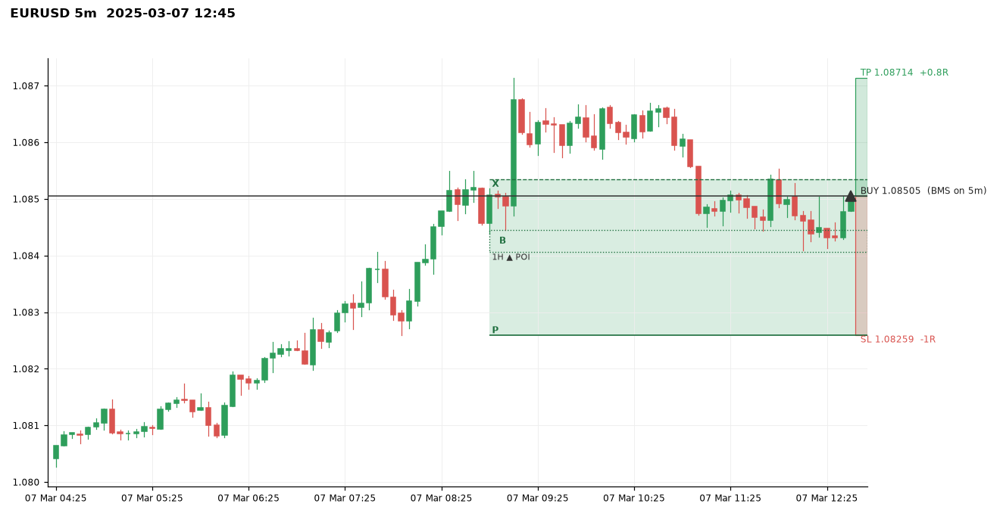
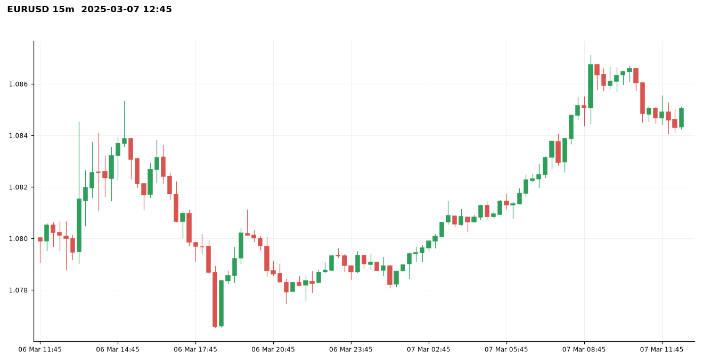
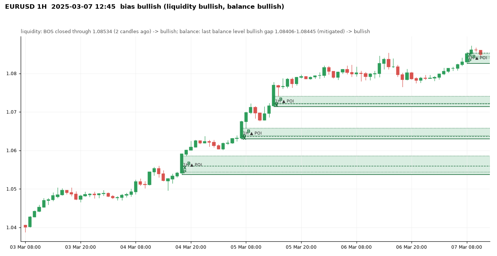
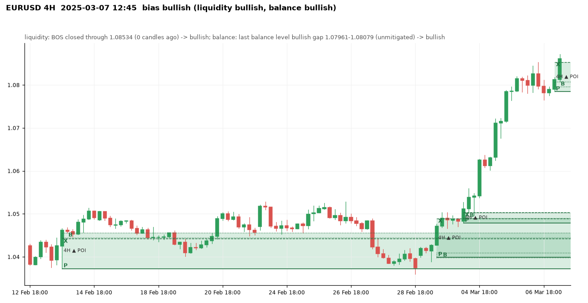
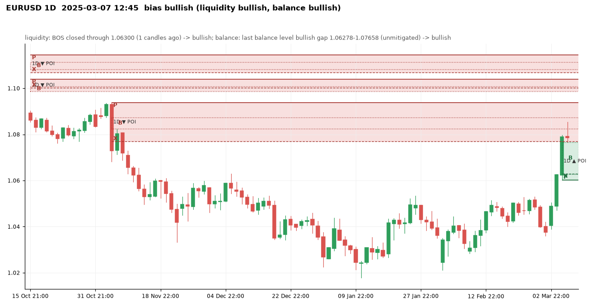
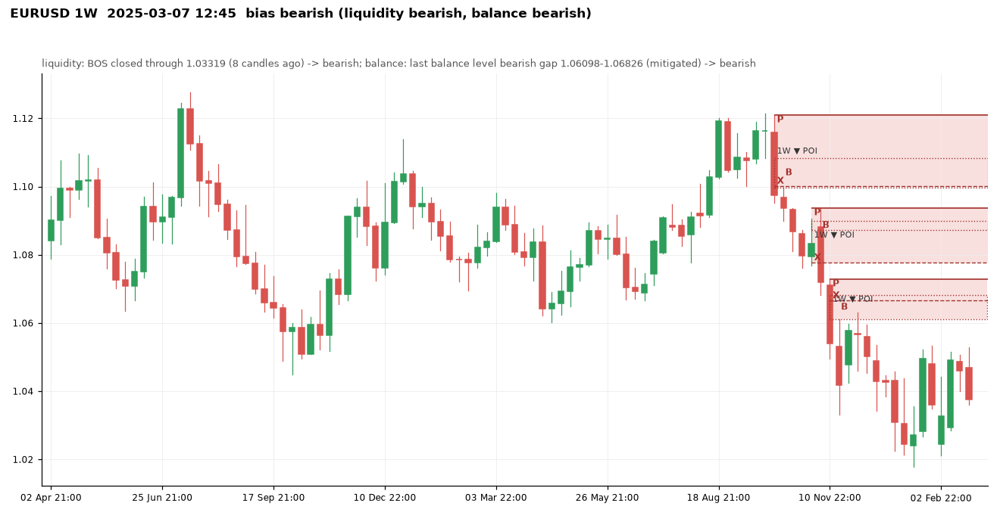
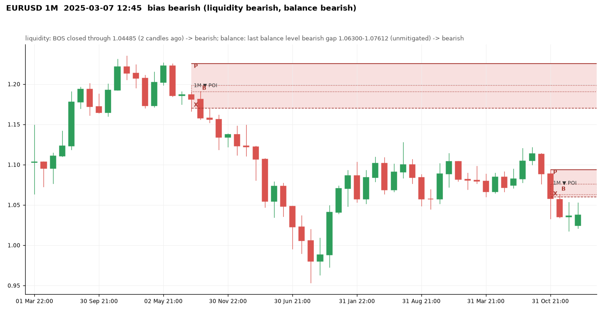

# EURUSD at 2025-03-07 12:45 UTC

Price 1.08505. Decision: **bullish**, scalp: bullish: 1D+4H+1H aligned -> scalp only

## 5m

Balance levels: 74 kept of 102 three-candle gaps in the window; 28 dropped by the size threshold (20% of the median range before them).

| Dropped gap (candle 3) | Side | Width | Required |
|---|---|---|---|
| 2025-03-07 01:50 | bullish | 0.00001 | 0.00008 |
| 2025-03-07 02:15 | bullish | 0.00005 | 0.00008 |
| 2025-03-07 03:10 | bullish | 0.00002 | 0.00007 |
| 2025-03-07 04:10 | bullish | 0.00004 | 0.00007 |
| 2025-03-07 04:50 | bullish | 0.00002 | 0.00007 |
| 2025-03-07 05:45 | bullish | 0.00001 | 0.00006 |
| 2025-03-07 06:45 | bullish | 0.00002 | 0.00006 |
| 2025-03-07 11:55 | bullish | 0.00004 | 0.00008 |

## 15m

Balance levels: 56 kept of 87 three-candle gaps in the window; 31 dropped by the size threshold (20% of the median range before them).

| Dropped gap (candle 3) | Side | Width | Required |
|---|---|---|---|
| 2025-03-06 17:45 | bearish | 0.00018 | 0.00020 |
| 2025-03-06 20:15 | bearish | 0.00004 | 0.00020 |
| 2025-03-06 21:15 | bearish | 0.00013 | 0.00020 |
| 2025-03-06 23:15 | bullish | 0.00019 | 0.00020 |
| 2025-03-07 02:15 | bullish | 0.00013 | 0.00020 |
| 2025-03-07 03:15 | bullish | 0.00015 | 0.00020 |
| 2025-03-07 05:45 | bullish | 0.00009 | 0.00020 |
| 2025-03-07 11:00 | bearish | 0.00004 | 0.00018 |

## 1H

Bias **bullish**: liquidity view bullish, balance view bullish.

- liquidity: BOS closed through 1.08534 (2 candles ago) -> bullish
- balance: last balance level bullish gap 1.08406-1.08445 (mitigated) -> bullish
- aligned -> bullish

| Zone | Low | High | X | B | P | Formed | Status | Visits |
|---|---|---|---|---|---|---|---|---|
| bearish | 1.04188 | 1.04412 | 1.04188 | 1.04247-1.04273 | 1.04412 | 2025-02-19 16:00 | invalidated |  |
| bullish | 1.04417 | 1.04640 | 1.04613 | 1.04605-1.04640 | 1.04417 | 2025-02-20 16:00 | invalidated |  |
| bearish | 1.04843 | 1.05005 | 1.04843 | 1.04940-1.04970 | 1.05005 | 2025-02-21 08:00 | invalidated |  |
| bearish | 1.04576 | 1.04859 | 1.04592 | 1.04576-1.04699 | 1.04859 | 2025-02-21 16:00 | invalidated |  |
| bullish | 1.04618 | 1.04705 | 1.04678 | 1.04619-1.04705 | 1.04618 | 2025-02-23 23:00 | invalidated |  |
| bullish | 1.04716 | 1.05021 | 1.04923 | 1.04846-1.05021 | 1.04716 | 2025-02-24 01:00 | invalidated |  |
| bullish | 1.05021 | 1.05154 | 1.05054 | 1.05071-1.05154 | 1.05021 | 2025-02-24 02:00 | invalidated |  |
| bullish | 1.04714 | 1.04882 | 1.04799 | 1.04739-1.04882 | 1.04714 | 2025-02-25 12:00 | invalidated |  |
| bullish | 1.05119 | 1.05195 | 1.05191 | 1.05141-1.05195 | 1.05119 | 2025-02-26 00:00 | invalidated |  |
| bullish | 1.04791 | 1.05113 | 1.05113 | 1.04924-1.05017 | 1.04791 | 2025-02-26 16:00 | invalidated |  |
| bearish | 1.04747 | 1.04878 | 1.04747 | 1.04831-1.04856 | 1.04878 | 2025-02-27 02:00 | invalidated |  |
| bearish | 1.04416 | 1.04893 | 1.04560 | 1.04416-1.04729 | 1.04893 | 2025-02-27 14:00 | invalidated |  |
| bearish | 1.03990 | 1.04052 | 1.04001 | 1.03990-1.04013 | 1.04052 | 2025-02-27 22:00 | invalidated |  |
| bullish | 1.03977 | 1.04052 | 1.04042 | 1.04011-1.04052 | 1.03977 | 2025-02-28 13:00 | invalidated |  |
| bearish | 1.03736 | 1.03980 | 1.03922 | 1.03736-1.03898 | 1.03980 | 2025-02-28 19:00 | invalidated |  |
| bullish | 1.04012 | 1.04270 | 1.04231 | 1.04065-1.04270 | 1.04012 | 2025-03-03 10:00 | fresh | 0 (outside) |
| bullish | 1.04861 | 1.05093 | 1.04959 | 1.05003-1.05093 | 1.04861 | 2025-03-04 09:00 | tested | 0 (outside) |
| bullish | 1.05096 | 1.05358 | 1.05287 | 1.05194-1.05358 | 1.05096 | 2025-03-04 12:00 | tested | 0 (outside) |
| bullish | 1.05376 | 1.05863 | 1.05596 | 1.05439-1.05863 | 1.05376 | 2025-03-04 19:00 | fresh | 0 (outside) |
| bullish | 1.06294 | 1.06585 | 1.06369 | 1.06388-1.06585 | 1.06294 | 2025-03-05 08:00 | fresh | 0 (outside) |
| bullish | 1.07137 | 1.07408 | 1.07220 | 1.07225-1.07408 | 1.07137 | 2025-03-05 15:00 | fresh | 0 (outside) |
| bullish | 1.07905 | 1.08221 | 1.08221 | 1.08067-1.08111 | 1.07905 | 2025-03-06 14:00 | invalidated |  |
| bearish | 1.07840 | 1.08222 | 1.07840 | 1.08017-1.08153 | 1.08222 | 2025-03-06 18:00 | invalidated |  |
| bullish | 1.08259 | 1.08534 | 1.08534 | 1.08406-1.08445 | 1.08259 | 2025-03-07 09:00 | active | 1 (inside) |

Balance levels: 50 kept of 67 three-candle gaps in the window; 17 dropped by the size threshold (20% of the median range before them).

| Dropped gap (candle 3) | Side | Width | Required |
|---|---|---|---|
| 2025-03-03 13:00 | bullish | 0.00013 | 0.00022 |
| 2025-03-03 15:00 | bullish | 0.00002 | 0.00022 |
| 2025-03-04 17:00 | bullish | 0.00025 | 0.00025 |
| 2025-03-07 03:00 | bullish | 0.00035 | 0.00037 |
| 2025-03-07 04:00 | bullish | 0.00035 | 0.00037 |
| 2025-03-07 07:00 | bullish | 0.00024 | 0.00037 |
| 2025-03-07 08:00 | bullish | 0.00009 | 0.00037 |
| 2025-03-07 10:00 | bullish | 0.00021 | 0.00037 |

## 4H

Bias **bullish**: liquidity view bullish, balance view bullish.

- liquidity: BOS closed through 1.08534 (0 candles ago) -> bullish
- balance: last balance level bullish gap 1.07961-1.08079 (unmitigated) -> bullish
- aligned -> bullish

| Zone | Low | High | X | B | P | Formed | Status | Visits |
|---|---|---|---|---|---|---|---|---|
| bearish | 1.03717 | 1.04199 | 1.03717 | 1.03942-1.03996 | 1.04199 | 2024-12-31 14:00 | invalidated |  |
| bearish | 1.03239 | 1.03568 | 1.03440 | 1.03239-1.03461 | 1.03568 | 2025-01-02 14:00 | invalidated |  |
| bullish | 1.03076 | 1.03756 | 1.03756 | 1.03182-1.03287 | 1.03076 | 2025-01-06 10:00 | invalidated |  |
| bullish | 1.03799 | 1.04243 | 1.04243 | 1.03909-1.03963 | 1.03799 | 2025-01-07 06:00 | invalidated |  |
| bullish | 1.02435 | 1.02867 | 1.02774 | 1.02731-1.02867 | 1.02435 | 2025-01-14 18:00 | invalidated |  |
| bullish | 1.02868 | 1.03306 | 1.03306 | 1.02929-1.02994 | 1.02868 | 2025-01-20 10:00 | invalidated |  |
| bullish | 1.03728 | 1.04367 | 1.04367 | 1.03778-1.04157 | 1.03728 | 2025-01-22 06:00 | invalidated |  |
| bullish | 1.04158 | 1.04471 | 1.04378 | 1.04230-1.04471 | 1.04158 | 2025-01-24 06:00 | invalidated |  |
| bullish | 1.04471 | 1.04636 | 1.04583 | 1.04537-1.04636 | 1.04471 | 2025-01-24 10:00 | invalidated |  |
| bearish | 1.04414 | 1.04932 | 1.04539 | 1.04414-1.04791 | 1.04932 | 2025-01-28 02:00 | invalidated |  |
| bearish | 1.04082 | 1.04434 | 1.04137 | 1.04082-1.04256 | 1.04434 | 2025-01-29 10:00 | invalidated |  |
| bearish | 1.03822 | 1.04322 | 1.03822 | 1.04022-1.04093 | 1.04322 | 2025-01-31 10:00 | invalidated |  |
| bearish | 1.02698 | 1.04217 | 1.03719 | 1.02698-1.03601 | 1.04217 | 2025-02-02 22:00 | invalidated |  |
| bearish | 1.02432 | 1.02698 | 1.03420 | 1.02432-1.03496 | 1.02698 | 2025-02-03 02:00 | invalidated |  |
| bullish | 1.03399 | 1.03742 | 1.03503 | 1.03432-1.03742 | 1.03399 | 2025-02-04 18:00 | invalidated |  |
| bullish | 1.03740 | 1.04013 | 1.03874 | 1.03860-1.04013 | 1.03740 | 2025-02-05 10:00 | invalidated |  |
| bearish | 1.03381 | 1.03886 | 1.03523 | 1.03381-1.03489 | 1.03886 | 2025-02-07 18:00 | invalidated |  |
| bullish | 1.02998 | 1.03363 | 1.03363 | 1.03058-1.03143 | 1.02998 | 2025-02-11 14:00 | tested | 0 (outside) |
| bullish | 1.03964 | 1.04340 | 1.04340 | 1.04017-1.04101 | 1.03964 | 2025-02-13 06:00 | invalidated |  |
| bullish | 1.03727 | 1.04559 | 1.04424 | 1.04451-1.04559 | 1.03727 | 2025-02-13 22:00 | tested | 0 (outside) |
| bearish | 1.04667 | 1.04862 | 1.04667 | 1.04723-1.04791 | 1.04862 | 2025-02-18 02:00 | invalidated |  |
| bearish | 1.04350 | 1.04613 | 1.04350 | 1.04352-1.04446 | 1.04613 | 2025-02-19 10:00 | invalidated |  |
| bullish | 1.04417 | 1.04852 | 1.04613 | 1.04546-1.04852 | 1.04417 | 2025-02-20 18:00 | invalidated |  |
| bullish | 1.04618 | 1.05098 | 1.05054 | 1.04678-1.05098 | 1.04618 | 2025-02-24 02:00 | invalidated |  |
| bearish | 1.04416 | 1.04893 | 1.04560 | 1.04416-1.04639 | 1.04893 | 2025-02-27 14:00 | invalidated |  |
| bullish | 1.03992 | 1.04893 | 1.04893 | 1.03980-1.04099 | 1.03992 | 2025-03-03 14:00 | tested | 0 (outside) |
| bullish | 1.04789 | 1.05036 | 1.05036 | 1.04900-1.05024 | 1.04789 | 2025-03-04 10:00 | tested | 0 (outside) |
| bullish | 1.07845 | 1.08534 | 1.08534 | 1.07961-1.08079 | 1.07845 | 2025-03-07 06:00 | active | 1 (inside) |

Balance levels: 48 kept of 62 three-candle gaps in the window; 14 dropped by the size threshold (20% of the median range before them).

| Dropped gap (candle 3) | Side | Width | Required |
|---|---|---|---|
| 2025-01-22 10:00 | bullish | 0.00008 | 0.00052 |
| 2025-02-05 22:00 | bearish | 0.00002 | 0.00059 |
| 2025-02-06 06:00 | bearish | 0.00025 | 0.00054 |
| 2025-02-11 22:00 | bullish | 0.00025 | 0.00055 |
| 2025-02-25 14:00 | bullish | 0.00038 | 0.00048 |
| 2025-02-27 18:00 | bearish | 0.00014 | 0.00046 |
| 2025-02-28 10:00 | bullish | 0.00007 | 0.00044 |
| 2025-03-03 10:00 | bullish | 0.00039 | 0.00046 |

## 1D

Bias **bullish**: liquidity view bullish, balance view bullish.

- liquidity: BOS closed through 1.06300 (1 candles ago) -> bullish
- balance: last balance level bullish gap 1.06278-1.07658 (unmitigated) -> bullish
- aligned -> bullish

| Zone | Low | High | X | B | P | Formed | Status | Visits |
|---|---|---|---|---|---|---|---|---|
| bearish | 1.07245 | 1.08665 | 1.07245 | 1.07566-1.08477 | 1.08665 | 2024-04-11 21:00 | invalidated |  |
| bullish | 1.07244 | 1.07552 | 1.07530 | 1.07302-1.07552 | 1.07244 | 2024-05-05 21:00 | invalidated |  |
| bullish | 1.08130 | 1.08766 | 1.08766 | 1.08257-1.08545 | 1.08130 | 2024-05-15 21:00 | invalidated |  |
| bearish | 1.07882 | 1.09023 | 1.07882 | 1.08017-1.08620 | 1.09023 | 2024-06-09 21:00 | invalidated |  |
| bullish | 1.07364 | 1.07837 | 1.07614 | 1.07472-1.07837 | 1.07364 | 2024-07-03 21:00 | invalidated |  |
| bullish | 1.08280 | 1.08617 | 1.08450 | 1.08308-1.08617 | 1.08280 | 2024-07-11 21:00 | invalidated |  |
| bullish | 1.07818 | 1.09482 | 1.09482 | 1.08354-1.08926 | 1.07818 | 2024-08-04 21:00 | invalidated |  |
| bullish | 1.09138 | 1.10089 | 1.10089 | 1.09394-1.09830 | 1.09138 | 2024-08-13 21:00 | invalidated |  |
| bullish | 1.10228 | 1.10718 | 1.10474 | 1.10298-1.10718 | 1.10228 | 2024-08-19 21:00 | invalidated |  |
| bearish | 1.10264 | 1.10911 | 1.10264 | 1.10496-1.10657 | 1.10911 | 2024-09-09 21:00 | invalidated |  |
| bearish | 1.10686 | 1.11442 | 1.10686 | 1.10829-1.11137 | 1.11442 | 2024-10-01 21:00 | fresh | 0 (outside) |
| bearish | 1.09870 | 1.10396 | 1.10020 | 1.09870-1.10084 | 1.10396 | 2024-10-06 21:00 | tested | 0 (outside) |
| bullish | 1.08080 | 1.08441 | 1.08394 | 1.08264-1.08441 | 1.08080 | 2024-10-30 21:00 | invalidated |  |
| bearish | 1.07690 | 1.09374 | 1.07690 | 1.08248-1.08726 | 1.09374 | 2024-11-06 22:00 | active | 1 (inside) |
| bearish | 1.06632 | 1.07280 | 1.06826 | 1.06632-1.06868 | 1.07280 | 2024-11-11 22:00 | invalidated |  |
| bearish | 1.05825 | 1.06546 | 1.06011 | 1.05825-1.05950 | 1.06546 | 2024-11-13 22:00 | invalidated |  |
| bearish | 1.04224 | 1.05129 | 1.04532 | 1.04224-1.04792 | 1.05129 | 2024-12-18 22:00 | invalidated |  |
| bearish | 1.03100 | 1.03759 | 1.03430 | 1.03100-1.03439 | 1.03759 | 2025-01-02 22:00 | invalidated |  |
| bullish | 1.04116 | 1.04539 | 1.04370 | 1.04380-1.04539 | 1.04116 | 2025-01-26 22:00 | invalidated |  |
| bullish | 1.03732 | 1.04471 | 1.04432 | 1.04299-1.04471 | 1.03732 | 2025-02-13 22:00 | tested | 0 (outside) |
| bearish | 1.04009 | 1.04926 | 1.04009 | 1.04200-1.04750 | 1.04926 | 2025-02-27 22:00 | invalidated |  |
| bullish | 1.03886 | 1.05290 | 1.05290 | 1.04200-1.04710 | 1.03886 | 2025-03-03 22:00 | fresh | 0 (outside) |
| bullish | 1.06020 | 1.07658 | 1.06300 | 1.06278-1.07658 | 1.06020 | 2025-03-05 22:00 | fresh | 0 (outside) |

Balance levels: 35 kept of 60 three-candle gaps in the window; 25 dropped by the size threshold (20% of the median range before them).

| Dropped gap (candle 3) | Side | Width | Required |
|---|---|---|---|
| 2024-10-16 21:00 | bearish | 0.00077 | 0.00106 |
| 2024-10-22 21:00 | bearish | 0.00042 | 0.00104 |
| 2024-11-21 22:00 | bearish | 0.00087 | 0.00115 |
| 2024-12-02 22:00 | bearish | 0.00063 | 0.00118 |
| 2025-01-14 22:00 | bullish | 0.00082 | 0.00128 |
| 2025-01-20 22:00 | bullish | 0.00109 | 0.00130 |
| 2025-01-28 22:00 | bearish | 0.00101 | 0.00138 |
| 2025-02-18 22:00 | bearish | 0.00057 | 0.00141 |

## 1W

Bias **bearish**: liquidity view bearish, balance view bearish.

- liquidity: BOS closed through 1.03319 (8 candles ago) -> bearish
- balance: last balance level bearish gap 1.06098-1.06826 (mitigated) -> bearish
- aligned -> bearish

| Zone | Low | High | X | B | P | Formed | Status | Visits |
|---|---|---|---|---|---|---|---|---|
| bullish | 1.07331 | 1.10120 | 1.10120 | 1.07872-1.08444 | 1.07331 | 2023-07-09 21:00 | invalidated |  |
| bearish | 1.08336 | 1.11498 | 1.08336 | 1.10459-1.11078 | 1.11498 | 2023-08-20 21:00 | invalidated |  |
| bearish | 1.06901 | 1.08851 | 1.06950 | 1.06901-1.07245 | 1.08851 | 2024-04-14 21:00 | invalidated |  |
| bullish | 1.07100 | 1.08951 | 1.08951 | 1.07465-1.08044 | 1.07100 | 2024-07-07 21:00 | invalidated |  |
| bearish | 1.09973 | 1.12090 | 1.10020 | 1.09973-1.10832 | 1.12090 | 2024-10-06 21:00 | fresh | 0 (outside) |
| bearish | 1.07774 | 1.09367 | 1.07774 | 1.08718-1.09001 | 1.09367 | 2024-11-03 22:00 | active | 1 (inside) |
| bearish | 1.06098 | 1.07280 | 1.06660 | 1.06098-1.06826 | 1.07280 | 2024-11-17 22:00 | tested | 1 (inside) |

Balance levels: 13 kept of 24 three-candle gaps in the window; 11 dropped by the size threshold (20% of the median range before them).

| Dropped gap (candle 3) | Side | Width | Required |
|---|---|---|---|
| 2024-01-07 22:00 | bearish | 0.00083 | 0.00316 |
| 2024-02-04 22:00 | bearish | 0.00174 | 0.00298 |
| 2024-03-10 21:00 | bullish | 0.00070 | 0.00289 |
| 2024-03-24 21:00 | bearish | 0.00086 | 0.00288 |
| 2024-05-19 21:00 | bullish | 0.00139 | 0.00287 |
| 2024-08-18 21:00 | bullish | 0.00139 | 0.00275 |
| 2024-10-13 21:00 | bearish | 0.00147 | 0.00273 |
| 2024-12-22 22:00 | bearish | 0.00070 | 0.00277 |

## 1M

Bias **bearish**: liquidity view bearish, balance view bearish.

- liquidity: BOS closed through 1.04485 (2 candles ago) -> bearish
- balance: last balance level bearish gap 1.06300-1.07612 (unmitigated) -> bearish
- aligned -> bearish

| Zone | Low | High | X | B | P | Formed | Status | Visits |
|---|---|---|---|---|---|---|---|---|
| bearish | 1.17042 | 1.22545 | 1.17042 | 1.19088-1.19860 | 1.22545 | 2021-08-31 21:00 | fresh | 0 (outside) |
| bearish | 1.06011 | 1.09374 | 1.06011 | 1.06300-1.07612 | 1.09374 | 2024-12-01 22:00 | active | 1 (inside) |

Balance levels: 5 kept of 15 three-candle gaps in the window; 10 dropped by the size threshold (20% of the median range before them).

| Dropped gap (candle 3) | Side | Width | Required |
|---|---|---|---|
| 2020-11-30 22:00 | bullish | 0.00441 | 0.00758 |
| 2020-12-31 22:00 | bullish | 0.00503 | 0.00764 |
| 2022-03-31 21:00 | bearish | 0.00300 | 0.00723 |
| 2022-05-01 21:00 | bearish | 0.00190 | 0.00740 |
| 2023-10-01 21:00 | bearish | 0.00712 | 0.00798 |
| 2023-11-30 22:00 | bullish | 0.00291 | 0.00798 |
| 2024-09-01 21:00 | bullish | 0.00538 | 0.00774 |
| 2024-10-31 21:00 | bearish | 0.00646 | 0.00768 |

## Rejections at this moment

- 4H bullish POI 1.07845-1.08534 (active, formed 2025-03-07 06:00:00): R:R 0.31 below minimum 0.7 (target 1H buy-side liquidity 1.08714 (x1))

## Setup

LONG from the 1H zone 1.08259-1.08534, BMS on 5m at 2025-03-07 12:40:00, entry 1.08505, stop 1.08259, target 1.08714 (1H buy-side liquidity 1.08714 (x1)), R:R 1:0.82, visit 1.
