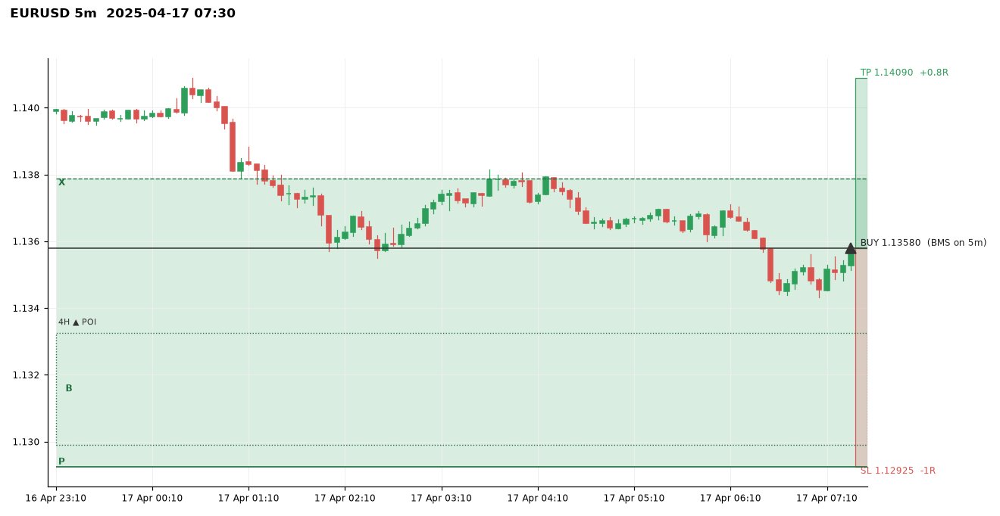
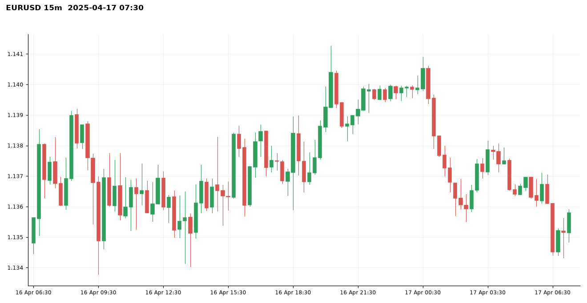
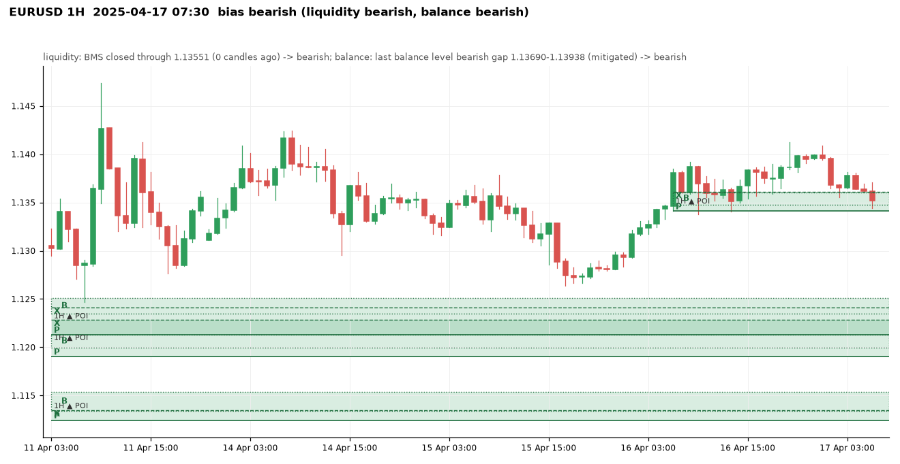
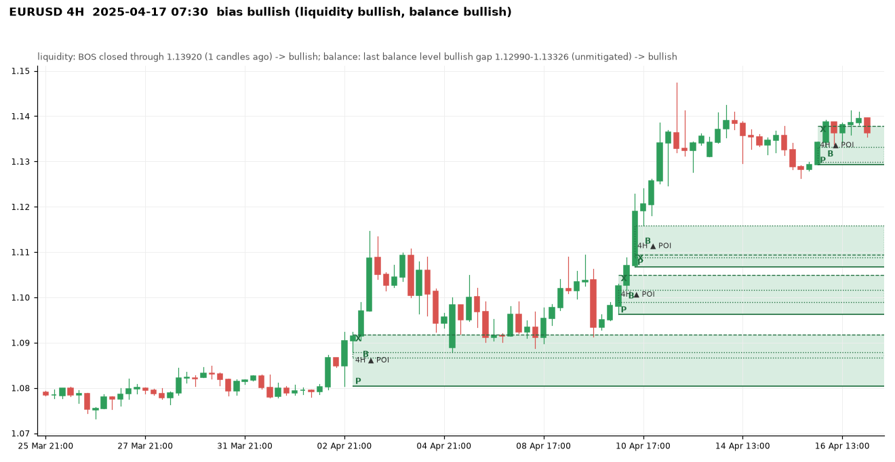
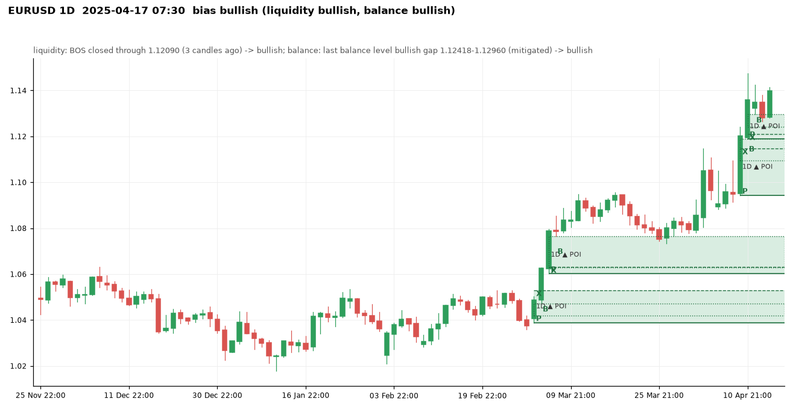
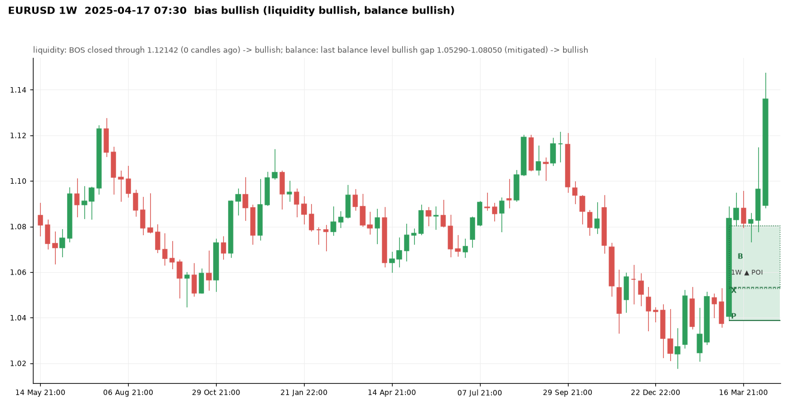
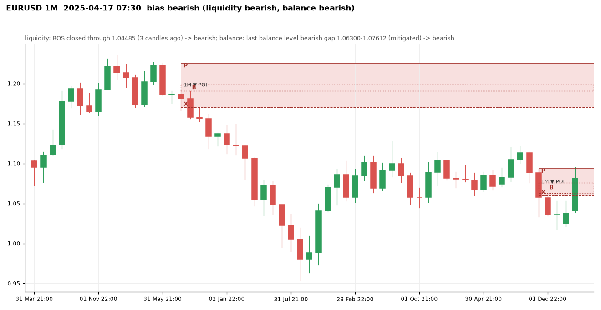

# EURUSD at 2025-04-17 07:30 UTC

Price 1.13580. Decision: **bullish**, full: bullish: 1W+1D+4H aligned -> full trade allowed

## 5m

Balance levels: 58 kept of 78 three-candle gaps in the window; 20 dropped by the size threshold (20% of the median range before them).

| Dropped gap (candle 3) | Side | Width | Required |
|---|---|---|---|
| 2025-04-16 21:05 | bearish | 0.00014 | 0.00015 |
| 2025-04-16 21:30 | bullish | 0.00007 | 0.00014 |
| 2025-04-16 21:55 | bullish | 0.00002 | 0.00014 |
| 2025-04-16 23:05 | bullish | 0.00003 | 0.00012 |
| 2025-04-17 03:10 | bullish | 0.00002 | 0.00010 |
| 2025-04-17 04:20 | bullish | 0.00004 | 0.00009 |
| 2025-04-17 04:40 | bearish | 0.00001 | 0.00009 |
| 2025-04-17 05:50 | bullish | 0.00006 | 0.00008 |

## 15m

Balance levels: 51 kept of 96 three-candle gaps in the window; 45 dropped by the size threshold (20% of the median range before them).

| Dropped gap (candle 3) | Side | Width | Required |
|---|---|---|---|
| 2025-04-16 09:15 | bearish | 0.00017 | 0.00022 |
| 2025-04-16 09:30 | bearish | 0.00021 | 0.00022 |
| 2025-04-16 14:15 | bullish | 0.00004 | 0.00023 |
| 2025-04-16 21:45 | bullish | 0.00016 | 0.00022 |
| 2025-04-17 01:00 | bearish | 0.00012 | 0.00022 |
| 2025-04-17 01:45 | bearish | 0.00004 | 0.00022 |
| 2025-04-17 03:00 | bullish | 0.00007 | 0.00022 |
| 2025-04-17 03:15 | bullish | 0.00022 | 0.00022 |

## 1H

Bias **bearish**: liquidity view bearish, balance view bearish.

- liquidity: BMS closed through 1.13551 (0 candles ago) -> bearish
- balance: last balance level bearish gap 1.13690-1.13938 (mitigated) -> bearish
- aligned -> bearish

| Zone | Low | High | X | B | P | Formed | Status | Visits |
|---|---|---|---|---|---|---|---|---|
| bearish | 1.07983 | 1.08184 | 1.07986 | 1.07983-1.08145 | 1.08184 | 2025-04-01 12:00 | invalidated |  |
| bullish | 1.07961 | 1.08147 | 1.08081 | 1.08061-1.08147 | 1.07961 | 2025-04-02 14:00 | tested | 0 (outside) |
| bullish | 1.08187 | 1.08508 | 1.08299 | 1.08291-1.08508 | 1.08187 | 2025-04-02 16:00 | tested | 0 (outside) |
| bullish | 1.08373 | 1.08795 | 1.08730 | 1.08391-1.08795 | 1.08373 | 2025-04-03 01:00 | tested | 0 (outside) |
| bullish | 1.09063 | 1.09346 | 1.09244 | 1.09162-1.09346 | 1.09063 | 2025-04-03 07:00 | invalidated |  |
| bearish | 1.10364 | 1.10861 | 1.10364 | 1.10669-1.10783 | 1.10861 | 2025-04-04 08:00 | invalidated |  |
| bearish | 1.09204 | 1.09660 | 1.09242 | 1.09204-1.09272 | 1.09660 | 2025-04-06 22:00 | invalidated |  |
| bullish | 1.09479 | 1.10006 | 1.10006 | 1.09543-1.09777 | 1.09479 | 2025-04-07 06:00 | invalidated |  |
| bullish | 1.09146 | 1.09524 | 1.09524 | 1.09189-1.09375 | 1.09146 | 2025-04-08 02:00 | invalidated |  |
| bearish | 1.09110 | 1.09357 | 1.09110 | 1.09194-1.09267 | 1.09357 | 2025-04-08 16:00 | invalidated |  |
| bullish | 1.09546 | 1.09684 | 1.09684 | 1.09571-1.09662 | 1.09546 | 2025-04-09 00:00 | invalidated |  |
| bullish | 1.09709 | 1.10137 | 1.09778 | 1.09849-1.10137 | 1.09709 | 2025-04-09 02:00 | invalidated |  |
| bearish | 1.09829 | 1.10632 | 1.09976 | 1.09829-1.10132 | 1.10632 | 2025-04-09 19:00 | invalidated |  |
| bullish | 1.10334 | 1.10948 | 1.10948 | 1.10477-1.10547 | 1.10334 | 2025-04-10 13:00 | tested | 0 (outside) |
| bullish | 1.11243 | 1.11534 | 1.11349 | 1.11342-1.11534 | 1.11243 | 2025-04-10 16:00 | fresh | 0 (outside) |
| bullish | 1.11903 | 1.12287 | 1.12287 | 1.11995-1.12130 | 1.11903 | 2025-04-11 00:00 | fresh | 0 (outside) |
| bullish | 1.12130 | 1.12510 | 1.12414 | 1.12346-1.12510 | 1.12130 | 2025-04-11 01:00 | tested | 0 (outside) |
| bullish | 1.12839 | 1.13541 | 1.13541 | 1.12902-1.13488 | 1.12839 | 2025-04-11 09:00 | invalidated |  |
| bullish | 1.13488 | 1.13852 | 1.13852 | 1.13688-1.13847 | 1.13488 | 2025-04-11 10:00 | invalidated |  |
| bullish | 1.13407 | 1.13642 | 1.13617 | 1.13489-1.13642 | 1.13407 | 2025-04-14 02:00 | invalidated |  |
| bearish | 1.13412 | 1.13885 | 1.13526 | 1.13412-1.13722 | 1.13885 | 2025-04-14 14:00 | invalidated |  |
| bullish | 1.13409 | 1.13610 | 1.13610 | 1.13477-1.13603 | 1.13409 | 2025-04-16 07:00 | active | 2 (inside) |

Balance levels: 47 kept of 71 three-candle gaps in the window; 24 dropped by the size threshold (20% of the median range before them).

| Dropped gap (candle 3) | Side | Width | Required |
|---|---|---|---|
| 2025-04-11 17:00 | bearish | 0.00002 | 0.00066 |
| 2025-04-14 00:00 | bullish | 0.00011 | 0.00067 |
| 2025-04-14 03:00 | bullish | 0.00003 | 0.00067 |
| 2025-04-14 18:00 | bearish | 0.00050 | 0.00072 |
| 2025-04-14 20:00 | bullish | 0.00021 | 0.00071 |
| 2025-04-15 01:00 | bearish | 0.00063 | 0.00070 |
| 2025-04-15 21:00 | bullish | 0.00028 | 0.00065 |
| 2025-04-16 05:00 | bullish | 0.00009 | 0.00060 |

## 4H

Bias **bullish**: liquidity view bullish, balance view bullish.

- liquidity: BOS closed through 1.13920 (1 candles ago) -> bullish
- balance: last balance level bullish gap 1.12990-1.13326 (unmitigated) -> bullish
- aligned -> bullish

| Zone | Low | High | X | B | P | Formed | Status | Visits |
|---|---|---|---|---|---|---|---|---|
| bullish | 1.02998 | 1.03363 | 1.03363 | 1.03058-1.03143 | 1.02998 | 2025-02-11 14:00 | tested | 0 (outside) |
| bearish | 1.04667 | 1.04862 | 1.04667 | 1.04723-1.04791 | 1.04862 | 2025-02-18 02:00 | invalidated |  |
| bearish | 1.04350 | 1.04613 | 1.04350 | 1.04352-1.04446 | 1.04613 | 2025-02-19 10:00 | invalidated |  |
| bullish | 1.04417 | 1.04852 | 1.04613 | 1.04546-1.04852 | 1.04417 | 2025-02-20 18:00 | invalidated |  |
| bullish | 1.04618 | 1.05098 | 1.05054 | 1.04678-1.05098 | 1.04618 | 2025-02-24 02:00 | invalidated |  |
| bearish | 1.04416 | 1.04893 | 1.04560 | 1.04416-1.04639 | 1.04893 | 2025-02-27 14:00 | invalidated |  |
| bullish | 1.03992 | 1.04893 | 1.04893 | 1.03980-1.04099 | 1.03992 | 2025-03-03 14:00 | tested | 0 (outside) |
| bullish | 1.04789 | 1.05036 | 1.05036 | 1.04900-1.05024 | 1.04789 | 2025-03-04 10:00 | tested | 0 (outside) |
| bullish | 1.07845 | 1.08534 | 1.08534 | 1.07961-1.08079 | 1.07845 | 2025-03-07 06:00 | invalidated |  |
| bullish | 1.08354 | 1.08810 | 1.08744 | 1.08615-1.08810 | 1.08354 | 2025-03-11 09:00 | invalidated |  |
| bullish | 1.08769 | 1.09125 | 1.09125 | 1.08867-1.08968 | 1.08769 | 2025-03-17 13:00 | invalidated |  |
| bearish | 1.08924 | 1.09360 | 1.08924 | 1.09174-1.09279 | 1.09360 | 2025-03-19 13:00 | invalidated |  |
| bearish | 1.08684 | 1.09032 | 1.08731 | 1.08684-1.09003 | 1.09032 | 2025-03-20 09:00 | invalidated |  |
| bearish | 1.08520 | 1.08684 | 1.08603 | 1.08520-1.08629 | 1.08684 | 2025-03-20 13:00 | invalidated |  |
| bearish | 1.07970 | 1.08303 | 1.07970 | 1.08130-1.08215 | 1.08303 | 2025-03-24 17:00 | invalidated |  |
| bearish | 1.07574 | 1.07891 | 1.07767 | 1.07574-1.07673 | 1.07891 | 2025-03-26 21:00 | invalidated |  |
| bullish | 1.07847 | 1.08210 | 1.08210 | 1.07918-1.08120 | 1.07847 | 2025-03-28 17:00 | invalidated |  |
| bullish | 1.07961 | 1.08467 | 1.08299 | 1.08081-1.08467 | 1.07961 | 2025-04-02 17:00 | tested | 0 (outside) |
| bullish | 1.08047 | 1.09171 | 1.09171 | 1.08675-1.08795 | 1.08047 | 2025-04-03 05:00 | tested | 0 (outside) |
| bullish | 1.09709 | 1.10091 | 1.09916 | 1.09849-1.10091 | 1.09709 | 2025-04-09 05:00 | invalidated |  |
| bullish | 1.09624 | 1.10498 | 1.10498 | 1.09891-1.10159 | 1.09624 | 2025-04-10 09:00 | fresh | 0 (outside) |
| bullish | 1.10677 | 1.11584 | 1.10948 | 1.10883-1.11584 | 1.10677 | 2025-04-10 17:00 | fresh | 0 (outside) |
| bearish | 1.12918 | 1.13413 | 1.12956 | 1.12918-1.13139 | 1.13413 | 2025-04-15 17:00 | invalidated |  |
| bullish | 1.12925 | 1.13789 | 1.13789 | 1.12990-1.13326 | 1.12925 | 2025-04-16 05:00 | active | 1 (inside) |

Balance levels: 42 kept of 51 three-candle gaps in the window; 9 dropped by the size threshold (20% of the median range before them).

| Dropped gap (candle 3) | Side | Width | Required |
|---|---|---|---|
| 2025-02-25 14:00 | bullish | 0.00038 | 0.00045 |
| 2025-02-27 18:00 | bearish | 0.00014 | 0.00046 |
| 2025-02-28 10:00 | bullish | 0.00007 | 0.00045 |
| 2025-03-03 10:00 | bullish | 0.00039 | 0.00046 |
| 2025-03-25 21:00 | bearish | 0.00030 | 0.00067 |
| 2025-04-08 05:00 | bullish | 0.00008 | 0.00058 |
| 2025-04-14 17:00 | bearish | 0.00010 | 0.00079 |
| 2025-04-16 01:00 | bullish | 0.00007 | 0.00085 |

## 1D

Bias **bullish**: liquidity view bullish, balance view bullish.

- liquidity: BOS closed through 1.12090 (3 candles ago) -> bullish
- balance: last balance level bullish gap 1.12418-1.12960 (mitigated) -> bullish
- aligned -> bullish

| Zone | Low | High | X | B | P | Formed | Status | Visits |
|---|---|---|---|---|---|---|---|---|
| bearish | 1.08048 | 1.08608 | 1.08048 | 1.08452-1.08549 | 1.08608 | 2024-05-29 21:00 | invalidated |  |
| bearish | 1.07882 | 1.09023 | 1.07882 | 1.08017-1.08620 | 1.09023 | 2024-06-09 21:00 | invalidated |  |
| bullish | 1.07364 | 1.07837 | 1.07614 | 1.07472-1.07837 | 1.07364 | 2024-07-03 21:00 | invalidated |  |
| bullish | 1.08280 | 1.08617 | 1.08450 | 1.08308-1.08617 | 1.08280 | 2024-07-11 21:00 | invalidated |  |
| bullish | 1.07818 | 1.09482 | 1.09482 | 1.08354-1.08926 | 1.07818 | 2024-08-04 21:00 | invalidated |  |
| bullish | 1.09138 | 1.10089 | 1.10089 | 1.09394-1.09830 | 1.09138 | 2024-08-13 21:00 | invalidated |  |
| bullish | 1.10228 | 1.10718 | 1.10474 | 1.10298-1.10718 | 1.10228 | 2024-08-19 21:00 | invalidated |  |
| bearish | 1.10264 | 1.10911 | 1.10264 | 1.10496-1.10657 | 1.10911 | 2024-09-09 21:00 | invalidated |  |
| bearish | 1.10686 | 1.11442 | 1.10686 | 1.10829-1.11137 | 1.11442 | 2024-10-01 21:00 | invalidated |  |
| bearish | 1.09870 | 1.10396 | 1.10020 | 1.09870-1.10084 | 1.10396 | 2024-10-06 21:00 | invalidated |  |
| bullish | 1.08080 | 1.08441 | 1.08394 | 1.08264-1.08441 | 1.08080 | 2024-10-30 21:00 | invalidated |  |
| bearish | 1.07690 | 1.09374 | 1.07690 | 1.08248-1.08726 | 1.09374 | 2024-11-06 22:00 | invalidated |  |
| bearish | 1.06632 | 1.07280 | 1.06826 | 1.06632-1.06868 | 1.07280 | 2024-11-11 22:00 | invalidated |  |
| bearish | 1.04224 | 1.05129 | 1.04532 | 1.04224-1.04792 | 1.05129 | 2024-12-18 22:00 | invalidated |  |
| bearish | 1.03100 | 1.03759 | 1.03430 | 1.03100-1.03439 | 1.03759 | 2025-01-02 22:00 | invalidated |  |
| bullish | 1.04116 | 1.04539 | 1.04370 | 1.04380-1.04539 | 1.04116 | 2025-01-26 22:00 | invalidated |  |
| bullish | 1.03732 | 1.04471 | 1.04432 | 1.04299-1.04471 | 1.03732 | 2025-02-13 22:00 | tested | 0 (outside) |
| bearish | 1.04009 | 1.04926 | 1.04009 | 1.04200-1.04750 | 1.04926 | 2025-02-27 22:00 | invalidated |  |
| bullish | 1.03886 | 1.05290 | 1.05290 | 1.04200-1.04710 | 1.03886 | 2025-03-03 22:00 | fresh | 0 (outside) |
| bullish | 1.06020 | 1.07658 | 1.06300 | 1.06278-1.07658 | 1.06020 | 2025-03-05 22:00 | tested | 0 (outside) |
| bullish | 1.09432 | 1.11902 | 1.11464 | 1.10952-1.11902 | 1.09432 | 2025-04-10 21:00 | fresh | 0 (outside) |
| bullish | 1.11902 | 1.12960 | 1.12090 | 1.12418-1.12960 | 1.11902 | 2025-04-13 21:00 | tested | 1 (inside) |

Balance levels: 35 kept of 57 three-candle gaps in the window; 22 dropped by the size threshold (20% of the median range before them).

| Dropped gap (candle 3) | Side | Width | Required |
|---|---|---|---|
| 2024-10-22 21:00 | bearish | 0.00042 | 0.00104 |
| 2024-11-21 22:00 | bearish | 0.00087 | 0.00115 |
| 2024-12-02 22:00 | bearish | 0.00063 | 0.00118 |
| 2025-01-14 22:00 | bullish | 0.00082 | 0.00128 |
| 2025-01-20 22:00 | bullish | 0.00109 | 0.00130 |
| 2025-01-28 22:00 | bearish | 0.00101 | 0.00138 |
| 2025-02-18 22:00 | bearish | 0.00057 | 0.00141 |
| 2025-03-11 21:00 | bullish | 0.00010 | 0.00151 |

## 1W

Bias **bullish**: liquidity view bullish, balance view bullish.

- liquidity: BOS closed through 1.12142 (0 candles ago) -> bullish
- balance: last balance level bullish gap 1.05290-1.08050 (mitigated) -> bullish
- aligned -> bullish

| Zone | Low | High | X | B | P | Formed | Status | Visits |
|---|---|---|---|---|---|---|---|---|
| bullish | 1.07331 | 1.10120 | 1.10120 | 1.07872-1.08444 | 1.07331 | 2023-07-09 21:00 | invalidated |  |
| bearish | 1.08336 | 1.11498 | 1.08336 | 1.10459-1.11078 | 1.11498 | 2023-08-20 21:00 | invalidated |  |
| bearish | 1.06901 | 1.08851 | 1.06950 | 1.06901-1.07245 | 1.08851 | 2024-04-14 21:00 | invalidated |  |
| bullish | 1.07100 | 1.08951 | 1.08951 | 1.07465-1.08044 | 1.07100 | 2024-07-07 21:00 | invalidated |  |
| bearish | 1.09973 | 1.12090 | 1.10020 | 1.09973-1.10832 | 1.12090 | 2024-10-06 21:00 | invalidated |  |
| bearish | 1.07774 | 1.09367 | 1.07774 | 1.08718-1.09001 | 1.09367 | 2024-11-03 22:00 | invalidated |  |
| bearish | 1.06098 | 1.07280 | 1.06660 | 1.06098-1.06826 | 1.07280 | 2024-11-17 22:00 | invalidated |  |
| bullish | 1.03886 | 1.08050 | 1.05333 | 1.05290-1.08050 | 1.03886 | 2025-03-09 21:00 | tested | 0 (outside) |

Balance levels: 14 kept of 26 three-candle gaps in the window; 12 dropped by the size threshold (20% of the median range before them).

| Dropped gap (candle 3) | Side | Width | Required |
|---|---|---|---|
| 2024-02-04 22:00 | bearish | 0.00174 | 0.00288 |
| 2024-03-10 21:00 | bullish | 0.00070 | 0.00282 |
| 2024-03-24 21:00 | bearish | 0.00086 | 0.00282 |
| 2024-05-19 21:00 | bullish | 0.00139 | 0.00279 |
| 2024-08-18 21:00 | bullish | 0.00139 | 0.00267 |
| 2024-10-13 21:00 | bearish | 0.00147 | 0.00266 |
| 2024-12-22 22:00 | bearish | 0.00070 | 0.00273 |
| 2025-04-06 21:00 | bullish | 0.00231 | 0.00282 |

## 1M

Bias **bearish**: liquidity view bearish, balance view bearish.

- liquidity: BOS closed through 1.04485 (3 candles ago) -> bearish
- balance: last balance level bearish gap 1.06300-1.07612 (mitigated) -> bearish
- aligned -> bearish

| Zone | Low | High | X | B | P | Formed | Status | Visits |
|---|---|---|---|---|---|---|---|---|
| bearish | 1.17042 | 1.22545 | 1.17042 | 1.19088-1.19860 | 1.22545 | 2021-08-31 21:00 | fresh | 0 (outside) |
| bearish | 1.06011 | 1.09374 | 1.06011 | 1.06300-1.07612 | 1.09374 | 2024-12-01 22:00 | tested | 1 (inside) |

Balance levels: 5 kept of 15 three-candle gaps in the window; 10 dropped by the size threshold (20% of the median range before them).

| Dropped gap (candle 3) | Side | Width | Required |
|---|---|---|---|
| 2020-11-30 22:00 | bullish | 0.00441 | 0.00701 |
| 2020-12-31 22:00 | bullish | 0.00503 | 0.00758 |
| 2022-03-31 21:00 | bearish | 0.00300 | 0.00708 |
| 2022-05-01 21:00 | bearish | 0.00190 | 0.00723 |
| 2023-10-01 21:00 | bearish | 0.00712 | 0.00793 |
| 2023-11-30 22:00 | bullish | 0.00291 | 0.00793 |
| 2024-09-01 21:00 | bullish | 0.00538 | 0.00771 |
| 2024-10-31 21:00 | bearish | 0.00646 | 0.00766 |

## Rejections at this moment

- none

## Setup

LONG from the 4H zone 1.12925-1.13789, BMS on 5m at 2025-04-17 07:25:00, entry 1.13580, stop 1.12925, target 1.14090 (1H buy-side liquidity 1.14090 (x1)), R:R 1:0.77, visit 1.
