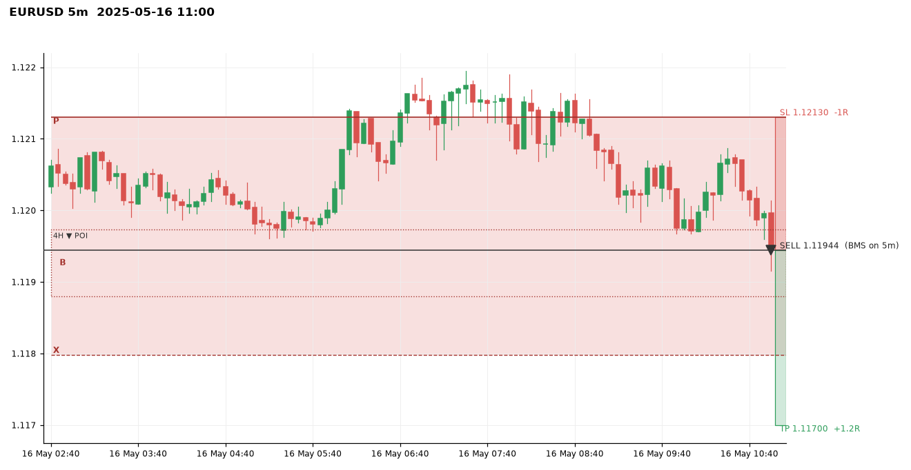
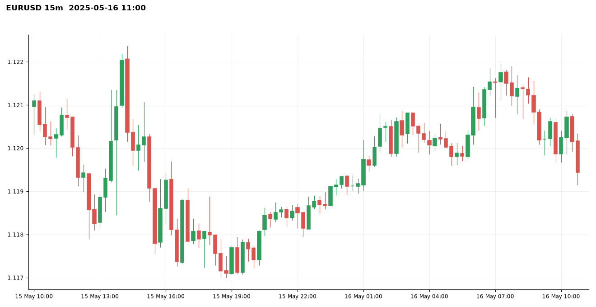
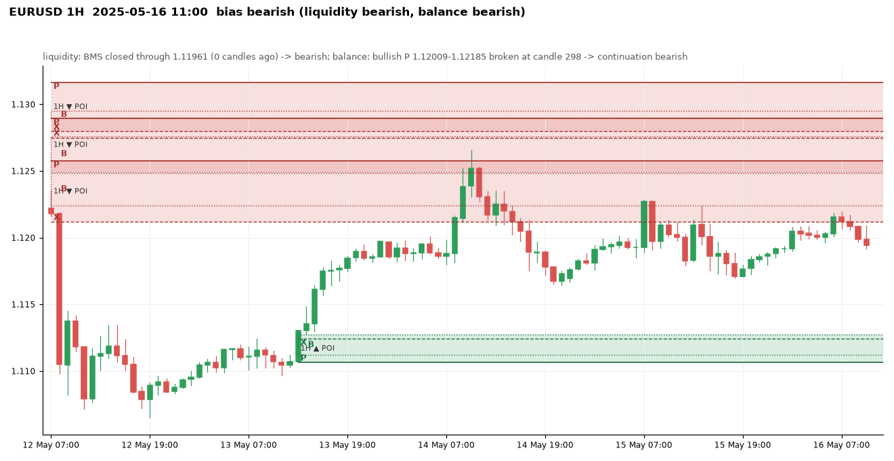
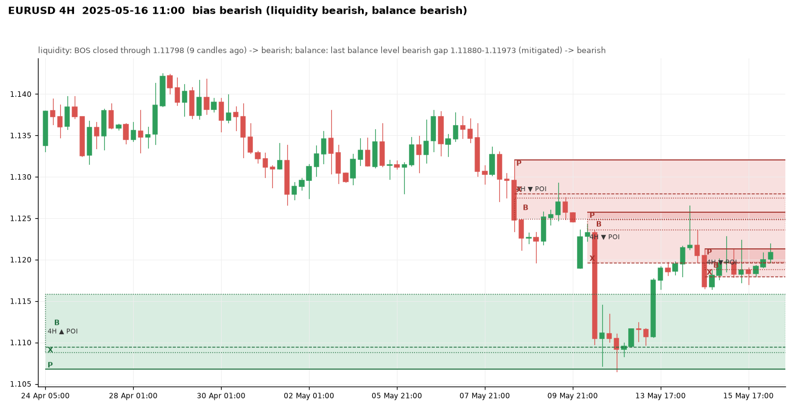
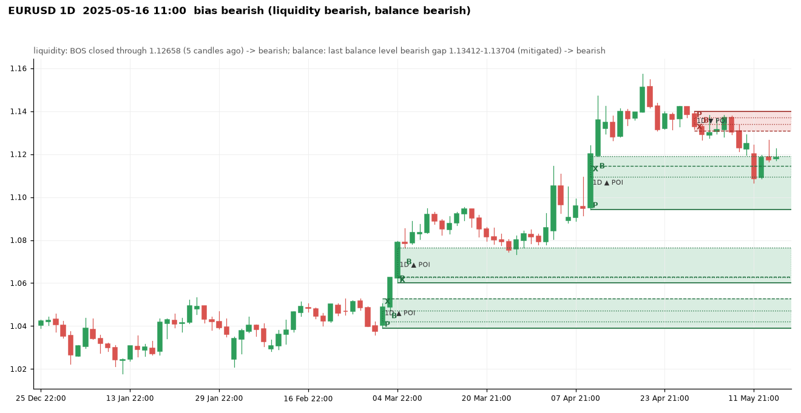
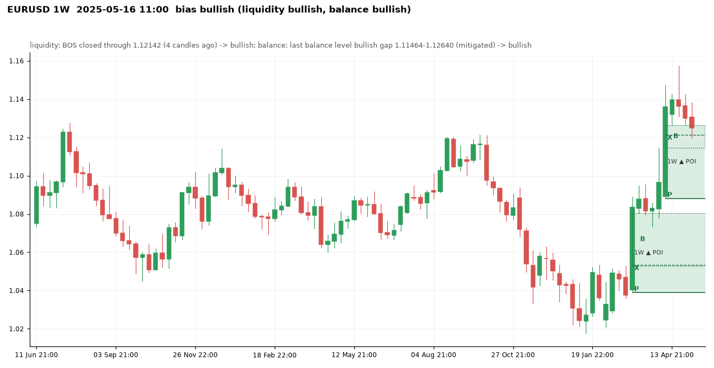
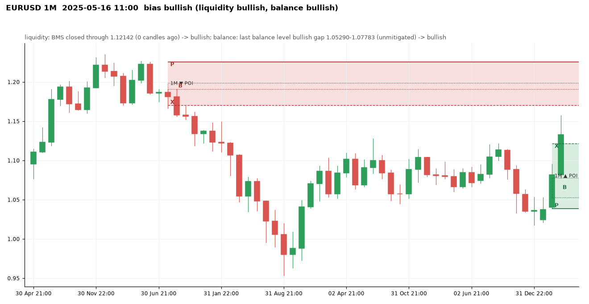

# EURUSD at 2025-05-16 11:00 UTC

Price 1.11944. Decision: **bearish**, scalp: bearish: 1D+4H+1H aligned -> scalp only

## 5m

Balance levels: 46 kept of 77 three-candle gaps in the window; 31 dropped by the size threshold (20% of the median range before them).

| Dropped gap (candle 3) | Side | Width | Required |
|---|---|---|---|
| 2025-05-16 01:40 | bullish | 0.00004 | 0.00006 |
| 2025-05-16 02:25 | bearish | 0.00002 | 0.00006 |
| 2025-05-16 02:35 | bullish | 0.00005 | 0.00006 |
| 2025-05-16 04:45 | bearish | 0.00005 | 0.00006 |
| 2025-05-16 06:30 | bearish | 0.00004 | 0.00006 |
| 2025-05-16 08:20 | bearish | 0.00001 | 0.00007 |
| 2025-05-16 09:35 | bullish | 0.00002 | 0.00008 |
| 2025-05-16 10:40 | bearish | 0.00005 | 0.00008 |

## 15m

Balance levels: 42 kept of 70 three-candle gaps in the window; 28 dropped by the size threshold (20% of the median range before them).

| Dropped gap (candle 3) | Side | Width | Required |
|---|---|---|---|
| 2025-05-15 12:00 | bearish | 0.00015 | 0.00017 |
| 2025-05-15 12:45 | bearish | 0.00006 | 0.00016 |
| 2025-05-15 20:45 | bullish | 0.00009 | 0.00015 |
| 2025-05-15 22:45 | bullish | 0.00009 | 0.00014 |
| 2025-05-16 01:45 | bullish | 0.00008 | 0.00014 |
| 2025-05-16 06:00 | bullish | 0.00004 | 0.00014 |
| 2025-05-16 06:15 | bullish | 0.00001 | 0.00015 |
| 2025-05-16 09:00 | bearish | 0.00014 | 0.00015 |

## 1H

Bias **bearish**: liquidity view bearish, balance view bearish.

- liquidity: BMS closed through 1.11961 (0 candles ago) -> bearish
- balance: bullish P 1.12009-1.12185 broken at candle 298 -> continuation bearish
- aligned -> bearish

| Zone | Low | High | X | B | P | Formed | Status | Visits |
|---|---|---|---|---|---|---|---|---|
| bearish | 1.13230 | 1.13533 | 1.13230 | 1.13311-1.13429 | 1.13533 | 2025-05-01 00:00 | invalidated |  |
| bearish | 1.13158 | 1.13221 | 1.13170 | 1.13158-1.13205 | 1.13221 | 2025-05-01 03:00 | invalidated |  |
| bearish | 1.12874 | 1.13204 | 1.12874 | 1.12900-1.13109 | 1.13204 | 2025-05-01 16:00 | invalidated |  |
| bullish | 1.13057 | 1.13175 | 1.13153 | 1.13138-1.13175 | 1.13057 | 2025-05-02 08:00 | invalidated |  |
| bullish | 1.13144 | 1.13574 | 1.13550 | 1.13472-1.13574 | 1.13144 | 2025-05-02 15:00 | invalidated |  |
| bearish | 1.13040 | 1.13683 | 1.13040 | 1.13389-1.13574 | 1.13683 | 2025-05-02 18:00 | invalidated |  |
| bearish | 1.13111 | 1.13531 | 1.13111 | 1.13409-1.13519 | 1.13531 | 2025-05-05 17:00 | invalidated |  |
| bearish | 1.12964 | 1.13121 | 1.12969 | 1.12964-1.13097 | 1.13121 | 2025-05-06 02:00 | invalidated |  |
| bullish | 1.12927 | 1.13208 | 1.13208 | 1.12964-1.13032 | 1.12927 | 2025-05-06 05:00 | invalidated |  |
| bullish | 1.13428 | 1.13594 | 1.13514 | 1.13513-1.13594 | 1.13428 | 2025-05-07 07:00 | invalidated |  |
| bearish | 1.13081 | 1.13344 | 1.13248 | 1.13081-1.13200 | 1.13344 | 2025-05-07 21:00 | tested | 0 (outside) |
| bearish | 1.12917 | 1.13308 | 1.12917 | 1.13181-1.13223 | 1.13308 | 2025-05-08 07:00 | tested | 0 (outside) |
| bearish | 1.12797 | 1.13162 | 1.12797 | 1.12895-1.12949 | 1.13162 | 2025-05-08 16:00 | tested | 0 (outside) |
| bearish | 1.12495 | 1.12895 | 1.12750 | 1.12495-1.12758 | 1.12895 | 2025-05-08 17:00 | tested | 0 (outside) |
| bullish | 1.12179 | 1.12332 | 1.12332 | 1.12190-1.12226 | 1.12179 | 2025-05-09 06:00 | invalidated |  |
| bearish | 1.12118 | 1.12574 | 1.12118 | 1.12242-1.12484 | 1.12574 | 2025-05-11 22:00 | tested | 1 (inside) |
| bearish | 1.11452 | 1.12190 | 1.11900 | 1.11452-1.12160 | 1.12190 | 2025-05-12 09:00 | invalidated |  |
| bullish | 1.11064 | 1.11272 | 1.11242 | 1.11120-1.11272 | 1.11064 | 2025-05-13 14:00 | fresh | 0 (outside) |
| bullish | 1.11814 | 1.12125 | 1.12006 | 1.11984-1.12125 | 1.11814 | 2025-05-14 09:00 | invalidated |  |
| bullish | 1.12125 | 1.12355 | 1.12355 | 1.12164-1.12309 | 1.12125 | 2025-05-14 10:00 | invalidated |  |
| bearish | 1.11780 | 1.11899 | 1.11798 | 1.11780-1.11813 | 1.11899 | 2025-05-14 20:00 | invalidated |  |
| bullish | 1.12009 | 1.12086 | 1.12086 | 1.12041-1.12071 | 1.12009 | 2025-05-16 07:00 | invalidated |  |

Balance levels: 33 kept of 52 three-candle gaps in the window; 19 dropped by the size threshold (20% of the median range before them).

| Dropped gap (candle 3) | Side | Width | Required |
|---|---|---|---|
| 2025-05-13 17:00 | bullish | 0.00004 | 0.00033 |
| 2025-05-13 20:00 | bullish | 0.00029 | 0.00033 |
| 2025-05-14 18:00 | bearish | 0.00005 | 0.00032 |
| 2025-05-14 23:00 | bullish | 0.00013 | 0.00030 |
| 2025-05-15 00:00 | bullish | 0.00029 | 0.00030 |
| 2025-05-15 02:00 | bullish | 0.00025 | 0.00030 |
| 2025-05-15 21:00 | bullish | 0.00025 | 0.00030 |
| 2025-05-16 00:00 | bullish | 0.00003 | 0.00029 |

## 4H

Bias **bearish**: liquidity view bearish, balance view bearish.

- liquidity: BOS closed through 1.11798 (9 candles ago) -> bearish
- balance: last balance level bearish gap 1.11880-1.11973 (mitigated) -> bearish
- aligned -> bearish

| Zone | Low | High | X | B | P | Formed | Status | Visits |
|---|---|---|---|---|---|---|---|---|
| bullish | 1.08769 | 1.09125 | 1.09125 | 1.08867-1.08968 | 1.08769 | 2025-03-17 13:00 | invalidated |  |
| bearish | 1.08924 | 1.09360 | 1.08924 | 1.09174-1.09279 | 1.09360 | 2025-03-19 13:00 | invalidated |  |
| bearish | 1.08684 | 1.09032 | 1.08731 | 1.08684-1.09003 | 1.09032 | 2025-03-20 09:00 | invalidated |  |
| bearish | 1.08520 | 1.08684 | 1.08603 | 1.08520-1.08629 | 1.08684 | 2025-03-20 13:00 | invalidated |  |
| bearish | 1.07970 | 1.08303 | 1.07970 | 1.08130-1.08215 | 1.08303 | 2025-03-24 17:00 | invalidated |  |
| bearish | 1.07574 | 1.07891 | 1.07767 | 1.07574-1.07673 | 1.07891 | 2025-03-26 21:00 | invalidated |  |
| bullish | 1.07847 | 1.08210 | 1.08210 | 1.07918-1.08120 | 1.07847 | 2025-03-28 17:00 | invalidated |  |
| bullish | 1.07961 | 1.08467 | 1.08299 | 1.08081-1.08467 | 1.07961 | 2025-04-02 17:00 | tested | 0 (outside) |
| bullish | 1.08047 | 1.09171 | 1.09171 | 1.08675-1.08795 | 1.08047 | 2025-04-03 05:00 | tested | 0 (outside) |
| bullish | 1.09709 | 1.10091 | 1.09916 | 1.09849-1.10091 | 1.09709 | 2025-04-09 05:00 | invalidated |  |
| bullish | 1.09624 | 1.10498 | 1.10498 | 1.09891-1.10159 | 1.09624 | 2025-04-10 09:00 | fresh | 0 (outside) |
| bullish | 1.10677 | 1.11584 | 1.10948 | 1.10883-1.11584 | 1.10677 | 2025-04-10 17:00 | tested | 0 (outside) |
| bearish | 1.12918 | 1.13413 | 1.12956 | 1.12918-1.13139 | 1.13413 | 2025-04-15 17:00 | invalidated |  |
| bullish | 1.12925 | 1.13789 | 1.13789 | 1.12990-1.13326 | 1.12925 | 2025-04-16 05:00 | invalidated |  |
| bullish | 1.13925 | 1.14488 | 1.13972 | 1.13940-1.14488 | 1.13925 | 2025-04-21 01:00 | invalidated |  |
| bullish | 1.14488 | 1.14987 | 1.14736 | 1.14582-1.14987 | 1.14488 | 2025-04-21 05:00 | invalidated |  |
| bearish | 1.14686 | 1.14920 | 1.14815 | 1.14686-1.14837 | 1.14920 | 2025-04-22 17:00 | fresh | 0 (outside) |
| bearish | 1.13578 | 1.14686 | 1.13578 | 1.14298-1.14558 | 1.14686 | 2025-04-22 21:00 | tested | 0 (outside) |
| bearish | 1.13349 | 1.14195 | 1.13349 | 1.13656-1.13796 | 1.14195 | 2025-04-23 17:00 | invalidated |  |
| bullish | 1.13393 | 1.13885 | 1.13885 | 1.13602-1.13849 | 1.13393 | 2025-04-28 17:00 | invalidated |  |
| bearish | 1.12933 | 1.13388 | 1.13077 | 1.12933-1.13097 | 1.13388 | 2025-05-01 17:00 | invalidated |  |
| bearish | 1.13141 | 1.13650 | 1.13248 | 1.13141-1.13413 | 1.13650 | 2025-05-07 21:00 | tested | 0 (outside) |
| bearish | 1.12495 | 1.13202 | 1.12797 | 1.12495-1.12750 | 1.13202 | 2025-05-08 17:00 | tested | 0 (outside) |
| bearish | 1.11964 | 1.12574 | 1.11964 | 1.12363-1.12484 | 1.12574 | 2025-05-12 05:00 | tested | 1 (inside) |
| bearish | 1.11798 | 1.12130 | 1.11798 | 1.11880-1.11973 | 1.12130 | 2025-05-14 21:00 | active | 1 (inside) |

Balance levels: 37 kept of 56 three-candle gaps in the window; 19 dropped by the size threshold (20% of the median range before them).

| Dropped gap (candle 3) | Side | Width | Required |
|---|---|---|---|
| 2025-05-02 05:00 | bullish | 0.00021 | 0.00080 |
| 2025-05-02 09:00 | bullish | 0.00006 | 0.00080 |
| 2025-05-08 21:00 | bearish | 0.00015 | 0.00074 |
| 2025-05-12 01:00 | bearish | 0.00030 | 0.00074 |
| 2025-05-12 21:00 | bearish | 0.00004 | 0.00075 |
| 2025-05-13 05:00 | bullish | 0.00013 | 0.00074 |
| 2025-05-13 21:00 | bullish | 0.00037 | 0.00073 |
| 2025-05-16 05:00 | bullish | 0.00024 | 0.00070 |

## 1D

Bias **bearish**: liquidity view bearish, balance view bearish.

- liquidity: BOS closed through 1.12658 (5 candles ago) -> bearish
- balance: last balance level bearish gap 1.13412-1.13704 (mitigated) -> bearish
- aligned -> bearish

| Zone | Low | High | X | B | P | Formed | Status | Visits |
|---|---|---|---|---|---|---|---|---|
| bearish | 1.07196 | 1.08017 | 1.07196 | 1.07736-1.07993 | 1.08017 | 2024-06-13 21:00 | invalidated |  |
| bullish | 1.07364 | 1.07837 | 1.07614 | 1.07472-1.07837 | 1.07364 | 2024-07-03 21:00 | invalidated |  |
| bullish | 1.08280 | 1.08617 | 1.08450 | 1.08308-1.08617 | 1.08280 | 2024-07-11 21:00 | invalidated |  |
| bullish | 1.07818 | 1.09482 | 1.09482 | 1.08354-1.08926 | 1.07818 | 2024-08-04 21:00 | invalidated |  |
| bullish | 1.09138 | 1.10089 | 1.10089 | 1.09394-1.09830 | 1.09138 | 2024-08-13 21:00 | invalidated |  |
| bullish | 1.10228 | 1.10718 | 1.10474 | 1.10298-1.10718 | 1.10228 | 2024-08-19 21:00 | invalidated |  |
| bearish | 1.10264 | 1.10911 | 1.10264 | 1.10496-1.10657 | 1.10911 | 2024-09-09 21:00 | invalidated |  |
| bearish | 1.10686 | 1.11442 | 1.10686 | 1.10829-1.11137 | 1.11442 | 2024-10-01 21:00 | invalidated |  |
| bearish | 1.09870 | 1.10396 | 1.10020 | 1.09870-1.10084 | 1.10396 | 2024-10-06 21:00 | invalidated |  |
| bullish | 1.08080 | 1.08441 | 1.08394 | 1.08264-1.08441 | 1.08080 | 2024-10-30 21:00 | invalidated |  |
| bearish | 1.07690 | 1.09374 | 1.07690 | 1.08248-1.08726 | 1.09374 | 2024-11-06 22:00 | invalidated |  |
| bearish | 1.06632 | 1.07280 | 1.06826 | 1.06632-1.06868 | 1.07280 | 2024-11-11 22:00 | invalidated |  |
| bearish | 1.04224 | 1.05129 | 1.04532 | 1.04224-1.04792 | 1.05129 | 2024-12-18 22:00 | invalidated |  |
| bearish | 1.03100 | 1.03759 | 1.03430 | 1.03100-1.03439 | 1.03759 | 2025-01-02 22:00 | invalidated |  |
| bullish | 1.04116 | 1.04539 | 1.04370 | 1.04380-1.04539 | 1.04116 | 2025-01-26 22:00 | invalidated |  |
| bullish | 1.03732 | 1.04471 | 1.04432 | 1.04299-1.04471 | 1.03732 | 2025-02-13 22:00 | tested | 0 (outside) |
| bearish | 1.04009 | 1.04926 | 1.04009 | 1.04200-1.04750 | 1.04926 | 2025-02-27 22:00 | invalidated |  |
| bullish | 1.03886 | 1.05290 | 1.05290 | 1.04200-1.04710 | 1.03886 | 2025-03-03 22:00 | fresh | 0 (outside) |
| bullish | 1.06020 | 1.07658 | 1.06300 | 1.06278-1.07658 | 1.06020 | 2025-03-05 22:00 | tested | 0 (outside) |
| bullish | 1.09432 | 1.11902 | 1.11464 | 1.10952-1.11902 | 1.09432 | 2025-04-10 21:00 | tested | 1 (inside) |
| bullish | 1.11902 | 1.12960 | 1.12090 | 1.12418-1.12960 | 1.11902 | 2025-04-13 21:00 | invalidated |  |
| bullish | 1.13958 | 1.14739 | 1.14739 | 1.13978-1.14175 | 1.13958 | 2025-04-21 21:00 | invalidated |  |
| bearish | 1.13080 | 1.13998 | 1.13080 | 1.13412-1.13704 | 1.13998 | 2025-04-30 21:00 | tested | 0 (outside) |

Balance levels: 35 kept of 56 three-candle gaps in the window; 21 dropped by the size threshold (20% of the median range before them).

| Dropped gap (candle 3) | Side | Width | Required |
|---|---|---|---|
| 2024-11-21 22:00 | bearish | 0.00087 | 0.00115 |
| 2024-12-02 22:00 | bearish | 0.00063 | 0.00118 |
| 2025-01-14 22:00 | bullish | 0.00082 | 0.00128 |
| 2025-01-20 22:00 | bullish | 0.00109 | 0.00130 |
| 2025-01-28 22:00 | bearish | 0.00101 | 0.00138 |
| 2025-02-18 22:00 | bearish | 0.00057 | 0.00141 |
| 2025-03-11 21:00 | bullish | 0.00010 | 0.00151 |
| 2025-05-12 21:00 | bearish | 0.00018 | 0.00167 |

## 1W

Bias **bullish**: liquidity view bullish, balance view bullish.

- liquidity: BOS closed through 1.12142 (4 candles ago) -> bullish
- balance: last balance level bullish gap 1.11464-1.12640 (mitigated) -> bullish
- aligned -> bullish

| Zone | Low | High | X | B | P | Formed | Status | Visits |
|---|---|---|---|---|---|---|---|---|
| bullish | 1.07331 | 1.10120 | 1.10120 | 1.07872-1.08444 | 1.07331 | 2023-07-09 21:00 | invalidated |  |
| bearish | 1.08336 | 1.11498 | 1.08336 | 1.10459-1.11078 | 1.11498 | 2023-08-20 21:00 | invalidated |  |
| bearish | 1.06901 | 1.08851 | 1.06950 | 1.06901-1.07245 | 1.08851 | 2024-04-14 21:00 | invalidated |  |
| bullish | 1.07100 | 1.08951 | 1.08951 | 1.07465-1.08044 | 1.07100 | 2024-07-07 21:00 | invalidated |  |
| bearish | 1.09973 | 1.12090 | 1.10020 | 1.09973-1.10832 | 1.12090 | 2024-10-06 21:00 | invalidated |  |
| bearish | 1.07774 | 1.09367 | 1.07774 | 1.08718-1.09001 | 1.09367 | 2024-11-03 22:00 | invalidated |  |
| bearish | 1.06098 | 1.07280 | 1.06660 | 1.06098-1.06826 | 1.07280 | 2024-11-17 22:00 | invalidated |  |
| bullish | 1.03886 | 1.08050 | 1.05333 | 1.05290-1.08050 | 1.03886 | 2025-03-09 21:00 | tested | 0 (outside) |
| bullish | 1.08814 | 1.12640 | 1.12142 | 1.11464-1.12640 | 1.08814 | 2025-04-13 21:00 | active | 1 (inside) |

Balance levels: 14 kept of 25 three-candle gaps in the window; 11 dropped by the size threshold (20% of the median range before them).

| Dropped gap (candle 3) | Side | Width | Required |
|---|---|---|---|
| 2024-02-04 22:00 | bearish | 0.00174 | 0.00288 |
| 2024-03-10 21:00 | bullish | 0.00070 | 0.00282 |
| 2024-03-24 21:00 | bearish | 0.00086 | 0.00282 |
| 2024-05-19 21:00 | bullish | 0.00139 | 0.00279 |
| 2024-08-18 21:00 | bullish | 0.00139 | 0.00266 |
| 2024-10-13 21:00 | bearish | 0.00147 | 0.00264 |
| 2024-12-22 22:00 | bearish | 0.00070 | 0.00273 |
| 2025-04-06 21:00 | bullish | 0.00231 | 0.00282 |

## 1M

Bias **bullish**: liquidity view bullish, balance view bullish.

- liquidity: BMS closed through 1.12142 (0 candles ago) -> bullish
- balance: last balance level bullish gap 1.05290-1.07783 (unmitigated) -> bullish
- aligned -> bullish

| Zone | Low | High | X | B | P | Formed | Status | Visits |
|---|---|---|---|---|---|---|---|---|
| bearish | 1.17042 | 1.22545 | 1.17042 | 1.19088-1.19860 | 1.22545 | 2021-08-31 21:00 | fresh | 0 (outside) |
| bearish | 1.06011 | 1.09374 | 1.06011 | 1.06300-1.07612 | 1.09374 | 2024-12-01 22:00 | invalidated |  |
| bullish | 1.03886 | 1.12142 | 1.12142 | 1.05290-1.07783 | 1.03886 | 2025-03-31 21:00 | active | 1 (inside) |

Balance levels: 6 kept of 15 three-candle gaps in the window; 9 dropped by the size threshold (20% of the median range before them).

| Dropped gap (candle 3) | Side | Width | Required |
|---|---|---|---|
| 2020-11-30 22:00 | bullish | 0.00441 | 0.00758 |
| 2020-12-31 22:00 | bullish | 0.00503 | 0.00764 |
| 2022-03-31 21:00 | bearish | 0.00300 | 0.00723 |
| 2022-05-01 21:00 | bearish | 0.00190 | 0.00740 |
| 2023-10-01 21:00 | bearish | 0.00712 | 0.00798 |
| 2023-11-30 22:00 | bullish | 0.00291 | 0.00798 |
| 2024-09-01 21:00 | bullish | 0.00538 | 0.00774 |
| 2024-10-31 21:00 | bearish | 0.00646 | 0.00768 |

## Rejections at this moment

- none

## Setup

SHORT from the 4H zone 1.11798-1.12130, BMS on 5m at 2025-05-16 10:55:00, entry 1.11944, stop 1.12130, target 1.11700 (1H sell-side liquidity 1.11700 (x1)), R:R 1:1.24, visit 1.
