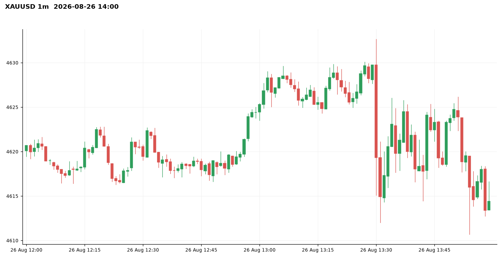
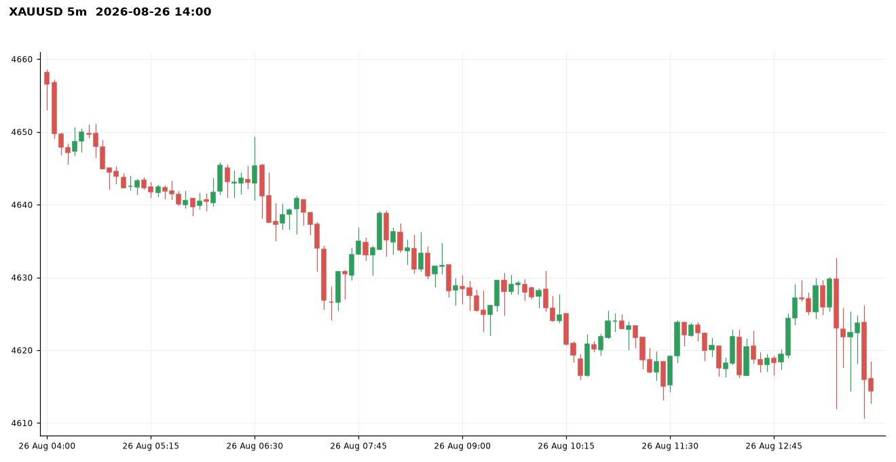
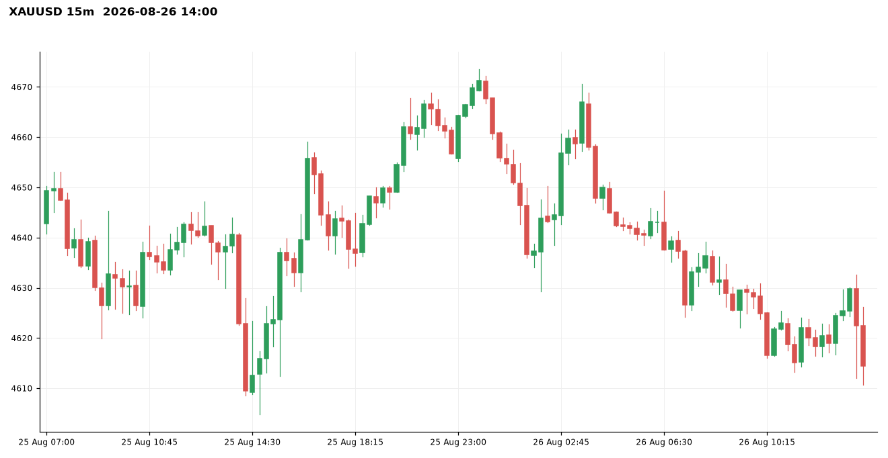
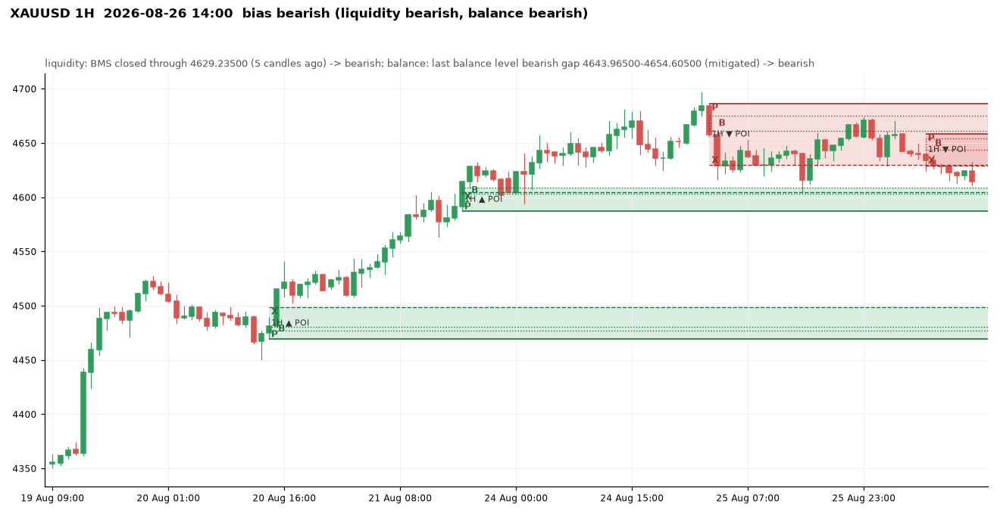
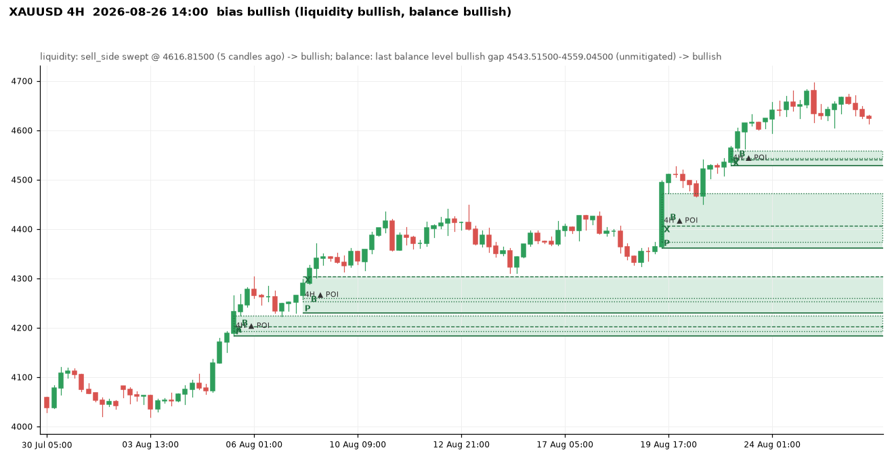
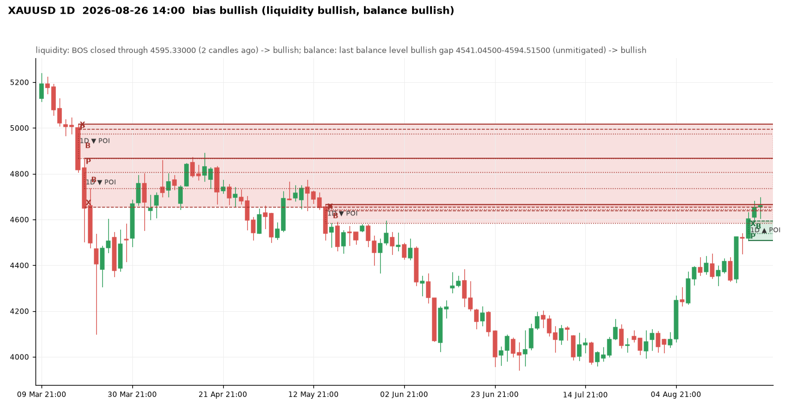
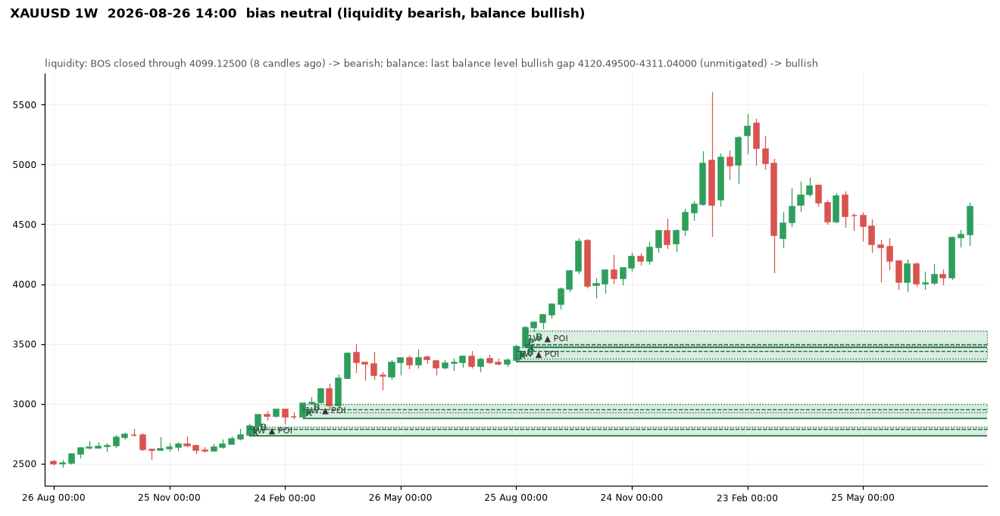
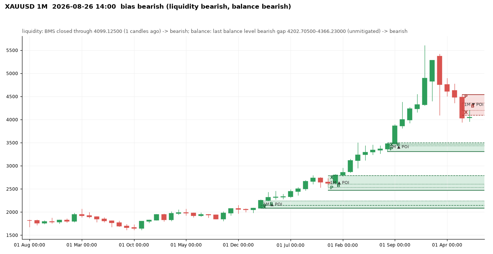

# XAUUSD at 2026-08-26 14:00 UTC

Price 4614.40. Decision: **neutral**, none: fewer than 3 timeframes agree (1M=bearish, 1W=50/50, 1D=bullish, 4H=bullish, 1H=bearish) -> no trade

Visit memory: warm-up replay of 5519 steps before this moment.

## 1m

Balance levels: 76 kept of 114 three-candle gaps in the window; 38 dropped by the size threshold (20% of the median range before them).

| Dropped gap (candle 3) | Side | Width | Required |
|---|---|---|---|
| 2026-08-26 12:18 | bullish | 0.13 | 0.24 |
| 2026-08-26 12:38 | bearish | 0.06 | 0.26 |
| 2026-08-26 12:44 | bullish | 0.07 | 0.25 |
| 2026-08-26 12:46 | bearish | 0.02 | 0.25 |
| 2026-08-26 13:13 | bullish | 0.05 | 0.28 |
| 2026-08-26 13:15 | bearish | 0.01 | 0.28 |
| 2026-08-26 13:50 | bullish | 0.06 | 0.36 |
| 2026-08-26 13:55 | bearish | 0.02 | 0.38 |

## 5m

Balance levels: 42 kept of 74 three-candle gaps in the window; 32 dropped by the size threshold (20% of the median range before them).

| Dropped gap (candle 3) | Side | Width | Required |
|---|---|---|---|
| 2026-08-26 04:15 | bearish | 0.70 | 0.75 |
| 2026-08-26 04:40 | bearish | 0.38 | 0.75 |
| 2026-08-26 08:55 | bearish | 0.65 | 0.78 |
| 2026-08-26 10:35 | bullish | 0.40 | 0.76 |
| 2026-08-26 10:45 | bullish | 0.41 | 0.75 |
| 2026-08-26 10:50 | bullish | 0.41 | 0.75 |
| 2026-08-26 11:15 | bearish | 0.06 | 0.74 |
| 2026-08-26 12:10 | bearish | 0.24 | 0.73 |

## 15m

Balance levels: 55 kept of 85 three-candle gaps in the window; 30 dropped by the size threshold (20% of the median range before them).

| Dropped gap (candle 3) | Side | Width | Required |
|---|---|---|---|
| 2026-08-26 00:45 | bearish | 0.87 | 1.64 |
| 2026-08-26 01:30 | bearish | 0.76 | 1.64 |
| 2026-08-26 04:45 | bearish | 0.34 | 1.64 |
| 2026-08-26 05:00 | bearish | 0.95 | 1.62 |
| 2026-08-26 06:45 | bearish | 0.84 | 1.52 |
| 2026-08-26 10:15 | bearish | 0.81 | 1.42 |
| 2026-08-26 11:15 | bearish | 1.36 | 1.38 |
| 2026-08-26 13:00 | bullish | 0.84 | 1.37 |

## 1H

Bias **bearish**: liquidity view bearish, balance view bearish.

- liquidity: BMS closed through 4629.23500 (5 candles ago) -> bearish
- balance: last balance level bearish gap 4643.96500-4654.60500 (mitigated) -> bearish
- aligned -> bearish

| Zone | Low | High | X | B | P | Formed | Status | Visits (a visit stays open until a close 1.5 zone heights beyond the zone) |
|---|---|---|---|---|---|---|---|---|
| bullish | 4317.74 | 4361.89 | 4361.89 | 4339.68-4343.10 | 4317.74 | 2026-08-10 19:00 | invalidated |  |
| bearish | 4382.20 | 4408.86 | 4393.44 | 4382.20-4403.09 | 4408.86 | 2026-08-11 07:00 | invalidated |  |
| bullish | 4366.06 | 4403.94 | 4403.94 | 4374.23-4377.90 | 4366.06 | 2026-08-12 03:00 | invalidated |  |
| bearish | 4385.36 | 4407.12 | 4395.98 | 4385.36-4391.38 | 4407.12 | 2026-08-13 07:00 | invalidated |  |
| bearish | 4341.23 | 4361.78 | 4343.36 | 4341.23-4348.06 | 4361.78 | 2026-08-14 02:00 | invalidated |  |
| bearish | 4316.31 | 4341.23 | 4316.31 | 4322.84-4328.91 | 4341.23 | 2026-08-14 03:00 | invalidated |  |
| bullish | 4329.51 | 4364.01 | 4364.01 | 4336.51-4341.72 | 4329.51 | 2026-08-14 12:00 | tested | 0 (no visit) |
| bullish | 4367.57 | 4396.77 | 4396.77 | 4384.80-4391.89 | 4367.57 | 2026-08-17 02:00 | invalidated |  |
| bullish | 4381.69 | 4405.65 | 4405.65 | 4398.64-4403.48 | 4381.69 | 2026-08-17 15:00 | invalidated |  |
| bearish | 4397.85 | 4435.90 | 4397.85 | 4407.77-4418.55 | 4435.90 | 2026-08-18 04:00 | invalidated |  |
| bearish | 4346.27 | 4358.52 | 4351.41 | 4346.27-4352.57 | 4358.52 | 2026-08-18 21:00 | invalidated |  |
| bullish | 4361.81 | 4423.82 | 4406.32 | 4373.97-4423.82 | 4361.81 | 2026-08-19 14:00 | fresh | 0 (no visit) |
| bullish | 4423.82 | 4454.90 | 4449.45 | 4442.20-4454.90 | 4423.82 | 2026-08-19 15:00 | tested | 1 (no visit) |
| bullish | 4494.23 | 4504.80 | 4499.12 | 4496.59-4504.80 | 4494.23 | 2026-08-19 21:00 | invalidated |  |
| bearish | 4484.06 | 4509.78 | 4484.06 | 4499.56-4503.23 | 4509.78 | 2026-08-20 06:00 | invalidated | 1 (visit open) |
| bearish | 4476.88 | 4491.12 | 4477.52 | 4476.88-4480.57 | 4491.12 | 2026-08-20 13:00 | invalidated | 1 (visit open) |
| bullish | 4469.14 | 4498.57 | 4498.57 | 4476.88-4480.44 | 4469.14 | 2026-08-20 15:00 | fresh | 0 (no visit) |
| bullish | 4587.03 | 4608.89 | 4604.57 | 4603.53-4608.89 | 4587.03 | 2026-08-21 17:00 | tested | 2 (no visit) |
| bullish | 4635.65 | 4680.65 | 4680.65 | 4641.86-4646.76 | 4635.65 | 2026-08-25 01:00 | invalidated | 1 (visit open) |
| bearish | 4629.55 | 4686.65 | 4629.55 | 4661.27-4674.93 | 4686.65 | 2026-08-25 03:00 | tested | 1 (visit open) |
| bullish | 4644.02 | 4653.19 | 4653.10 | 4648.31-4653.19 | 4644.02 | 2026-08-25 20:00 | invalidated | 1 (visit open) |
| bearish | 4629.23 | 4658.56 | 4629.23 | 4643.97-4654.60 | 4658.56 | 2026-08-26 08:00 | tested | 1 (visit open) |

Balance levels: 36 kept of 59 three-candle gaps in the window; 23 dropped by the size threshold (20% of the median range before them).

| Dropped gap (candle 3) | Side | Width | Required |
|---|---|---|---|
| 2026-08-18 19:00 | bearish | 2.02 | 2.82 |
| 2026-08-19 06:00 | bearish | 1.17 | 2.77 |
| 2026-08-19 09:00 | bullish | 1.80 | 2.80 |
| 2026-08-19 12:00 | bullish | 1.24 | 2.75 |
| 2026-08-20 02:00 | bearish | 0.91 | 2.79 |
| 2026-08-21 08:00 | bullish | 2.18 | 2.80 |
| 2026-08-21 21:00 | bearish | 1.85 | 3.06 |
| 2026-08-25 21:00 | bullish | 1.70 | 3.56 |

## 4H

Bias **bullish**: liquidity view bullish, balance view bullish.

- liquidity: sell_side swept @ 4616.81500 (5 candles ago) -> bullish
- balance: last balance level bullish gap 4543.51500-4559.04500 (unmitigated) -> bullish
- aligned -> bullish

| Zone | Low | High | X | B | P | Formed | Status | Visits (a visit stays open until a close 1.5 zone heights beyond the zone) |
|---|---|---|---|---|---|---|---|---|
| bearish | 4146.80 | 4198.44 | 4169.48 | 4146.80-4186.51 | 4198.44 | 2026-06-23 05:00 | invalidated |  |
| bullish | 3969.03 | 4063.20 | 4063.20 | 3982.47-4012.55 | 3969.03 | 2026-07-01 13:00 | tested | 0 (no visit) |
| bullish | 4030.53 | 4115.48 | 4115.48 | 4044.22-4052.95 | 4030.53 | 2026-07-02 13:00 | invalidated |  |
| bullish | 4122.62 | 4160.23 | 4143.72 | 4131.90-4160.23 | 4122.62 | 2026-07-03 05:00 | invalidated |  |
| bearish | 4128.27 | 4162.45 | 4128.27 | 4140.99-4156.60 | 4162.45 | 2026-07-07 05:00 | invalidated |  |
| bearish | 4115.60 | 4148.09 | 4116.52 | 4115.60-4135.55 | 4148.09 | 2026-07-07 21:00 | invalidated |  |
| bearish | 4086.24 | 4121.06 | 4091.84 | 4086.24-4114.61 | 4121.06 | 2026-07-08 13:00 | invalidated |  |
| bearish | 4072.59 | 4103.27 | 4072.59 | 4090.80-4107.94 | 4103.27 | 2026-07-13 01:00 | invalidated |  |
| bearish | 4017.72 | 4067.36 | 4021.53 | 4017.72-4046.28 | 4067.36 | 2026-07-13 17:00 | invalidated |  |
| bearish | 4017.16 | 4061.07 | 4017.16 | 4037.76-4054.86 | 4061.07 | 2026-07-16 13:00 | invalidated |  |
| bullish | 4003.49 | 4043.36 | 4040.43 | 4010.49-4043.36 | 4003.49 | 2026-07-21 05:00 | tested | 0 (no visit) |
| bullish | 4076.32 | 4109.02 | 4100.78 | 4086.26-4109.02 | 4076.32 | 2026-07-22 05:00 | invalidated |  |
| bullish | 4107.27 | 4141.47 | 4141.47 | 4123.01-4128.73 | 4107.27 | 2026-07-22 17:00 | invalidated |  |
| bearish | 4099.31 | 4130.40 | 4107.27 | 4099.31-4111.81 | 4130.40 | 2026-07-23 09:00 | invalidated |  |
| bearish | 4039.68 | 4085.80 | 4039.68 | 4054.47-4072.76 | 4085.80 | 2026-07-24 01:00 | invalidated |  |
| bullish | 4080.62 | 4084.36 | 4081.89 | 4055.80-4084.36 | 4080.62 | 2026-07-27 01:00 | invalidated |  |
| bearish | 4052.32 | 4073.86 | 4065.07 | 4052.32-4069.59 | 4073.86 | 2026-07-28 05:00 | invalidated |  |
| bullish | 4007.47 | 4047.64 | 4047.64 | 4033.30-4043.62 | 4007.47 | 2026-07-29 21:00 | tested | 0 (no visit) |
| bullish | 4070.22 | 4127.95 | 4120.16 | 4085.72-4127.95 | 4070.22 | 2026-08-05 05:00 | fresh | 0 (no visit) |
| bullish | 4127.95 | 4165.77 | 4165.77 | 4136.23-4150.15 | 4127.95 | 2026-08-05 09:00 | fresh | 0 (no visit) |
| bullish | 4182.90 | 4224.52 | 4202.90 | 4192.38-4224.52 | 4182.90 | 2026-08-05 17:00 | tested | 0 (no visit) |
| bullish | 4229.39 | 4303.74 | 4303.74 | 4252.94-4260.43 | 4229.39 | 2026-08-07 09:00 | tested | 0 (no visit) |
| bullish | 4350.80 | 4385.51 | 4361.89 | 4359.34-4385.51 | 4350.80 | 2026-08-10 21:00 | invalidated |  |
| bearish | 4371.51 | 4406.32 | 4376.78 | 4371.51-4386.73 | 4406.32 | 2026-08-18 17:00 | invalidated |  |
| bullish | 4361.81 | 4471.76 | 4406.32 | 4373.97-4471.76 | 4361.81 | 2026-08-19 17:00 | tested | 1 (no visit) |
| bullish | 4529.05 | 4559.05 | 4540.80 | 4543.52-4559.05 | 4529.05 | 2026-08-21 09:00 | fresh | 0 (no visit) |

Balance levels: 42 kept of 70 three-candle gaps in the window; 28 dropped by the size threshold (20% of the median range before them).

| Dropped gap (candle 3) | Side | Width | Required |
|---|---|---|---|
| 2026-08-17 05:00 | bullish | 1.37 | 6.25 |
| 2026-08-18 05:00 | bearish | 5.38 | 6.25 |
| 2026-08-18 21:00 | bearish | 5.14 | 6.25 |
| 2026-08-20 05:00 | bearish | 5.98 | 6.30 |
| 2026-08-20 17:00 | bullish | 3.99 | 6.46 |
| 2026-08-21 17:00 | bullish | 4.31 | 6.34 |
| 2026-08-24 05:00 | bullish | 5.21 | 6.25 |
| 2026-08-26 05:00 | bearish | 3.47 | 6.72 |

## 1D

Bias **bullish**: liquidity view bullish, balance view bullish.

- liquidity: BOS closed through 4595.33000 (2 candles ago) -> bullish
- balance: last balance level bullish gap 4541.04500-4594.51500 (unmitigated) -> bullish
- aligned -> bullish

| Zone | Low | High | X | B | P | Formed | Status | Visits (a visit stays open until a close 1.5 zone heights beyond the zone) |
|---|---|---|---|---|---|---|---|---|
| bullish | 3626.46 | 3674.70 | 3674.70 | 3656.70-3674.70 | 3626.46 | 2025-09-15 21:00 | tested | 0 (no visit) |
| bullish | 3632.38 | 3707.55 | 3707.55 | 3673.20-3683.55 | 3632.38 | 2025-09-21 21:00 | fresh | 0 (no visit) |
| bullish | 3941.05 | 4059.35 | 4059.35 | 3970.20-3984.32 | 3941.05 | 2025-10-12 21:00 | invalidated |  |
| bearish | 4004.28 | 4375.62 | 4004.28 | 4161.53-4219.11 | 4375.62 | 2025-10-26 21:00 | invalidated |  |
| bullish | 4004.36 | 4097.24 | 4046.59 | 4027.59-4097.24 | 4004.36 | 2025-11-10 22:00 | invalidated |  |
| bullish | 4204.27 | 4259.34 | 4259.34 | 4238.78-4257.27 | 4204.27 | 2025-12-11 22:00 | invalidated |  |
| bullish | 4339.90 | 4430.52 | 4353.56 | 4356.62-4430.52 | 4339.90 | 2025-12-22 22:00 | invalidated |  |
| bullish | 4452.92 | 4550.15 | 4550.15 | 4479.71-4521.19 | 4452.92 | 2026-01-11 22:00 | invalidated |  |
| bullish | 4536.49 | 4646.14 | 4642.97 | 4625.02-4646.14 | 4536.49 | 2026-01-18 22:00 | invalidated |  |
| bullish | 4981.67 | 5117.81 | 5091.93 | 5022.39-5117.81 | 4981.67 | 2026-02-22 22:00 | invalidated |  |
| bullish | 5166.99 | 5260.28 | 5250.01 | 5205.64-5260.28 | 5166.99 | 2026-03-01 22:00 | invalidated |  |
| bearish | 5015.05 | 5191.79 | 5015.05 | 5128.48-5149.15 | 5191.79 | 2026-03-15 21:00 | tested | 0 (no visit) |
| bearish | 4867.23 | 5016.53 | 4996.27 | 4867.23-4973.72 | 5016.53 | 2026-03-18 21:00 | tested | 0 (no visit) |
| bearish | 4655.23 | 4867.23 | 4655.23 | 4736.18-4806.85 | 4867.23 | 2026-03-19 21:00 | tested | 1 (visit open) |
| bullish | 4482.66 | 4662.12 | 4602.65 | 4580.73-4662.12 | 4482.66 | 2026-03-31 21:00 | invalidated |  |
| bullish | 4745.84 | 4800.80 | 4800.80 | 4750.20-4786.08 | 4745.84 | 2026-04-14 21:00 | invalidated |  |
| bearish | 4610.53 | 4701.64 | 4644.47 | 4610.53-4667.34 | 4701.64 | 2026-04-28 21:00 | invalidated |  |
| bullish | 4546.36 | 4685.27 | 4660.59 | 4586.60-4685.27 | 4546.36 | 2026-05-06 21:00 | invalidated |  |
| bearish | 4584.38 | 4665.44 | 4638.36 | 4584.38-4644.31 | 4665.44 | 2026-05-17 21:00 | active | 1 (visit open) |
| bearish | 4353.45 | 4481.62 | 4366.23 | 4353.45-4423.97 | 4481.62 | 2026-06-07 21:00 | invalidated |  |
| bearish | 4023.87 | 4115.23 | 4023.87 | 4044.14-4091.03 | 4115.23 | 2026-06-24 21:00 | invalidated |  |
| bullish | 4065.33 | 4223.51 | 4120.49 | 4106.48-4223.51 | 4065.33 | 2026-08-05 21:00 | fresh | 0 (no visit) |
| bullish | 4508.99 | 4595.33 | 4595.33 | 4541.05-4594.52 | 4508.99 | 2026-08-23 21:00 | fresh | 0 (no visit) |

Balance levels: 47 kept of 63 three-candle gaps in the window; 16 dropped by the size threshold (20% of the median range before them).

| Dropped gap (candle 3) | Side | Width | Required |
|---|---|---|---|
| 2026-05-26 21:00 | bearish | 20.86 | 22.47 |
| 2026-06-09 21:00 | bearish | 10.88 | 24.14 |
| 2026-06-10 21:00 | bearish | 16.48 | 24.26 |
| 2026-06-18 21:00 | bearish | 8.47 | 23.89 |
| 2026-06-23 21:00 | bearish | 21.46 | 22.47 |
| 2026-07-02 21:00 | bullish | 5.66 | 22.44 |
| 2026-08-09 21:00 | bullish | 9.12 | 20.07 |
| 2026-08-19 21:00 | bullish | 14.52 | 18.72 |

## 1W

Bias **neutral**: liquidity view bearish, balance view bullish.

- liquidity: BOS closed through 4099.12500 (8 candles ago) -> bearish
- balance: last balance level bullish gap 4120.49500-4311.04000 (unmitigated) -> bullish
- conflicting / incomplete -> 50/50

| Zone | Low | High | X | B | P | Formed | Status | Visits (a visit stays open until a close 1.5 zone heights beyond the zone) |
|---|---|---|---|---|---|---|---|---|
| bullish | 2546.86 | 2685.64 | 2685.64 | 2589.72-2622.68 | 2546.86 | 2024-10-14 00:00 | tested | 0 (no visit) |
| bullish | 2734.82 | 2807.28 | 2790.17 | 2786.06-2807.28 | 2734.82 | 2025-02-03 00:00 | fresh | 0 (no visit) |
| bullish | 2880.25 | 2999.46 | 2956.31 | 2930.54-2999.46 | 2880.25 | 2025-03-17 00:00 | tested | 0 (no visit) |
| bullish | 3351.33 | 3470.05 | 3439.03 | 3378.84-3470.05 | 3351.33 | 2025-09-01 00:00 | fresh | 0 (no visit) |
| bullish | 3470.05 | 3612.84 | 3500.20 | 3489.84-3612.84 | 3470.05 | 2025-09-08 00:00 | fresh | 0 (no visit) |
| bullish | 4109.71 | 4381.44 | 4381.44 | 4139.89-4163.81 | 4109.71 | 2025-12-15 00:00 | invalidated |  |

Balance levels: 21 kept of 28 three-candle gaps in the window; 7 dropped by the size threshold (20% of the median range before them).

| Dropped gap (candle 3) | Side | Width | Required |
|---|---|---|---|
| 2024-12-23 00:00 | bearish | 4.42 | 12.67 |
| 2025-01-20 00:00 | bullish | 4.87 | 12.67 |
| 2025-01-27 00:00 | bullish | 10.03 | 12.83 |
| 2025-03-24 00:00 | bullish | 2.50 | 12.98 |
| 2025-04-21 00:00 | bullish | 14.35 | 15.33 |
| 2025-12-15 00:00 | bullish | 12.23 | 20.72 |
| 2026-04-06 00:00 | bullish | 4.98 | 24.16 |

## 1M

Bias **bearish**: liquidity view bearish, balance view bearish.

- liquidity: BMS closed through 4099.12500 (1 candles ago) -> bearish
- balance: last balance level bearish gap 4202.70500-4366.23000 (unmitigated) -> bearish
- aligned -> bearish

| Zone | Low | High | X | B | P | Formed | Status | Visits (a visit stays open until a close 1.5 zone heights beyond the zone) |
|---|---|---|---|---|---|---|---|---|
| bullish | 1788.68 | 1890.15 | 1877.14 | 1853.88-1890.15 | 1788.68 | 2022-03-01 00:00 | invalidated |  |
| bullish | 2079.53 | 2246.72 | 2148.99 | 2088.38-2246.72 | 2079.53 | 2024-04-01 00:00 | fresh | 0 (no visit) |
| bullish | 2471.91 | 2790.17 | 2790.17 | 2531.76-2604.39 | 2471.91 | 2025-01-01 00:00 | tested | 0 (no visit) |
| bullish | 3311.56 | 3500.20 | 3500.20 | 3439.03-3470.05 | 3311.56 | 2025-09-01 00:00 | fresh | 0 (no visit) |
| bearish | 4099.12 | 4541.63 | 4099.12 | 4202.70-4366.23 | 4541.63 | 2026-07-01 00:00 | fresh | 1 (visit open) |

Balance levels: 11 kept of 15 three-candle gaps in the window; 4 dropped by the size threshold (20% of the median range before them).

| Dropped gap (candle 3) | Side | Width | Required |
|---|---|---|---|
| 2023-01-01 00:00 | bullish | 19.67 | 23.81 |
| 2024-03-01 00:00 | bullish | 0.56 | 23.81 |
| 2024-05-01 00:00 | bullish | 11.57 | 24.05 |
| 2025-04-01 00:00 | bullish | 0.26 | 26.83 |

## Rejections at this moment

- fewer than 3 timeframes agree (1M=bearish, 1W=50/50, 1D=bullish, 4H=bullish, 1H=bearish) -> no trade
- diagnostic: walking on as SHORT past the bias gate; nothing below is a signal
- 1D bearish POI 4584.37500-4665.44500 (active, formed 2026-05-17 21:00:00): R:R 0.22 below minimum 0.7 (target 1H sell-side liquidity 4604.81500 (x1))
