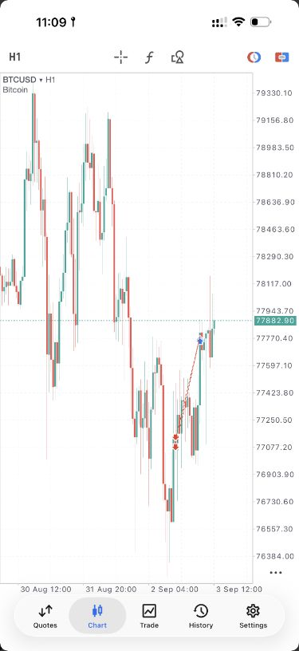

# btcusd_undated_1h_loss

**Status:** incomplete_chart_record. **Regression ready:** no.

**Source:** [S4 — Verliezende trade; public post and attached mobile chart](https://www.skool.com/dorusview/verliezende-trade)

**Attribution:** Dorus Wanders. Chart author: Dorus Wanders.

Dorus describes this loss as a trade that followed his strategy; the public text does not explain its individual technical conditions.

## Data handoff

No candle CSV accompanies this record. The exact UTC candle interval has not been established. The metadata below is incomplete and does not satisfy the full export fallback in the brief. Do not invent a UTC event time from a video publication date or a chart display clock.

```yaml
symbol: BTCUSD
displayed_timeframe: 1H
exact_utc_range_established: false
```

## Missing evidence

- year on chart
- broker/feed
- chart timezone
- POI timeframe confirmation
- exact order prices and times
- sweep/break annotations
- complete candle interval

## Inspected frame


