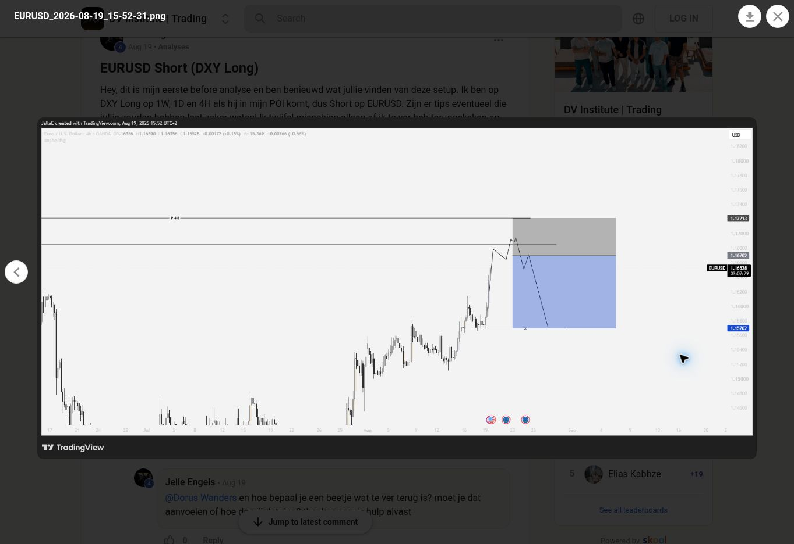

# eurusd_2026-08-19_4h_review

**Status:** student_plan_reviewed_critically_by_dorus. **Regression ready:** no.

**Source:** [S1 — EURUSD Short (DXY Long); Dorus reply dated Aug 19 and attached EURUSD_2026-08-19_15-52-31.png](https://www.skool.com/dorusview/eurusd-short-dxy-long)

**Attribution:** Dorus Wanders (critique only). Chart author: Jelle Engels.

Dorus says the analysis looks too far back and is no longer relevant; he gives no numerical lookback threshold.

## Data handoff

No candle CSV accompanies this record. The exact UTC candle interval has not been established. The metadata below is incomplete and does not satisfy the full export fallback in the brief. Do not invent a UTC event time from a video publication date or a chart display clock.

```yaml
symbol: EURUSD
feed: OANDA
displayed_timeframe: 4H
chart_snapshot_date: '2026-08-19'
exact_utc_range_established: false
```

## Missing evidence

- Dorus-approved POI and bias
- actual entry confirmation
- event candle times
- full exact dated interval
- OHLC export

The YAML separates student price labels from Dorus’s assessment. They are not `expect` values for the strategy detector and are not approved executable trade parameters.

## Inspected frame


