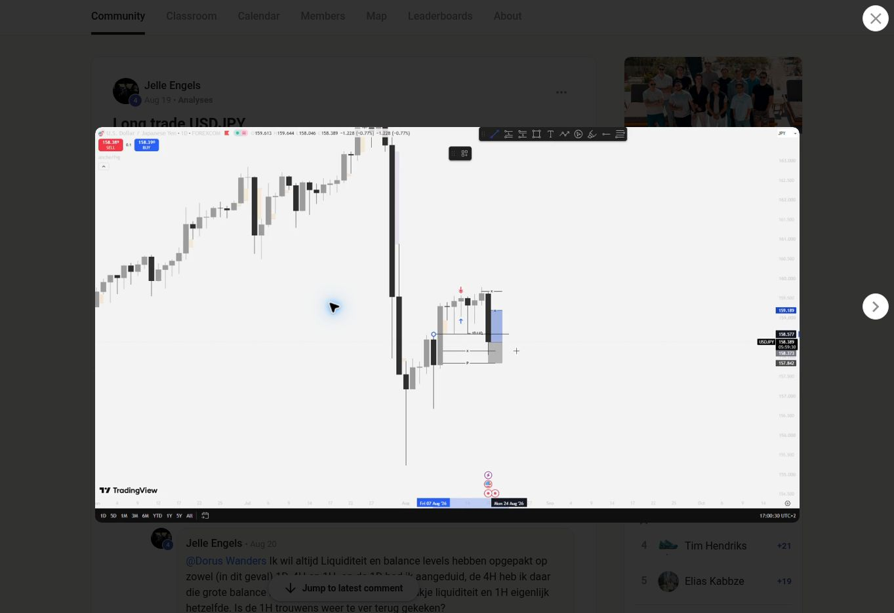

# usdjpy_2026-08-19_bias_review

**Status:** student_scalp_claim_with_dorus_bias_warning. **Regression ready:** no.

**Source:** [S2 — Long trade USDJPY; Dorus reply dated Aug 19; attached 43-second chart video](https://www.skool.com/dorusview/long-trade-usdjpy)

**Attribution:** Dorus Wanders (critique only). Chart author: Jelle Engels.

Dorus identifies errors in the student’s bias analysis but does not enumerate the exact incorrect levels or votes.

## Data handoff

No candle CSV accompanies this record. The exact UTC candle interval has not been established. The metadata below is incomplete and does not satisfy the full export fallback in the brief. Do not invent a UTC event time from a video publication date or a chart display clock.

```yaml
symbol: USDJPY
feed: FOREXCOM
displayed_timeframes:
- 1H
- 1D
chart_month: 2026-08
exact_utc_range_established: false
```

## Missing evidence

- which bias votes Dorus corrects
- Dorus-approved POI timeframe
- exact entry/sweep/break candle times
- full exact data range
- OHLC export

The YAML separates student price labels from Dorus’s assessment. They are not `expect` values for the strategy detector and are not approved executable trade parameters.

## Inspected frame


