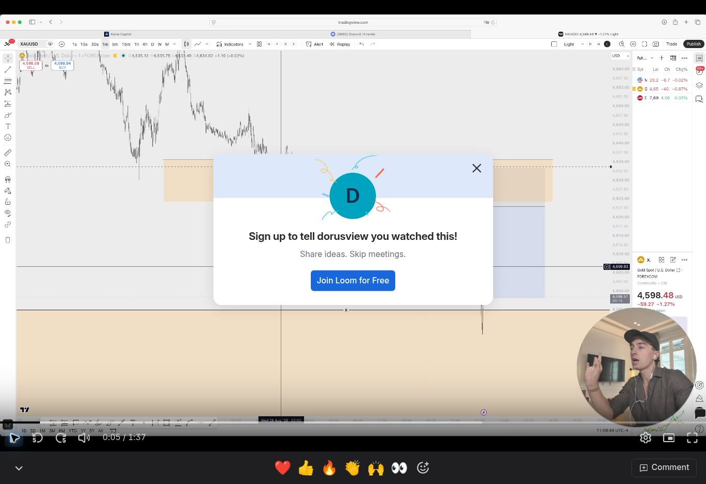

# xauusd_2026-08-26_public_recap

**Status:** incomplete_chart_record. **Regression ready:** no.

**Source:** [S5 — €8.000 verdiend binnen één uur.; public Loom recap, approximately 00:05](https://www.skool.com/dorusview/8000-verdiend-binnen-een-uur)

**Attribution:** Dorus Wanders. Chart author: Dorus Wanders.

The public recap shows the chart, but the protected-zone and entry rationale cannot be fully recovered from this frame.

## Data handoff

No candle CSV accompanies this record. The exact UTC candle interval has not been established. The metadata below is incomplete and does not satisfy the full export fallback in the brief. Do not invent a UTC event time from a video publication date or a chart display clock.

```yaml
symbol: XAUUSD
feed: FOREXCOM
displayed_timeframe: 1m
chart_date: '2026-08-26'
exact_utc_range_established: false
```

## Missing evidence

- POI timeframe
- exact sweep and break candles
- labeled entry/stop/target prices
- exact historical data interval
- 60 pre-sweep candles
- post-break return data

## Inspected frame


