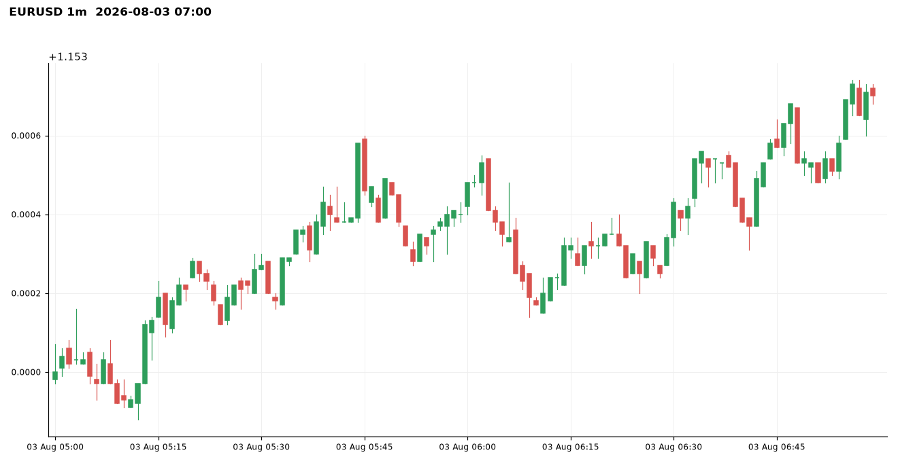
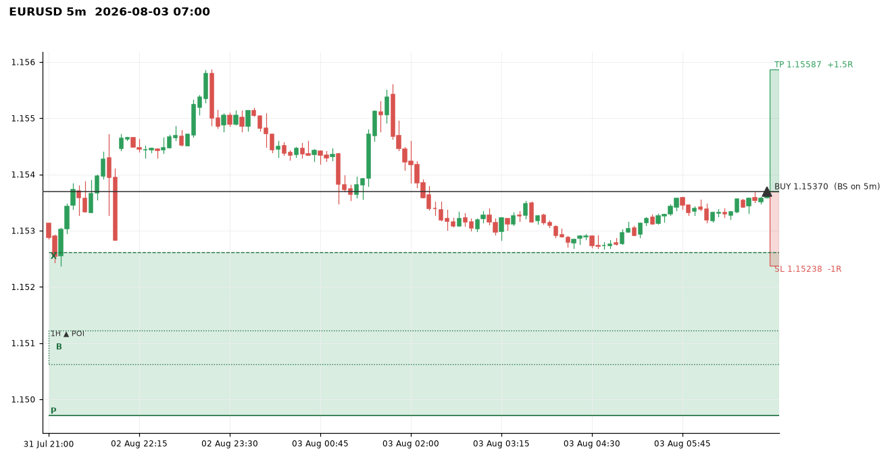
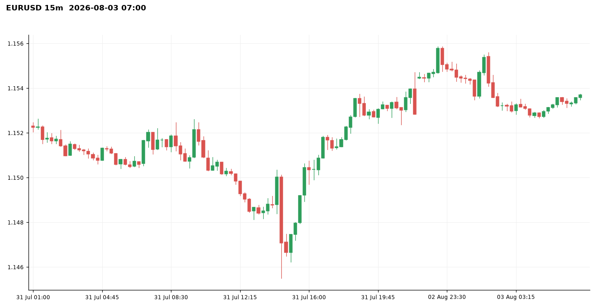
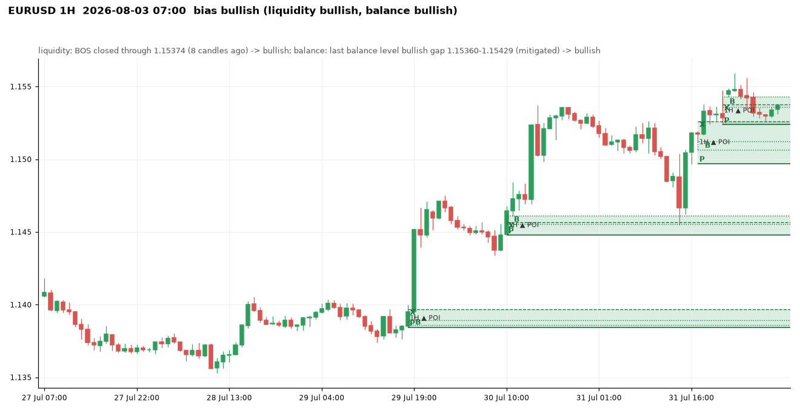
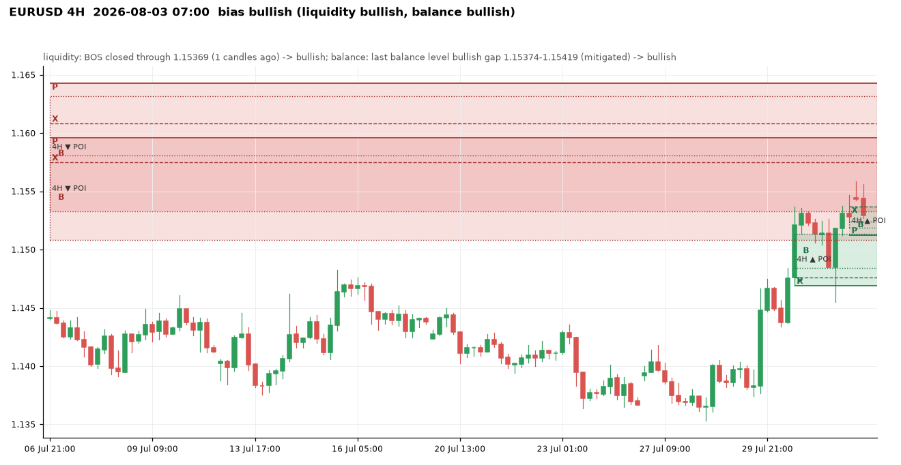
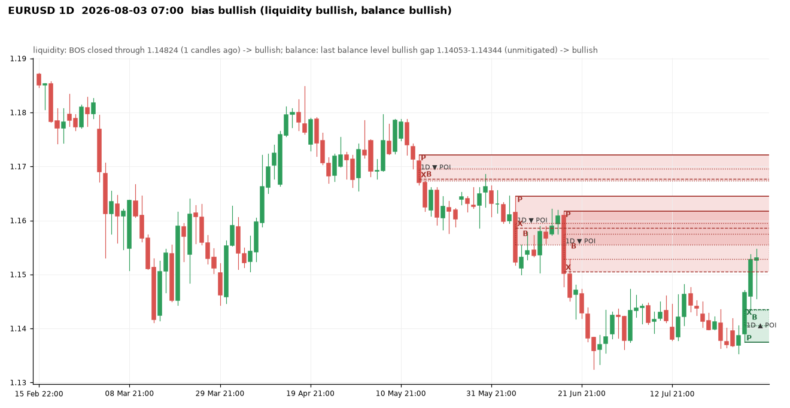
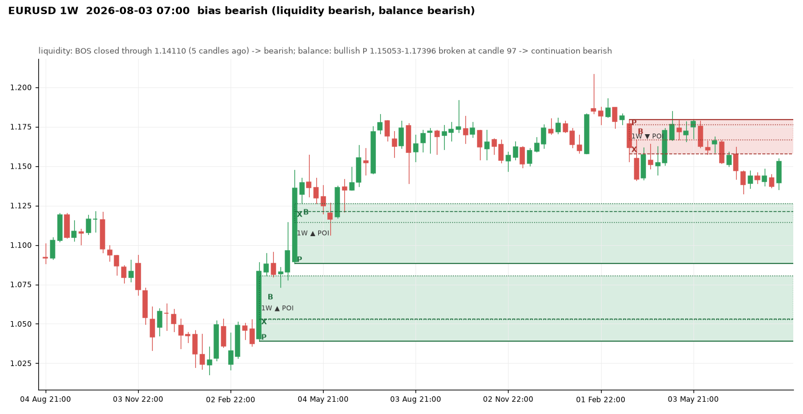
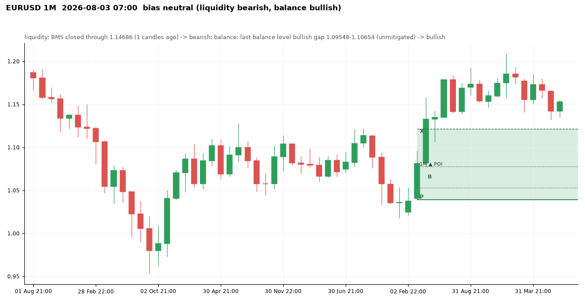

# EURUSD at 2026-08-03 07:00 UTC

Price 1.15370. Decision: **bullish**, scalp: bullish: 1D+4H+1H aligned -> scalp only

Visit memory: the run's own engine (visits counted from each zone's formation).

## 1m

Balance levels: 75 kept of 96 three-candle gaps in the window; 21 dropped by the size threshold (20% of the median range before them).

| Dropped gap (candle 3) | Side | Width | Required |
|---|---|---|---|
| 2026-08-03 04:25 | bullish | 0.00001 | 0.00002 |
| 2026-08-03 04:42 | bearish | 0.00001 | 0.00002 |
| 2026-08-03 05:15 | bullish | 0.00001 | 0.00001 |
| 2026-08-03 05:21 | bullish | 0.00001 | 0.00001 |
| 2026-08-03 05:35 | bullish | 0.00001 | 0.00001 |
| 2026-08-03 06:21 | bullish | 0.00001 | 0.00001 |
| 2026-08-03 06:31 | bullish | 0.00001 | 0.00001 |
| 2026-08-03 06:33 | bullish | 0.00001 | 0.00001 |

## 5m

Balance levels: 70 kept of 90 three-candle gaps in the window; 20 dropped by the size threshold (20% of the median range before them).

| Dropped gap (candle 3) | Side | Width | Required |
|---|---|---|---|
| 2026-07-31 21:15 | bullish | 0.00002 | 0.00008 |
| 2026-07-31 21:45 | bullish | 0.00002 | 0.00009 |
| 2026-08-02 22:40 | bullish | 0.00002 | 0.00009 |
| 2026-08-03 04:00 | bearish | 0.00003 | 0.00006 |
| 2026-08-03 04:05 | bearish | 0.00003 | 0.00006 |
| 2026-08-03 04:15 | bearish | 0.00004 | 0.00006 |
| 2026-08-03 05:15 | bullish | 0.00001 | 0.00005 |
| 2026-08-03 06:10 | bearish | 0.00002 | 0.00005 |

## 15m

Balance levels: 78 kept of 110 three-candle gaps in the window; 32 dropped by the size threshold (20% of the median range before them).

| Dropped gap (candle 3) | Side | Width | Required |
|---|---|---|---|
| 2026-07-31 00:15 | bearish | 0.00009 | 0.00011 |
| 2026-07-31 02:45 | bearish | 0.00004 | 0.00011 |
| 2026-07-31 16:45 | bullish | 0.00008 | 0.00010 |
| 2026-07-31 20:00 | bullish | 0.00004 | 0.00010 |
| 2026-08-03 02:00 | bearish | 0.00001 | 0.00011 |
| 2026-08-03 04:00 | bearish | 0.00007 | 0.00011 |
| 2026-08-03 05:15 | bullish | 0.00007 | 0.00011 |
| 2026-08-03 06:45 | bullish | 0.00008 | 0.00011 |

## 1H

Bias **bullish**: liquidity view bullish, balance view bullish.

- liquidity: BOS closed through 1.15374 (8 candles ago) -> bullish
- balance: last balance level bullish gap 1.15360-1.15429 (mitigated) -> bullish
- aligned -> bullish

| Zone | Low | High | X | B | P | Formed | Status | Visits (a visit stays open until a close 1.5 zone heights beyond the zone) |
|---|---|---|---|---|---|---|---|---|
| bearish | 1.14345 | 1.14477 | 1.14345 | 1.14424-1.14441 | 1.14477 | 2026-07-17 11:00 | invalidated |  |
| bearish | 1.14297 | 1.14423 | 1.14332 | 1.14297-1.14337 | 1.14423 | 2026-07-19 22:00 | invalidated |  |
| bearish | 1.14245 | 1.14300 | 1.14272 | 1.14245-1.14278 | 1.14300 | 2026-07-20 14:00 | invalidated |  |
| bearish | 1.14023 | 1.14068 | 1.14023 | 1.14039-1.14063 | 1.14068 | 2026-07-21 20:00 | invalidated |  |
| bullish | 1.14103 | 1.14159 | 1.14126 | 1.14117-1.14159 | 1.14103 | 2026-07-23 02:00 | invalidated |  |
| bullish | 1.14160 | 1.14230 | 1.14215 | 1.14203-1.14230 | 1.14160 | 2026-07-23 04:00 | invalidated |  |
| bearish | 1.14054 | 1.14250 | 1.14054 | 1.14151-1.14195 | 1.14250 | 2026-07-23 11:00 | invalidated |  |
| bearish | 1.13955 | 1.14065 | 1.14002 | 1.13955-1.14030 | 1.14065 | 2026-07-23 13:00 | invalidated |  |
| bullish | 1.13750 | 1.13816 | 1.13807 | 1.13798-1.13816 | 1.13750 | 2026-07-24 02:00 | invalidated |  |
| bullish | 1.13771 | 1.13876 | 1.13876 | 1.13832-1.13863 | 1.13771 | 2026-07-24 08:00 | invalidated |  |
| bearish | 1.13763 | 1.13880 | 1.13763 | 1.13782-1.13809 | 1.13880 | 2026-07-24 13:00 | invalidated |  |
| bullish | 1.13666 | 1.13928 | 1.13928 | 1.13721-1.13875 | 1.13666 | 2026-07-27 00:00 | invalidated |  |
| bullish | 1.13947 | 1.14016 | 1.14011 | 1.13951-1.14016 | 1.13947 | 2026-07-27 02:00 | invalidated |  |
| bearish | 1.14012 | 1.14099 | 1.14012 | 1.14031-1.14055 | 1.14099 | 2026-07-27 09:00 | invalidated |  |
| bullish | 1.13657 | 1.13734 | 1.13734 | 1.13684-1.13712 | 1.13657 | 2026-07-28 15:00 | fresh | 0 (no visit) |
| bullish | 1.13902 | 1.13943 | 1.13923 | 1.13924-1.13943 | 1.13902 | 2026-07-29 04:00 | invalidated |  |
| bearish | 1.13883 | 1.13928 | 1.13898 | 1.13883-1.13915 | 1.13928 | 2026-07-29 12:00 | invalidated |  |
| bullish | 1.13844 | 1.13969 | 1.13969 | 1.13859-1.13894 | 1.13844 | 2026-07-29 19:00 | fresh | 0 (no visit) |
| bullish | 1.14479 | 1.14612 | 1.14566 | 1.14555-1.14612 | 1.14479 | 2026-07-30 11:00 | tested | 0 (no visit) |
| bullish | 1.14693 | 1.15024 | 1.14841 | 1.14832-1.15024 | 1.14693 | 2026-07-30 15:00 | invalidated |  |
| bullish | 1.14971 | 1.15261 | 1.15261 | 1.15063-1.15122 | 1.14971 | 2026-07-31 18:00 | tested | 1 (visit open) |
| bullish | 1.15238 | 1.15429 | 1.15374 | 1.15360-1.15429 | 1.15238 | 2026-08-02 22:00 | active | 1 (visit open) |

Balance levels: 42 kept of 66 three-candle gaps in the window; 24 dropped by the size threshold (20% of the median range before them).

| Dropped gap (candle 3) | Side | Width | Required |
|---|---|---|---|
| 2026-07-29 05:00 | bullish | 0.00004 | 0.00016 |
| 2026-07-29 11:00 | bearish | 0.00002 | 0.00016 |
| 2026-07-29 13:00 | bearish | 0.00003 | 0.00016 |
| 2026-07-30 03:00 | bearish | 0.00004 | 0.00017 |
| 2026-07-30 22:00 | bearish | 0.00010 | 0.00017 |
| 2026-07-31 02:00 | bearish | 0.00007 | 0.00017 |
| 2026-07-31 12:00 | bearish | 0.00012 | 0.00017 |
| 2026-08-03 06:00 | bullish | 0.00005 | 0.00019 |

## 4H

Bias **bullish**: liquidity view bullish, balance view bullish.

- liquidity: BOS closed through 1.15369 (1 candles ago) -> bullish
- balance: last balance level bullish gap 1.15374-1.15419 (mitigated) -> bullish
- aligned -> bullish

| Zone | Low | High | X | B | P | Formed | Status | Visits (a visit stays open until a close 1.5 zone heights beyond the zone) |
|---|---|---|---|---|---|---|---|---|
| bullish | 1.16403 | 1.16614 | 1.16614 | 1.16481-1.16605 | 1.16403 | 2026-05-29 17:00 | invalidated |  |
| bearish | 1.15330 | 1.16427 | 1.16081 | 1.15330-1.16317 | 1.16427 | 2026-06-05 17:00 | active | 1 (visit open) |
| bullish | 1.15028 | 1.15731 | 1.15731 | 1.15434-1.15729 | 1.15028 | 2026-06-11 21:00 | invalidated |  |
| bullish | 1.15730 | 1.15941 | 1.15896 | 1.15716-1.15941 | 1.15730 | 2026-06-15 01:00 | invalidated |  |
| bearish | 1.15084 | 1.15961 | 1.15748 | 1.15084-1.15809 | 1.15961 | 2026-06-17 21:00 | active | 1 (visit open) |
| bearish | 1.14778 | 1.15138 | 1.14778 | 1.14875-1.15064 | 1.15138 | 2026-06-18 13:00 | invalidated |  |
| bearish | 1.14178 | 1.14618 | 1.14178 | 1.14333-1.14414 | 1.14618 | 2026-06-23 05:00 | invalidated |  |
| bearish | 1.13755 | 1.14174 | 1.13755 | 1.14000-1.14096 | 1.14174 | 2026-06-24 01:00 | invalidated |  |
| bullish | 1.13684 | 1.13879 | 1.13879 | 1.13715-1.13829 | 1.13684 | 2026-06-26 09:00 | invalidated |  |
| bullish | 1.13815 | 1.14118 | 1.14118 | 1.13883-1.14004 | 1.13815 | 2026-07-02 13:00 | invalidated |  |
| bullish | 1.14250 | 1.14410 | 1.14410 | 1.14260-1.14395 | 1.14250 | 2026-07-06 21:00 | invalidated |  |
| bearish | 1.14083 | 1.14299 | 1.14083 | 1.14171-1.14221 | 1.14299 | 2026-07-07 21:00 | invalidated |  |
| bearish | 1.13843 | 1.14333 | 1.13843 | 1.14025-1.14239 | 1.14333 | 2026-07-13 17:00 | invalidated |  |
| bullish | 1.14303 | 1.14596 | 1.14437 | 1.14414-1.14596 | 1.14303 | 2026-07-15 21:00 | invalidated |  |
| bearish | 1.14234 | 1.14455 | 1.14234 | 1.14300-1.14339 | 1.14455 | 2026-07-20 13:00 | invalidated |  |
| bearish | 1.14023 | 1.14204 | 1.14023 | 1.14107-1.14163 | 1.14204 | 2026-07-21 17:00 | invalidated |  |
| bullish | 1.14103 | 1.14215 | 1.14215 | 1.14126-1.14195 | 1.14103 | 2026-07-23 05:00 | invalidated |  |
| bearish | 1.13942 | 1.14250 | 1.13942 | 1.13955-1.14195 | 1.14250 | 2026-07-23 13:00 | invalidated |  |
| bullish | 1.13875 | 1.14011 | 1.14011 | 1.13733-1.13947 | 1.13875 | 2026-07-27 01:00 | invalidated |  |
| bullish | 1.13766 | 1.14467 | 1.14052 | 1.13969-1.14467 | 1.13766 | 2026-07-29 21:00 | tested | 0 (no visit) |
| bullish | 1.14371 | 1.14727 | 1.14727 | 1.14566-1.14693 | 1.14371 | 2026-07-30 13:00 | tested | 0 (no visit) |
| bullish | 1.14693 | 1.15136 | 1.14762 | 1.14841-1.15136 | 1.14693 | 2026-07-30 17:00 | tested | 1 (visit open) |
| bullish | 1.15122 | 1.15369 | 1.15369 | 1.15186-1.15238 | 1.15122 | 2026-08-02 21:00 | tested | 1 (visit open) |

Balance levels: 46 kept of 73 three-candle gaps in the window; 27 dropped by the size threshold (20% of the median range before them).

| Dropped gap (candle 3) | Side | Width | Required |
|---|---|---|---|
| 2026-07-07 05:00 | bearish | 0.00003 | 0.00038 |
| 2026-07-10 05:00 | bullish | 0.00017 | 0.00038 |
| 2026-07-15 17:00 | bullish | 0.00030 | 0.00038 |
| 2026-07-19 21:00 | bearish | 0.00020 | 0.00036 |
| 2026-07-20 05:00 | bullish | 0.00027 | 0.00036 |
| 2026-07-22 05:00 | bullish | 0.00003 | 0.00035 |
| 2026-07-23 17:00 | bearish | 0.00026 | 0.00035 |
| 2026-07-26 21:00 | bullish | 0.00012 | 0.00034 |

## 1D

Bias **bullish**: liquidity view bullish, balance view bullish.

- liquidity: BOS closed through 1.14824 (1 candles ago) -> bullish
- balance: last balance level bullish gap 1.14053-1.14344 (unmitigated) -> bullish
- aligned -> bullish

| Zone | Low | High | X | B | P | Formed | Status | Visits (a visit stays open until a close 1.5 zone heights beyond the zone) |
|---|---|---|---|---|---|---|---|---|
| bullish | 1.16480 | 1.17365 | 1.17365 | 1.16696-1.17036 | 1.16480 | 2025-09-07 21:00 | invalidated |  |
| bullish | 1.17574 | 1.18078 | 1.17801 | 1.17746-1.18078 | 1.17574 | 2025-09-16 21:00 | invalidated |  |
| bearish | 1.17262 | 1.18194 | 1.17262 | 1.17540-1.17790 | 1.18194 | 2025-09-24 21:00 | invalidated |  |
| bullish | 1.16211 | 1.16562 | 1.16562 | 1.16260-1.16410 | 1.16211 | 2025-12-03 22:00 | invalidated |  |
| bullish | 1.16216 | 1.16823 | 1.16820 | 1.16573-1.16823 | 1.16216 | 2025-12-10 22:00 | invalidated |  |
| bullish | 1.16823 | 1.17285 | 1.17285 | 1.16998-1.17196 | 1.16823 | 2025-12-11 22:00 | invalidated |  |
| bullish | 1.17064 | 1.17787 | 1.17787 | 1.17378-1.17571 | 1.17064 | 2025-12-22 22:00 | invalidated |  |
| bullish | 1.16326 | 1.16985 | 1.16985 | 1.16489-1.16762 | 1.16326 | 2026-01-20 22:00 | invalidated |  |
| bullish | 1.17283 | 1.18350 | 1.17693 | 1.17566-1.18350 | 1.17283 | 2026-01-25 22:00 | invalidated |  |
| bullish | 1.18350 | 1.19188 | 1.19188 | 1.18339-1.18504 | 1.18350 | 2026-01-26 22:00 | invalidated |  |
| bearish | 1.17070 | 1.17958 | 1.17420 | 1.17070-1.17890 | 1.17958 | 2026-03-02 22:00 | invalidated |  |
| bearish | 1.15745 | 1.16456 | 1.15782 | 1.15745-1.16058 | 1.16456 | 2026-03-11 21:00 | invalidated |  |
| bearish | 1.15298 | 1.15745 | 1.15303 | 1.15298-1.15608 | 1.15745 | 2026-03-12 21:00 | invalidated |  |
| bullish | 1.15242 | 1.16272 | 1.16272 | 1.15716-1.15889 | 1.15242 | 2026-04-07 21:00 | invalidated |  |
| bearish | 1.16740 | 1.17216 | 1.16766 | 1.16740-1.16954 | 1.17216 | 2026-05-14 21:00 | tested | 0 (no visit) |
| bearish | 1.15548 | 1.16445 | 1.15864 | 1.15548-1.15946 | 1.16445 | 2026-06-07 21:00 | tested | 1 (visit open) |
| bearish | 1.15053 | 1.16168 | 1.15053 | 1.15283-1.15748 | 1.16168 | 2026-06-17 21:00 | active | 1 (visit open) |
| bearish | 1.13845 | 1.14391 | 1.14110 | 1.13845-1.14190 | 1.14391 | 2026-06-23 21:00 | invalidated |  |
| bullish | 1.13746 | 1.14358 | 1.14358 | 1.14053-1.14344 | 1.13746 | 2026-07-29 21:00 | fresh | 0 (no visit) |

Balance levels: 32 kept of 54 three-candle gaps in the window; 22 dropped by the size threshold (20% of the median range before them).

| Dropped gap (candle 3) | Side | Width | Required |
|---|---|---|---|
| 2026-04-02 21:00 | bearish | 0.00036 | 0.00121 |
| 2026-04-14 21:00 | bullish | 0.00060 | 0.00125 |
| 2026-04-22 21:00 | bearish | 0.00022 | 0.00125 |
| 2026-05-04 21:00 | bearish | 0.00020 | 0.00127 |
| 2026-05-06 21:00 | bullish | 0.00088 | 0.00129 |
| 2026-05-12 21:00 | bearish | 0.00065 | 0.00129 |
| 2026-05-13 21:00 | bearish | 0.00002 | 0.00129 |
| 2026-05-17 21:00 | bearish | 0.00046 | 0.00129 |

## 1W

Bias **bearish**: liquidity view bearish, balance view bearish.

- liquidity: BOS closed through 1.14110 (5 candles ago) -> bearish
- balance: bullish P 1.15053-1.17396 broken at candle 97 -> continuation bearish
- aligned -> bearish

| Zone | Low | High | X | B | P | Formed | Status | Visits (a visit stays open until a close 1.5 zone heights beyond the zone) |
|---|---|---|---|---|---|---|---|---|
| bearish | 1.09973 | 1.12090 | 1.10020 | 1.09973-1.10832 | 1.12090 | 2024-10-06 21:00 | invalidated |  |
| bullish | 1.03886 | 1.08050 | 1.05333 | 1.05290-1.08050 | 1.03886 | 2025-03-09 21:00 | tested | 0 (no visit) |
| bullish | 1.08814 | 1.12640 | 1.12142 | 1.11464-1.12640 | 1.08814 | 2025-04-13 21:00 | tested | 0 (no visit) |
| bullish | 1.14536 | 1.17080 | 1.15734 | 1.16148-1.17080 | 1.14536 | 2025-06-29 21:00 | invalidated |  |
| bullish | 1.15782 | 1.18350 | 1.18080 | 1.16985-1.18350 | 1.15782 | 2026-01-25 22:00 | invalidated |  |
| bearish | 1.15782 | 1.17958 | 1.15782 | 1.16672-1.17662 | 1.17958 | 2026-03-08 21:00 | tested | 0 (no visit) |

Balance levels: 10 kept of 19 three-candle gaps in the window; 9 dropped by the size threshold (20% of the median range before them).

| Dropped gap (candle 3) | Side | Width | Required |
|---|---|---|---|
| 2024-10-13 21:00 | bearish | 0.00147 | 0.00260 |
| 2024-12-22 22:00 | bearish | 0.00070 | 0.00278 |
| 2025-04-06 21:00 | bullish | 0.00231 | 0.00338 |
| 2025-12-07 22:00 | bullish | 0.00015 | 0.00325 |
| 2025-12-14 22:00 | bullish | 0.00204 | 0.00321 |
| 2026-01-11 22:00 | bearish | 0.00147 | 0.00318 |
| 2026-05-17 21:00 | bearish | 0.00148 | 0.00318 |
| 2026-06-21 21:00 | bearish | 0.00260 | 0.00316 |

## 1M

Bias **neutral**: liquidity view bearish, balance view bullish.

- liquidity: BMS closed through 1.14686 (1 candles ago) -> bearish
- balance: last balance level bullish gap 1.09548-1.10654 (unmitigated) -> bullish
- conflicting / incomplete -> 50/50

| Zone | Low | High | X | B | P | Formed | Status | Visits (a visit stays open until a close 1.5 zone heights beyond the zone) |
|---|---|---|---|---|---|---|---|---|
| bearish | 1.06011 | 1.09374 | 1.06011 | 1.06300-1.07612 | 1.09374 | 2024-12-01 22:00 | invalidated |  |
| bullish | 1.03886 | 1.12142 | 1.12142 | 1.05290-1.07783 | 1.03886 | 2025-03-31 21:00 | tested | 0 (no visit) |

Balance levels: 5 kept of 12 three-candle gaps in the window; 7 dropped by the size threshold (20% of the median range before them).

| Dropped gap (candle 3) | Side | Width | Required |
|---|---|---|---|
| 2022-03-31 21:00 | bearish | 0.00300 | 0.00708 |
| 2022-05-01 21:00 | bearish | 0.00190 | 0.00723 |
| 2023-10-01 21:00 | bearish | 0.00712 | 0.00842 |
| 2023-11-30 22:00 | bullish | 0.00291 | 0.00842 |
| 2024-09-01 21:00 | bullish | 0.00538 | 0.00788 |
| 2024-10-31 21:00 | bearish | 0.00646 | 0.00777 |
| 2026-06-30 21:00 | bearish | 0.00287 | 0.00711 |

## Rejections at this moment

- 4H bullish POI 1.13766-1.14467 (tested, formed 2026-07-29 21:00:00): no active visit on 1m
- 4H bullish POI 1.14371-1.14727 (tested, formed 2026-07-30 13:00:00): no active visit on 1m
- 4H bullish POI 1.14693-1.15136 (tested, formed 2026-07-30 17:00:00): touched at 2026-07-31 15:24:00, waiting for confirmation on 15m
- 4H bullish POI 1.15122-1.15369 (tested, formed 2026-08-02 21:00:00): touched at 2026-08-03 01:01:00, waiting for confirmation on 15m
- 1H bullish POI 1.13657-1.13734 (fresh, formed 2026-07-28 15:00:00): no active visit on 1m
- 1H bullish POI 1.13844-1.13969 (fresh, formed 2026-07-29 19:00:00): no active visit on 1m
- 1H bullish POI 1.14479-1.14612 (tested, formed 2026-07-30 11:00:00): no active visit on 1m

## Setup

LONG from the 1H zone 1.14971-1.15261, BS on 5m at 2026-08-03 06:55:00, entry 1.15370, stop 1.15238, target 1.15587 (15m buy-side liquidity 1.15587 (x2)), R:R 1:1.53, visit 1.
