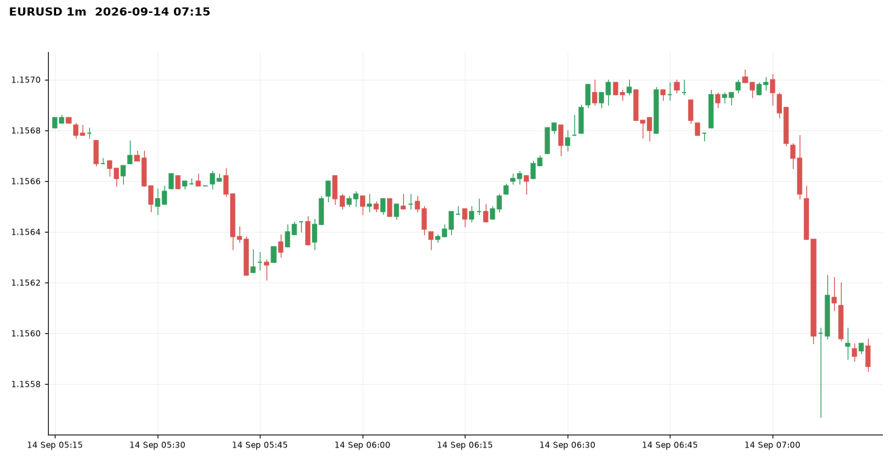
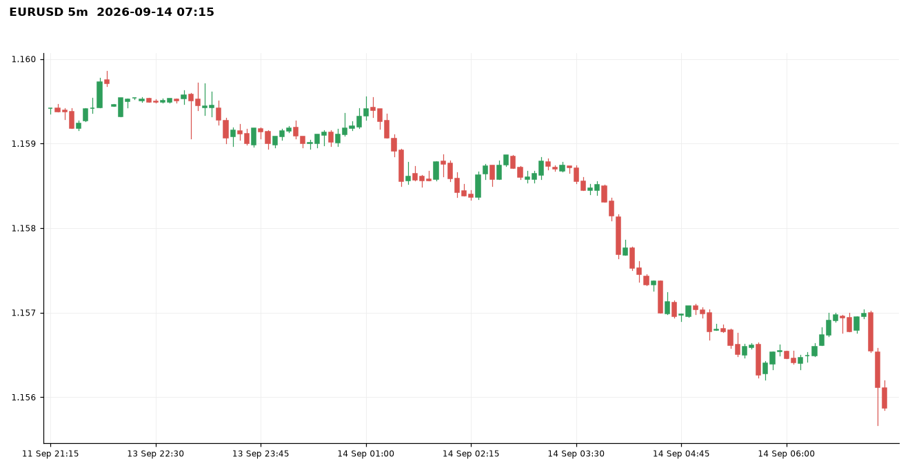
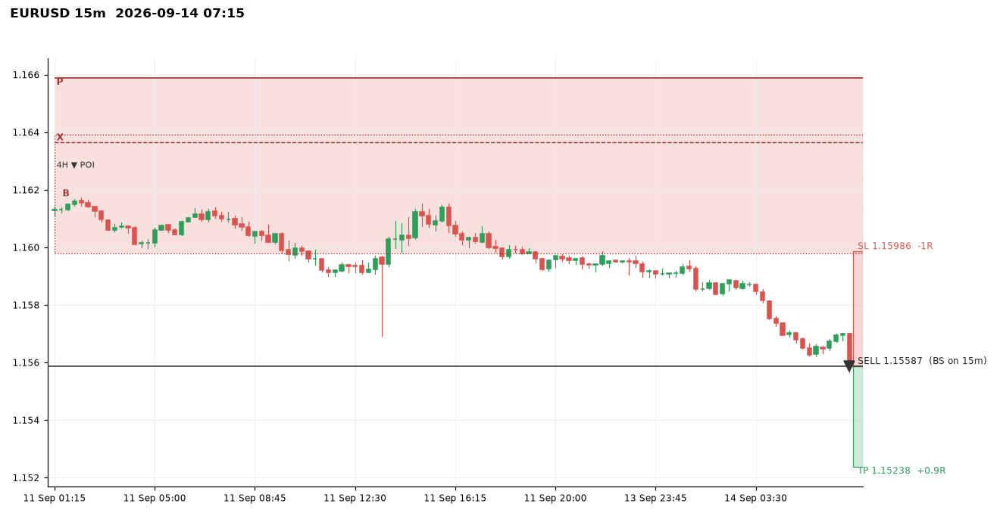
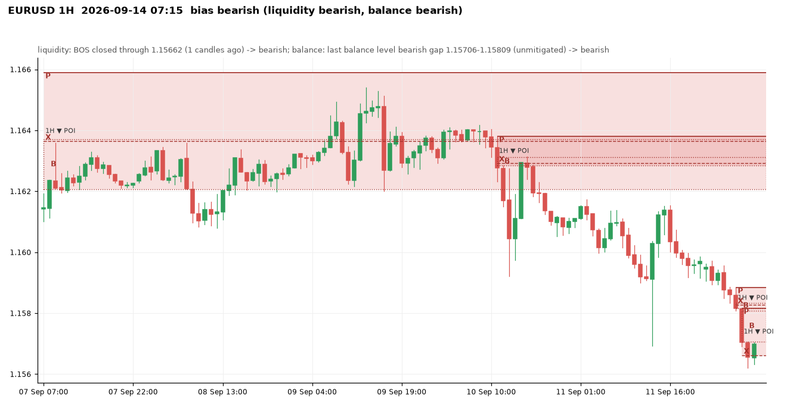
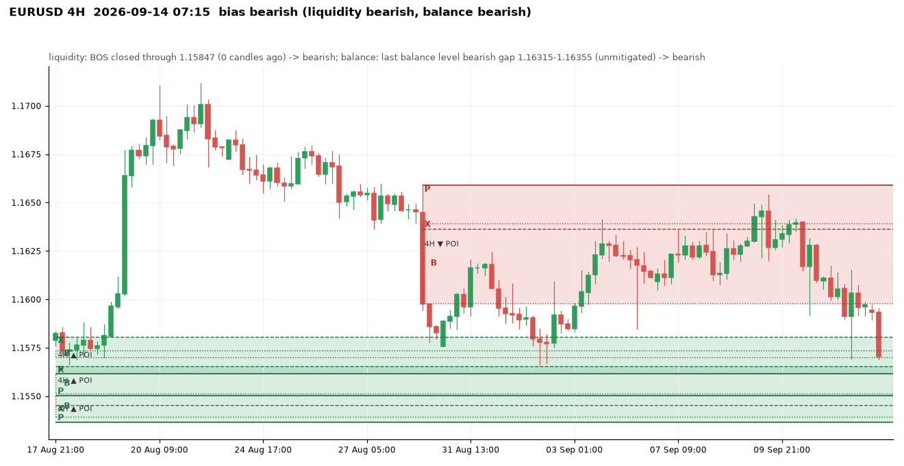
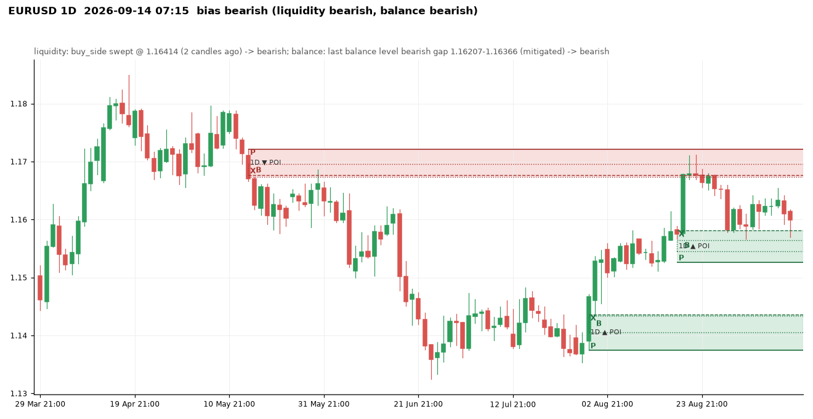
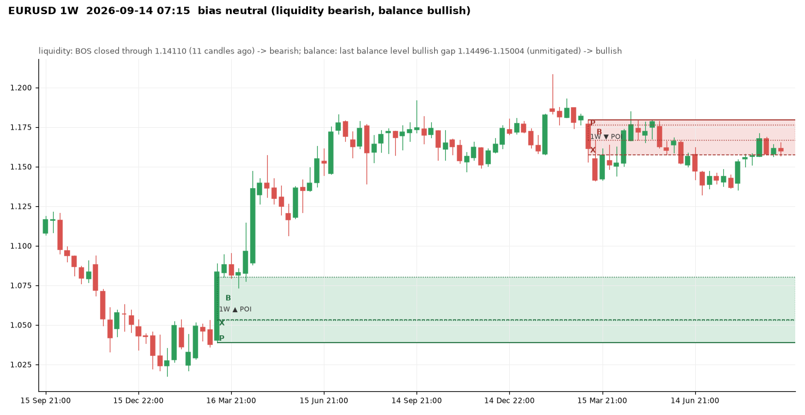
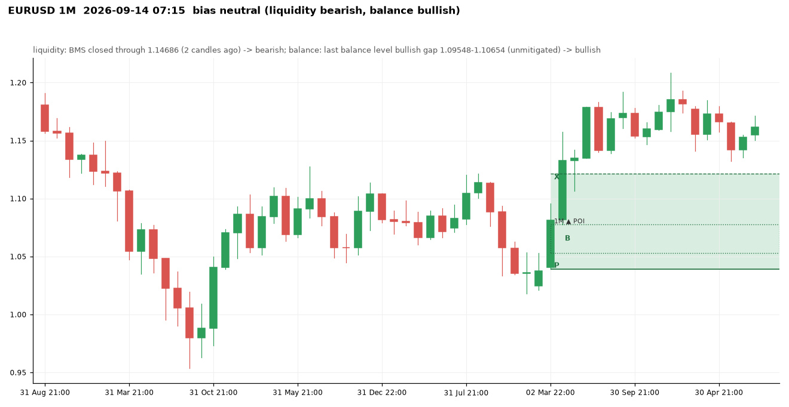

# EURUSD at 2026-09-14 07:15 UTC

Price 1.15587. Decision: **bearish**, scalp: bearish: 1D+4H+1H aligned -> scalp only

Visit memory: the run's own engine (visits counted from each zone's formation).

## 1m

Balance levels: 88 kept of 109 three-candle gaps in the window; 21 dropped by the size threshold (20% of the median range before them).

| Dropped gap (candle 3) | Side | Width | Required |
|---|---|---|---|
| 2026-09-14 05:06 | bearish | 0.00001 | 0.00001 |
| 2026-09-14 05:19 | bearish | 0.00001 | 0.00001 |
| 2026-09-14 05:30 | bearish | 0.00001 | 0.00001 |
| 2026-09-14 05:37 | bearish | 0.00001 | 0.00001 |
| 2026-09-14 05:48 | bullish | 0.00001 | 0.00001 |
| 2026-09-14 07:01 | bearish | 0.00001 | 0.00001 |
| 2026-09-14 07:02 | bearish | 0.00001 | 0.00001 |
| 2026-09-14 07:12 | bearish | 0.00001 | 0.00001 |

## 5m

Balance levels: 49 kept of 82 three-candle gaps in the window; 33 dropped by the size threshold (20% of the median range before them).

| Dropped gap (candle 3) | Side | Width | Required |
|---|---|---|---|
| 2026-09-14 01:00 | bullish | 0.00002 | 0.00004 |
| 2026-09-14 02:10 | bearish | 0.00003 | 0.00004 |
| 2026-09-14 02:55 | bearish | 0.00003 | 0.00004 |
| 2026-09-14 03:10 | bullish | 0.00001 | 0.00004 |
| 2026-09-14 03:40 | bearish | 0.00001 | 0.00003 |
| 2026-09-14 03:55 | bearish | 0.00003 | 0.00003 |
| 2026-09-14 04:35 | bearish | 0.00002 | 0.00003 |
| 2026-09-14 05:25 | bearish | 0.00001 | 0.00004 |

## 15m

Balance levels: 42 kept of 71 three-candle gaps in the window; 29 dropped by the size threshold (20% of the median range before them).

| Dropped gap (candle 3) | Side | Width | Required |
|---|---|---|---|
| 2026-09-11 02:00 | bullish | 0.00005 | 0.00007 |
| 2026-09-11 02:45 | bearish | 0.00003 | 0.00007 |
| 2026-09-11 03:30 | bearish | 0.00007 | 0.00007 |
| 2026-09-11 08:45 | bearish | 0.00004 | 0.00008 |
| 2026-09-11 11:30 | bearish | 0.00006 | 0.00008 |
| 2026-09-11 16:45 | bearish | 0.00004 | 0.00007 |
| 2026-09-14 05:15 | bearish | 0.00004 | 0.00008 |
| 2026-09-14 05:30 | bearish | 0.00003 | 0.00008 |

## 1H

Bias **bearish**: liquidity view bearish, balance view bearish.

- liquidity: BOS closed through 1.15662 (1 candles ago) -> bearish
- balance: last balance level bearish gap 1.15706-1.15809 (unmitigated) -> bearish
- aligned -> bearish

| Zone | Low | High | X | B | P | Formed | Status | Visits (a visit stays open until a close 1.5 zone heights beyond the zone) |
|---|---|---|---|---|---|---|---|---|
| bearish | 1.16467 | 1.16580 | 1.16467 | 1.16484-1.16516 | 1.16580 | 2026-08-27 10:00 | tested | 3 (no visit) |
| bearish | 1.16206 | 1.16589 | 1.16364 | 1.16206-1.16371 | 1.16589 | 2026-08-28 16:00 | tested | 1 (no visit) |
| bullish | 1.15846 | 1.15944 | 1.15944 | 1.15913-1.15929 | 1.15846 | 2026-08-31 09:00 | invalidated | 2 (visit open) |
| bullish | 1.15950 | 1.16121 | 1.16058 | 1.16009-1.16121 | 1.15950 | 2026-08-31 16:00 | invalidated | 1 (visit open) |
| bearish | 1.15916 | 1.15986 | 1.15916 | 1.15931-1.15945 | 1.15986 | 2026-09-01 17:00 | invalidated | 2 (visit open) |
| bearish | 1.15843 | 1.15917 | 1.15846 | 1.15843-1.15904 | 1.15917 | 2026-09-02 02:00 | invalidated | 2 (visit open) |
| bullish | 1.15709 | 1.15849 | 1.15849 | 1.15726-1.15755 | 1.15709 | 2026-09-02 14:00 | invalidated | 4 (visit open) |
| bullish | 1.16081 | 1.16171 | 1.16147 | 1.16143-1.16171 | 1.16081 | 2026-09-03 14:00 | invalidated | 2 (visit open) |
| bullish | 1.16212 | 1.16326 | 1.16301 | 1.16273-1.16326 | 1.16212 | 2026-09-03 18:00 | invalidated | 1 (visit open) |
| bearish | 1.16084 | 1.16206 | 1.16084 | 1.16133-1.16175 | 1.16206 | 2026-09-06 22:00 | invalidated | 1 (visit open) |
| bullish | 1.16112 | 1.16209 | 1.16200 | 1.16193-1.16209 | 1.16112 | 2026-09-07 09:00 | invalidated | 2 (visit open) |
| bullish | 1.16229 | 1.16331 | 1.16331 | 1.16229-1.16252 | 1.16229 | 2026-09-08 02:00 | invalidated | 1 (visit open) |
| bearish | 1.16284 | 1.16380 | 1.16292 | 1.16284-1.16312 | 1.16380 | 2026-09-10 12:00 | tested | 1 (no visit) |
| bearish | 1.16053 | 1.16126 | 1.16053 | 1.16077-1.16107 | 1.16126 | 2026-09-11 04:00 | invalidated | 2 (visit open) |
| bullish | 1.15693 | 1.16138 | 1.16138 | 1.15956-1.15983 | 1.15693 | 2026-09-11 15:00 | invalidated | 1 (visit open) |
| bearish | 1.15816 | 1.15884 | 1.15827 | 1.15816-1.15833 | 1.15884 | 2026-09-14 04:00 | fresh | 0 (no visit) |
| bearish | 1.15662 | 1.15816 | 1.15662 | 1.15706-1.15809 | 1.15816 | 2026-09-14 05:00 | tested | 1 (visit open) |

Balance levels: 31 kept of 51 three-candle gaps in the window; 20 dropped by the size threshold (20% of the median range before them).

| Dropped gap (candle 3) | Side | Width | Required |
|---|---|---|---|
| 2026-09-09 01:00 | bullish | 0.00002 | 0.00014 |
| 2026-09-09 07:00 | bullish | 0.00011 | 0.00013 |
| 2026-09-09 08:00 | bullish | 0.00005 | 0.00013 |
| 2026-09-10 18:00 | bearish | 0.00010 | 0.00014 |
| 2026-09-10 21:00 | bearish | 0.00007 | 0.00013 |
| 2026-09-11 07:00 | bullish | 0.00009 | 0.00013 |
| 2026-09-11 09:00 | bearish | 0.00009 | 0.00013 |
| 2026-09-14 02:00 | bearish | 0.00008 | 0.00015 |

## 4H

Bias **bearish**: liquidity view bearish, balance view bearish.

- liquidity: BOS closed through 1.15847 (0 candles ago) -> bearish
- balance: last balance level bearish gap 1.16315-1.16355 (unmitigated) -> bearish
- aligned -> bearish

| Zone | Low | High | X | B | P | Formed | Status | Visits (a visit stays open until a close 1.5 zone heights beyond the zone) |
|---|---|---|---|---|---|---|---|---|
| bearish | 1.13843 | 1.14333 | 1.13843 | 1.14025-1.14239 | 1.14333 | 2026-07-13 17:00 | invalidated |  |
| bullish | 1.14303 | 1.14596 | 1.14437 | 1.14414-1.14596 | 1.14303 | 2026-07-15 21:00 | invalidated |  |
| bearish | 1.14234 | 1.14455 | 1.14234 | 1.14300-1.14339 | 1.14455 | 2026-07-20 13:00 | invalidated |  |
| bearish | 1.14023 | 1.14204 | 1.14023 | 1.14107-1.14163 | 1.14204 | 2026-07-21 17:00 | invalidated |  |
| bullish | 1.14103 | 1.14215 | 1.14215 | 1.14126-1.14195 | 1.14103 | 2026-07-23 05:00 | invalidated |  |
| bearish | 1.13942 | 1.14250 | 1.13942 | 1.13955-1.14195 | 1.14250 | 2026-07-23 13:00 | invalidated |  |
| bullish | 1.13875 | 1.14011 | 1.14011 | 1.13733-1.13947 | 1.13875 | 2026-07-27 01:00 | invalidated |  |
| bullish | 1.13766 | 1.14467 | 1.14052 | 1.13969-1.14467 | 1.13766 | 2026-07-29 21:00 | tested | 0 (no visit) |
| bullish | 1.14371 | 1.14762 | 1.14762 | 1.14566-1.14693 | 1.14371 | 2026-07-30 13:00 | tested | 0 (no visit) |
| bullish | 1.15122 | 1.15369 | 1.15369 | 1.15186-1.15238 | 1.15122 | 2026-08-02 21:00 | invalidated | 1 (visit open) |
| bullish | 1.15269 | 1.15594 | 1.15594 | 1.15331-1.15573 | 1.15269 | 2026-08-07 17:00 | invalidated | 1 (visit open) |
| bearish | 1.15280 | 1.15401 | 1.15312 | 1.15280-1.15329 | 1.15401 | 2026-08-12 21:00 | invalidated | 1 (visit open) |
| bullish | 1.15366 | 1.15502 | 1.15454 | 1.15392-1.15502 | 1.15366 | 2026-08-14 09:00 | fresh | 0 (no visit) |
| bullish | 1.15502 | 1.15656 | 1.15656 | 1.15512-1.15619 | 1.15502 | 2026-08-14 13:00 | active | 2 (visit open) |
| bullish | 1.15614 | 1.15808 | 1.15808 | 1.15702-1.15736 | 1.15614 | 2026-08-17 01:00 | tested | 5 (visit open) |
| bullish | 1.15806 | 1.15954 | 1.15882 | 1.15871-1.15954 | 1.15806 | 2026-08-19 09:00 | invalidated | 3 (visit open) |
| bullish | 1.15954 | 1.16141 | 1.16141 | 1.15985-1.16023 | 1.15954 | 2026-08-19 13:00 | invalidated | 1 (visit open) |
| bearish | 1.16687 | 1.16829 | 1.16687 | 1.16734-1.16765 | 1.16829 | 2026-08-24 09:00 | tested | 1 (no visit) |
| bearish | 1.16510 | 1.16749 | 1.16510 | 1.16543-1.16602 | 1.16749 | 2026-08-26 17:00 | tested | 2 (no visit) |
| bearish | 1.15980 | 1.16589 | 1.16364 | 1.15980-1.16392 | 1.16589 | 2026-08-28 17:00 | tested | 1 (visit open) |
| bullish | 1.15835 | 1.16091 | 1.16091 | 1.15899-1.15934 | 1.15835 | 2026-09-03 09:00 | invalidated | 2 (visit open) |
| bullish | 1.16081 | 1.16212 | 1.16206 | 1.16143-1.16212 | 1.16081 | 2026-09-03 17:00 | invalidated | 3 (visit open) |
| bearish | 1.16201 | 1.16403 | 1.16201 | 1.16315-1.16355 | 1.16403 | 2026-09-10 13:00 | tested | 1 (no visit) |

Balance levels: 43 kept of 63 three-candle gaps in the window; 20 dropped by the size threshold (20% of the median range before them).

| Dropped gap (candle 3) | Side | Width | Required |
|---|---|---|---|
| 2026-08-19 05:00 | bullish | 0.00024 | 0.00030 |
| 2026-08-20 17:00 | bearish | 0.00027 | 0.00032 |
| 2026-08-21 17:00 | bearish | 0.00017 | 0.00029 |
| 2026-09-01 05:00 | bearish | 0.00025 | 0.00027 |
| 2026-09-02 05:00 | bearish | 0.00016 | 0.00027 |
| 2026-09-02 17:00 | bullish | 0.00005 | 0.00027 |
| 2026-09-08 17:00 | bullish | 0.00015 | 0.00027 |
| 2026-09-09 05:00 | bullish | 0.00008 | 0.00026 |

## 1D

Bias **bearish**: liquidity view bearish, balance view bearish.

- liquidity: buy_side swept @ 1.16414 (2 candles ago) -> bearish
- balance: last balance level bearish gap 1.16207-1.16366 (mitigated) -> bearish
- aligned -> bearish

| Zone | Low | High | X | B | P | Formed | Status | Visits (a visit stays open until a close 1.5 zone heights beyond the zone) |
|---|---|---|---|---|---|---|---|---|
| bullish | 1.16211 | 1.16562 | 1.16562 | 1.16260-1.16410 | 1.16211 | 2025-12-03 22:00 | invalidated |  |
| bullish | 1.16216 | 1.16823 | 1.16820 | 1.16573-1.16823 | 1.16216 | 2025-12-10 22:00 | invalidated |  |
| bullish | 1.16823 | 1.17285 | 1.17285 | 1.16998-1.17196 | 1.16823 | 2025-12-11 22:00 | invalidated |  |
| bullish | 1.17064 | 1.17787 | 1.17787 | 1.17378-1.17571 | 1.17064 | 2025-12-22 22:00 | invalidated |  |
| bearish | 1.16592 | 1.16830 | 1.16592 | 1.16622-1.16729 | 1.16830 | 2026-01-08 22:00 | invalidated |  |
| bullish | 1.16326 | 1.16985 | 1.16985 | 1.16489-1.16762 | 1.16326 | 2026-01-20 22:00 | invalidated |  |
| bullish | 1.17283 | 1.18350 | 1.17693 | 1.17566-1.18350 | 1.17283 | 2026-01-25 22:00 | invalidated |  |
| bearish | 1.17070 | 1.17958 | 1.17420 | 1.17070-1.17890 | 1.17958 | 2026-03-02 22:00 | invalidated |  |
| bearish | 1.15745 | 1.16456 | 1.15782 | 1.15745-1.16058 | 1.16456 | 2026-03-11 21:00 | invalidated |  |
| bearish | 1.15298 | 1.15745 | 1.15303 | 1.15298-1.15608 | 1.15745 | 2026-03-12 21:00 | invalidated |  |
| bullish | 1.15242 | 1.16272 | 1.16272 | 1.15716-1.15889 | 1.15242 | 2026-04-07 21:00 | invalidated |  |
| bearish | 1.16740 | 1.17216 | 1.16766 | 1.16740-1.16954 | 1.17216 | 2026-05-14 21:00 | tested | 1 (no visit) |
| bearish | 1.15548 | 1.16445 | 1.15864 | 1.15548-1.15946 | 1.16445 | 2026-06-07 21:00 | invalidated | 1 (visit open) |
| bearish | 1.15053 | 1.16168 | 1.15053 | 1.15283-1.15748 | 1.16168 | 2026-06-17 21:00 | invalidated | 1 (visit open) |
| bearish | 1.13845 | 1.14391 | 1.14110 | 1.13845-1.14190 | 1.14391 | 2026-06-23 21:00 | invalidated |  |
| bullish | 1.13746 | 1.14358 | 1.14358 | 1.14053-1.14344 | 1.13746 | 2026-07-29 21:00 | fresh | 0 (no visit) |
| bullish | 1.15265 | 1.15808 | 1.15808 | 1.15456-1.15640 | 1.15265 | 2026-08-18 21:00 | active | 1 (visit open) |

Balance levels: 31 kept of 50 three-candle gaps in the window; 19 dropped by the size threshold (20% of the median range before them).

| Dropped gap (candle 3) | Side | Width | Required |
|---|---|---|---|
| 2026-04-14 21:00 | bullish | 0.00060 | 0.00125 |
| 2026-04-22 21:00 | bearish | 0.00022 | 0.00125 |
| 2026-05-04 21:00 | bearish | 0.00020 | 0.00127 |
| 2026-05-06 21:00 | bullish | 0.00088 | 0.00129 |
| 2026-05-12 21:00 | bearish | 0.00065 | 0.00129 |
| 2026-05-13 21:00 | bearish | 0.00002 | 0.00129 |
| 2026-05-17 21:00 | bearish | 0.00046 | 0.00129 |
| 2026-09-10 21:00 | bearish | 0.00026 | 0.00101 |

## 1W

Bias **neutral**: liquidity view bearish, balance view bullish.

- liquidity: BOS closed through 1.14110 (11 candles ago) -> bearish
- balance: last balance level bullish gap 1.14496-1.15004 (unmitigated) -> bullish
- conflicting / incomplete -> 50/50

| Zone | Low | High | X | B | P | Formed | Status | Visits (a visit stays open until a close 1.5 zone heights beyond the zone) |
|---|---|---|---|---|---|---|---|---|
| bullish | 1.03886 | 1.08050 | 1.05333 | 1.05290-1.08050 | 1.03886 | 2025-03-09 21:00 | tested | 0 (no visit) |
| bullish | 1.14536 | 1.17080 | 1.15734 | 1.16148-1.17080 | 1.14536 | 2025-06-29 21:00 | invalidated |  |
| bullish | 1.15782 | 1.18350 | 1.18080 | 1.16985-1.18350 | 1.15782 | 2026-01-25 22:00 | invalidated |  |
| bearish | 1.15782 | 1.17958 | 1.15782 | 1.16672-1.17662 | 1.17958 | 2026-03-08 21:00 | tested | 1 (visit open) |

Balance levels: 11 kept of 19 three-candle gaps in the window; 8 dropped by the size threshold (20% of the median range before them).

| Dropped gap (candle 3) | Side | Width | Required |
|---|---|---|---|
| 2024-10-13 21:00 | bearish | 0.00147 | 0.00252 |
| 2024-12-22 22:00 | bearish | 0.00070 | 0.00311 |
| 2025-04-06 21:00 | bullish | 0.00231 | 0.00345 |
| 2025-12-07 22:00 | bullish | 0.00015 | 0.00337 |
| 2025-12-14 22:00 | bullish | 0.00204 | 0.00337 |
| 2026-01-11 22:00 | bearish | 0.00147 | 0.00321 |
| 2026-05-17 21:00 | bearish | 0.00148 | 0.00321 |
| 2026-06-21 21:00 | bearish | 0.00260 | 0.00319 |

## 1M

Bias **neutral**: liquidity view bearish, balance view bullish.

- liquidity: BMS closed through 1.14686 (2 candles ago) -> bearish
- balance: last balance level bullish gap 1.09548-1.10654 (unmitigated) -> bullish
- conflicting / incomplete -> 50/50

| Zone | Low | High | X | B | P | Formed | Status | Visits (a visit stays open until a close 1.5 zone heights beyond the zone) |
|---|---|---|---|---|---|---|---|---|
| bearish | 1.06011 | 1.09374 | 1.06011 | 1.06300-1.07612 | 1.09374 | 2024-12-01 22:00 | invalidated |  |
| bullish | 1.03886 | 1.12142 | 1.12142 | 1.05290-1.07783 | 1.03886 | 2025-03-31 21:00 | tested | 0 (no visit) |

Balance levels: 5 kept of 12 three-candle gaps in the window; 7 dropped by the size threshold (20% of the median range before them).

| Dropped gap (candle 3) | Side | Width | Required |
|---|---|---|---|
| 2022-03-31 21:00 | bearish | 0.00300 | 0.00723 |
| 2022-05-01 21:00 | bearish | 0.00190 | 0.00750 |
| 2023-10-01 21:00 | bearish | 0.00712 | 0.00854 |
| 2023-11-30 22:00 | bullish | 0.00291 | 0.00854 |
| 2024-09-01 21:00 | bullish | 0.00538 | 0.00808 |
| 2024-10-31 21:00 | bearish | 0.00646 | 0.00783 |
| 2026-06-30 21:00 | bearish | 0.00287 | 0.00717 |

## Rejections at this moment

- 4H bearish POI 1.16687-1.16829 (tested, formed 2026-08-24 09:00:00): no active visit on 1m
- 4H bearish POI 1.16510-1.16749 (tested, formed 2026-08-26 17:00:00): no active visit on 1m

## Setup

SHORT from the 4H zone 1.15980-1.16589, BS on 15m at 2026-09-14 07:00:00, entry 1.15587, stop 1.15986, target 1.15238 (4H sell-side liquidity 1.15238 (x1)), R:R 1:0.85, visit 1.
